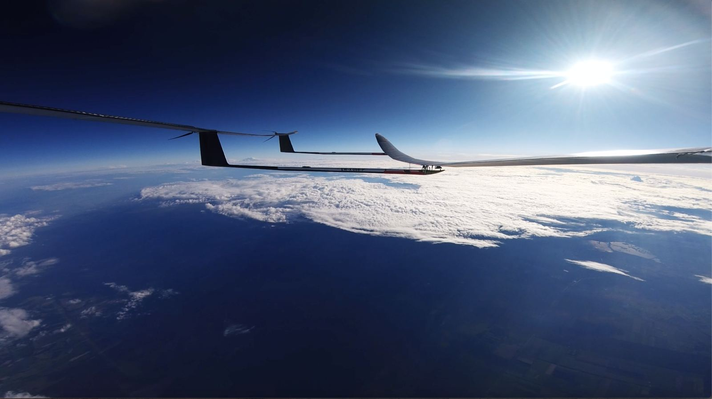

# CEO Tech Commentary: UAVOS’ team provided its partner, Mira Aerospace, with engineering support in preparing HAPS for new test flights

An interview with Aliaksei Stratsilatau, CEO of UAVOS

**UAVOS Inc., a joint venture with Bayanat, supported Mira Aerospace in a successful series of High Altitude Platform Station (HAPS) test flights in the UAE. UAVOS engineers were responsible for software development and maintenance of an advanced Earth Observation (EO) payload installed on Mira Aerospace's HAPS. The mission objective was to test various surveillance scenarios, during which an EO camera system successfully demonstrated high-performance daytime imaging from a stratospheric altitude of 15,000 meters.**

> 
*“UAVOS' EO camera software is an advanced Earth Observation service designed to capture ultra-high-resolution imagery and live video from the stratosphere. Our software provides essential capabilities for a wide range of HAPS applications, including maritime surveillance, border monitoring, mapping, forest fire detection, and emergency response,” said **Aliaksei Stratsilatau, Founder and CEO of UAVOS.***

#### HAPS design reimagined through UAVOS' autopilot

The “sweet spot” of HAPS technology also lies in using UAVOS’ autopilot system to challenge traditional HAPS design principles. The autopilot distributes structural load and directly controls roll, pitch, and other flight dynamics by adjusting the angle of attack across different wing sections. This minimizes wing stress, which, in turn, reduces drag and overall aircraft weight.

*“Everyone else is relying on structural strength,” said Aliaksei. “We rely on the autopilot. Imagine being able to forget about structural rigidity and mechanical constraints. You can use any airfoil profile or wing aspect ratio you want. We have a flexible wing: fully controlled by the autopilot. A human could never do this; you'd need ten hands.”*

The HAPS design features two staggered wings and three tails, each equipped with a rudder to maintain optimal landing angles. The tail-mounted engines improve efficiency. Three independent autopilot units perform formation flight control, with the full HAPS system consisting of three connected aerial vehicles.

#### Advancing toward commercialization

UAVOS continues to improve system sustainability by enhancing battery mounting and heating systems.

*“Sourcing suitable motors is another major challenge. Most companies working on HAPS platforms have to design their own propulsion systems because propellers must operate efficiently in extremely thin air. We're working to solve this issue to make the technology ready for fast commercialization, because delays and inefficiencies increase our costs,” said Aliaksei.*

#### Next steps

*“Now that all basic aircraft preparations for the HAPS are complete, we are moving forward with the next stage - preparing for upcoming test flights,”**added Aliaksei Stratsilatau.***

*August, 2025*