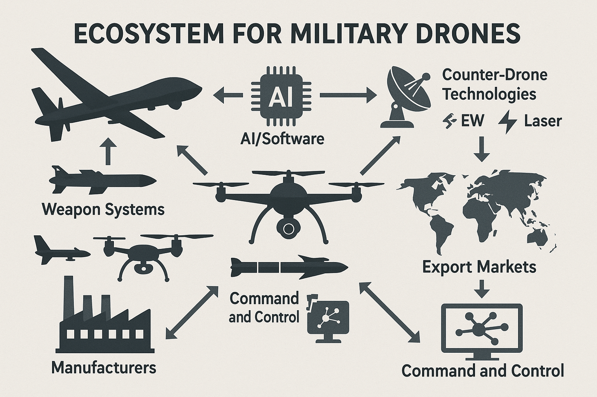

# Ecosystem for Military Drones

Expert opinion of Aliaksei Stratsilatau, CEO of UAVOS

> 
**Aliaksei Stratsilatau, Founder and CEO of UAVOS.**

#### 1. How have low-cost swarming drones changed battlefield tactics and the balance of power in recent conflicts?

In the past, the development of air defense systems was primarily geared toward neutralizing large, high-value targets such as aircraft, ballistic missiles, and cruise missiles. Consequently, the main arsenal of air defense assets, along with personnel training, was focused on operating systems like Patriot-class systems and similar platforms.

However, modern air defense has proven ill-suited to handle the emerging threat posed by large numbers of drones operating simultaneously. The absence of affordable, dedicated counter UAV solutions has created a major vulnerability, shifting the balance in favor of low-cost, expendable drones capable of executing swarming missions.

This challenge is compounded by the limited effectiveness of electronic warfare (EW) against such threats, as well as the availability of advanced, low-cost autopilot systems that can operate without GNSS. In addition, the use of fiber optic communication links further reduces exposure to traditional countermeasures.

At present, the development and fielding of counter drone technologies and automated Remote Control Weapon Stations remain in the very early stages. The number of manufacturers in this niche is significantly lower than the growing base of loitering munitions (kamikaze drones) producers.

As a result, front-line forces are practically saturated with drone activity within a 15–20 km radius, where traditional air defense is unable to provide effective coverage. At longer distances, the use of conventional air defense systems remains technically feasible but proves extremely costly economically.

#### 2. What are the biggest technical and operational challenges in defending against drone swarms?

- Modern drones operate at low altitudes, which makes their early detection by radar difficult.
- Neutralizing loitering munition (kamikaze drones) with missiles at low altitudes is a very challenging task.
- The use of small arms carries the risk of hitting civilian infrastructure or friendly forces due to the flat trajectory of fire.
- At present, electronic warfare (EW) systems have shown low effectiveness.
- The large number of drones—and therefore targets— overloads the air defense system.

#### 3. How is the rapid innovation cycle in commercial drone technology affecting traditional defense procurement and R&D?

As a general rule, most functionalities integrated into modern drones are primarily employed in military applications. Consequently, innovations emerging in the commercial sector have virtually no significant impact on enhancing the reliability or on expanding the operational capabilities of military UAVs.

#### 4. What role do AI and machine learning play in both drone autonomy and counter-drone systems?

The principal functions of artificial intelligence within counter-drone systems can be summarized as follows:
- Automated target selection within the effective detection radius
- Automated assessment and prioritization of targets
- Integration with automatic guidance and target-tracking subsystems embedded in air-defense assets (e.g., turret systems and counter-UAV platforms)
- Deployment of specialized electronic warfare capabilities, most notably spoofing techniques
- For mission-oriented UAVs: terrain-referenced navigation facilitated by downward-facing electro-optical sensors or advanced radar-based navigation solutions
- Terminal-phase guidance incorporating target recognition algorithms and hierarchical ranking of targets by operational importance

#### 5. Which companies are best positioned to benefit from the growth in military drone and counter-drone markets, and what differentiates them from their competitors?

The principal functions of artificial intelligence within counter-drone systems can be summarized as follows:

- Traditional Defense Contractors. These are large military-industrial corporations (conventional weapons manufacturers). They have access to government contracts and long-term programs. They already enjoy the trust of defense ministries, have established supply chains, and possess experience in integrating complex systems.

- Specialized Drone Manufacturers. Armed forces are seeking mass-produced and affordable platforms that can be deployed in large numbers.
    - These are companies that originally focused on drones (reconnaissance, strike, loitering munitions, tactical quadcopters).
    - They adopt new technologies quickly;
    - They offer solutions that are cheaper and more scalable than those of traditional contractors;
    - They export their products to dozens of countries, strengthening international influence.

- Developers of Electronic Warfare and Counter-Drone Technologies. These are manufacturers of detection systems, EW, radar, laser, and microwave weapons.
    - The counter-drone market is growing even faster than the drone market itself;
    - Every country seeks to protect military bases, cities, and infrastructure;
    - Solutions are often modular and integrate easily into existing air defense systems.
    - With the widespread use of drones, militaries are forced to invest in protection—demand is steady and long-term.

- IT and AI Companies in the Defense Sector. These are players that develop command-and-control systems, data analytics, autonomous flight algorithms, and navigation solutions.
    - AI is essential for drone swarms, target recognition, and interceptor management;
    - Sensor-to-shooter integration requires advanced C2 systems;
    - Algorithms reduce human dependence and speed up reaction times.
    - Without AI and analytics, even the most advanced drones are ineffective—demand for such technologies will continue to grow.

- Component and Dual-Use Manufacturers. They receive orders for both military supplies and the civilian mass market, creating economies of scale. This includes engines, batteries, optics, radars, and communication systems.

- Countries with Developing Defense Industries and Export Potential. These are national companies in Turkey, South Korea, China, Israel, Europe, and the United States.
    - Drones have become an important tool of military-political influence;
    - Exports of UAVs and C-UAS systems strengthen a country’s role as a military partner;
    - Government support provides companies with rapid access to contracts.
    - Drone exports are turning into a geopolitical instrument, while states actively invest in their defense industries.

These are the main differentiators from competitors in the growing defense market:
- Companies capable of rapidly scaling production (factories, localization in customer countries, subcontracting).
- Equipment proven in real conflicts (e.g., drones successfully deployed on the battlefield).
- Companies possessing key technologies: AI-based autonomy, drone swarming, target recognition, advanced sensors.
- Companies offering complete systems (detection, command and control, neutralization).
- Customers prefer a unified solution rather than a set of incompatible components.
- Solutions with low cost per effect (low-cost drones, reusable interceptors, lasers, high-power microwave systems).
- Militaries compare the cost of a drone threat against the cost of interception - the advantage goes to those who can make it cheaper to neutralize than to launch.
- Systems that can be easily integrated into existing air defense and communication networks, or adapted for different missions.

*September, 2025*
