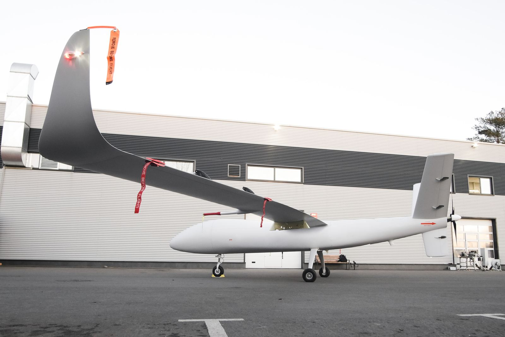

# S1-V300 MALE UAS

Expert opinion of Aliaksei Stratsilatau, CEO of UAVOS

> 
**Aliaksei Stratsilatau, Founder and CEO of UAVOS.**

**The S1-V300 MALE UAS has demonstrated remarkable fuel efficiency, resulting in outstanding flight performance. During a test flight, the 1,000 kg S1-V300 UAS achieved 16 hours of continuous operation at a cruising speed of 130 km/h, with a fuel consumption rate of only 10 liters per hour. In total, the aircraft covered 2,400 km. This impressive result was made possible by the aircraft’s excellent aerodynamic design.**

#### What specific engineering factors have positively affected its flight performance?

Excellent aerodynamic design was translated into following specific design elements that directly improve flight efficiency and endurance:
- High efficiency wing configuration with extended span, combined with optimized propellers, reduces drag and increases lift.
- Lightweight composite landing gear with aerodynamic profiles lowers overall mass without compromising strength.
- Adjustable air intakes that retract during flight enhance aerodynamic performance.
- Streamlined fuselage with the engine located behind the wing, rather than at the tail, optimized for endurance flights.
- Y shaped empennage design provides minimal aerodynamic resistance.
- Well designed fowler flaps and interceptors improve lift augmentation and maneuverability.

*September, 2025*
