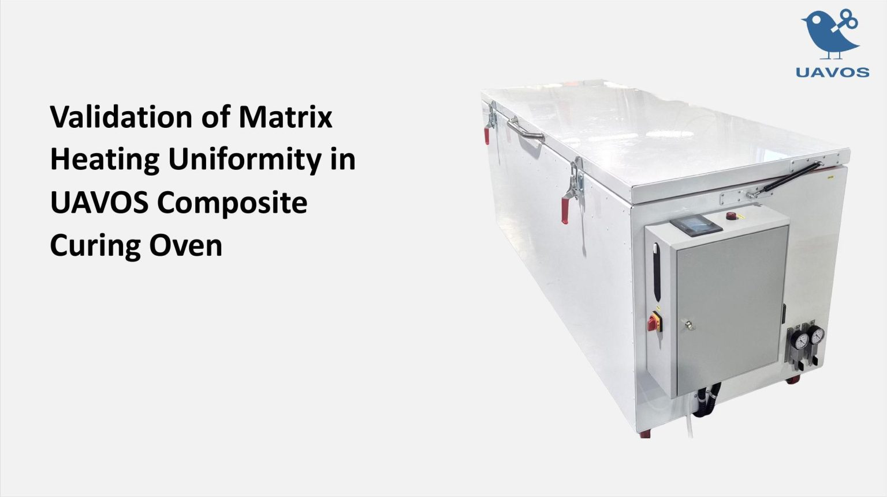
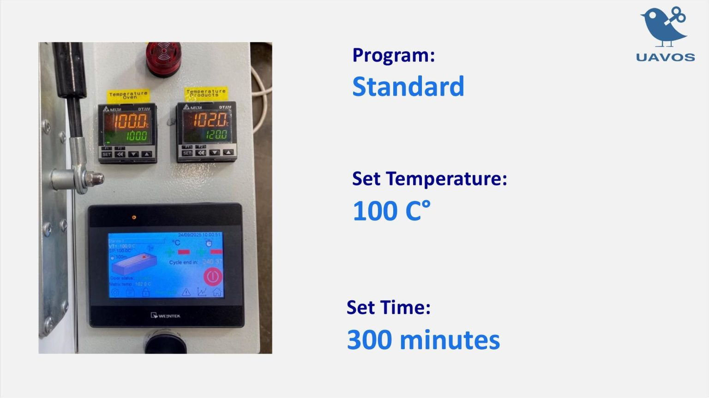
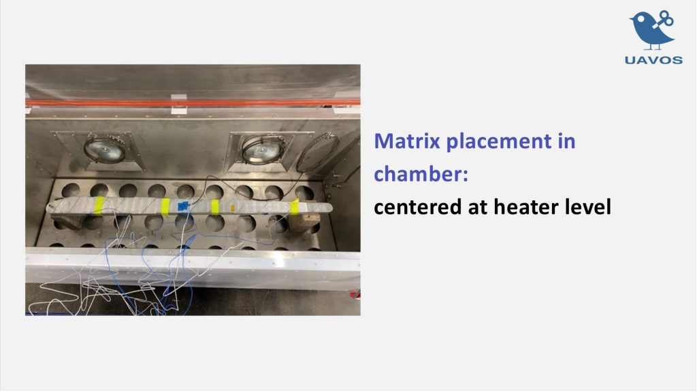
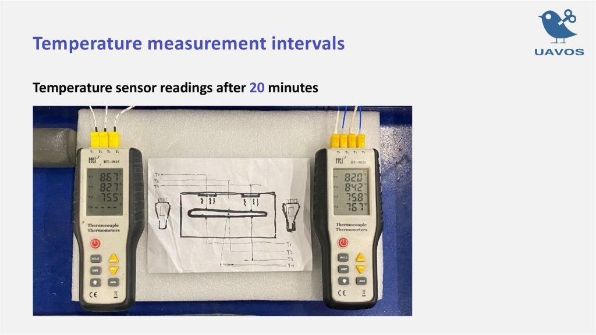
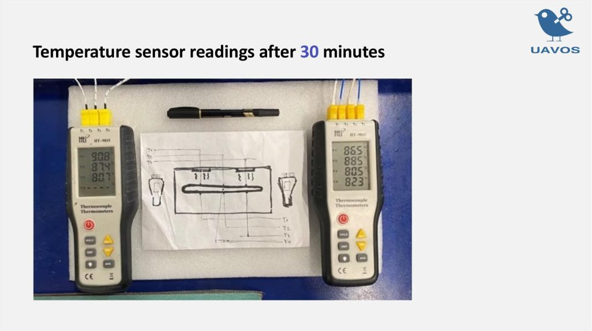
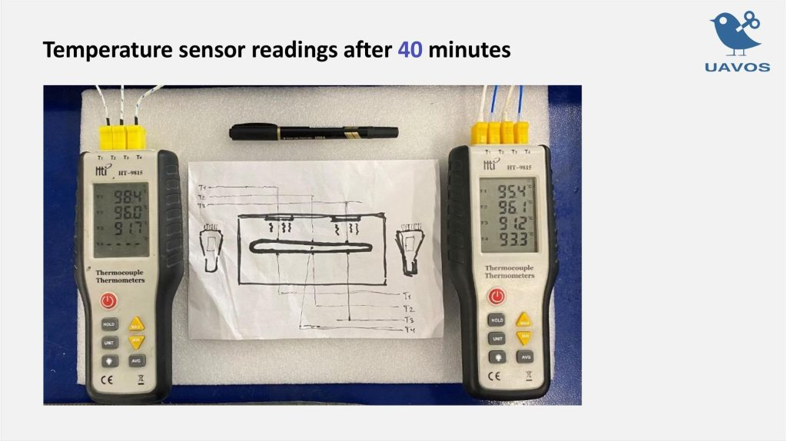
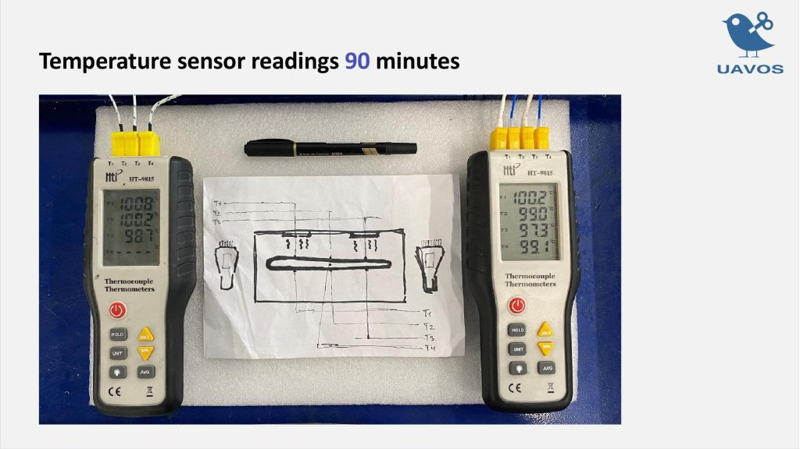
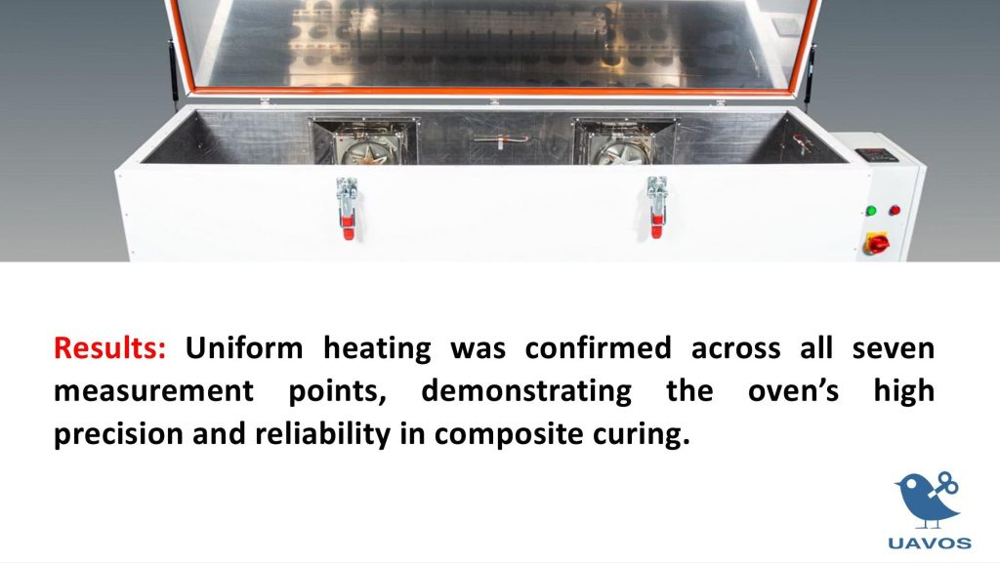

# Validation of Matrix Heating Uniformity in UAVOS Composite Curing Oven

✅ Successful Test of UAVOS Composite Curing Oven

We are pleased to share successful results of our recent test aimed at verifying the uniformity of matrix heating in the UAVOS composite curing oven.

Using the Standard program with a target temperature of 100 °C and a set time of 300 minutes, we installed seven thermocouples at evenly distributed points across the matrix. Temperature was monitored at 20, 30, 60, and 90 minutes, with the matrix reaching the target temperature after 90 minutes.

📊 Results: The test confirmed uniform heating across all seven measurement points, validating the oven’s high precision and reliability for composite production. 

> [Download the presentation as PDF-file.](/products/Validation-of-Matrix-Heating-Uniformity-in-UAVOS-Composite-Curing-Oven.pdf)

*October 2025*

