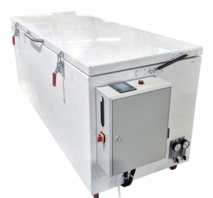

# UAVOS’ Composite Curing Oven Delivers Aerospace Grade Precision for the Aviation Industry

[UAVOS’ Composite Curing Oven](/products/lme/ce/) is an intelligent, high‑performance solution engineered to meet the stringent quality standards of the Aerospace and Aviation industry.

The top loaded ovens are specifically designed for composite manufacturing, including curing and post curing of laminates, prepregs, thermoplastics, castings, and molds. The system operates at temperatures of up to 200°C, ensuring the precise polymerization required for aerospace grade materials.

Built from aluminum and stainless steel, [UAVOS’ ovens](/products/lme/ce/) feature high accuracy PID temperature control, enabling smooth and uniform heating for consistent product curing. The combination airflow system provides both horizontal and vertical upward air circulation, maximizing heating rates and temperature uniformity across the entire work area.

> 
*Additional advanced features include a programmable logic controller (PLC) with UAVOS software, an intuitive touchscreen interface, 19 pre programmed operating modes, an integrated overheating protection system, dual vacuum supply inlets, and programmable ramp and soak cycles to adapt to specific curing profiles.*

*November 2025*