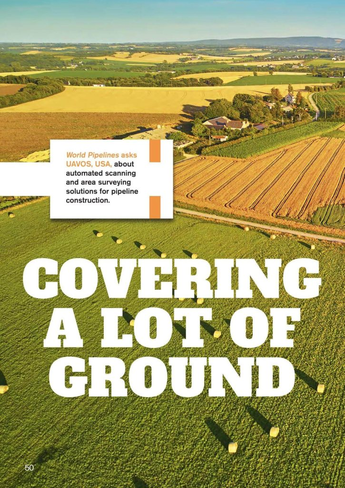
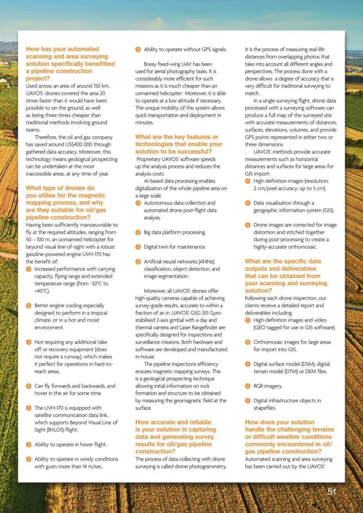
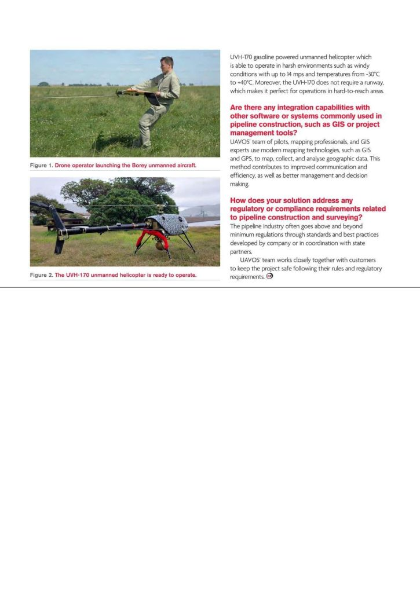
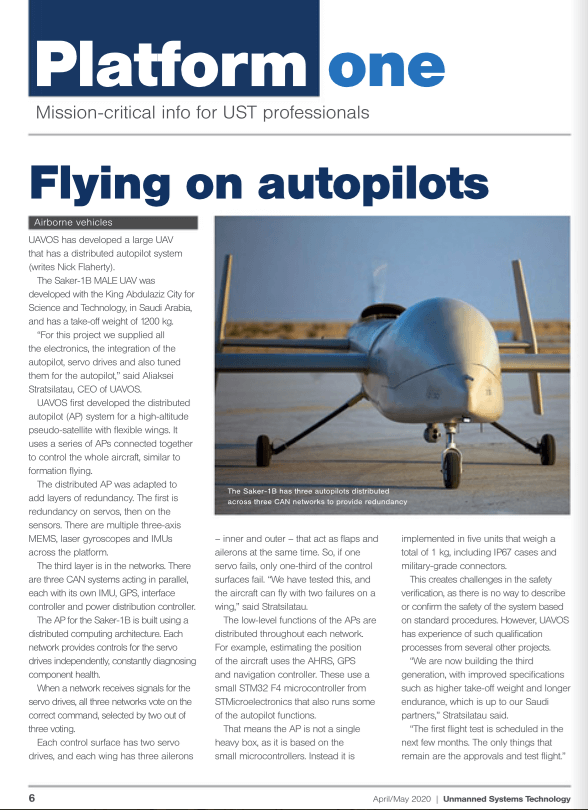
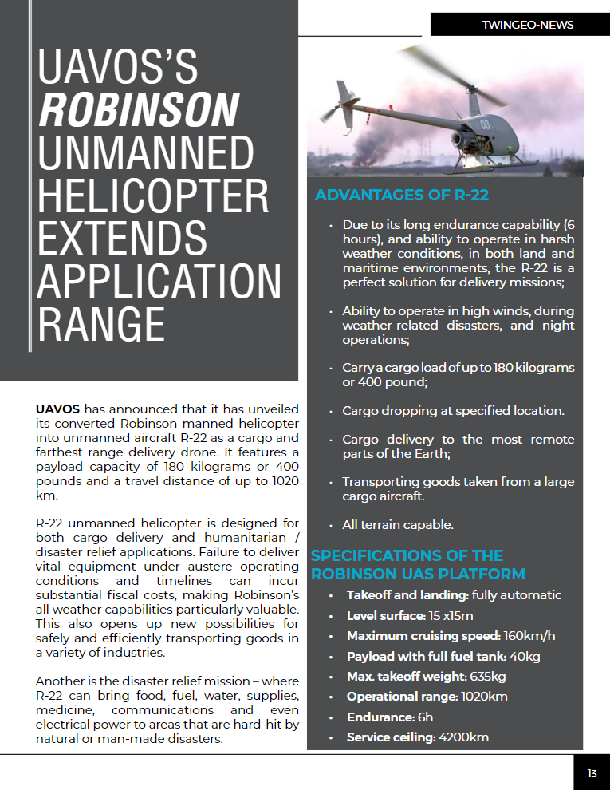

## Media Coverage

#### 8 October 2025  
**[UAV Survey: A Q&A — World Pipelines interviews Aliaksei Stratsiltau, CEO of UAVOS, about transforming UAV-based midstream, survey, and security operations](/blog/UAVOS'_World_Pipelines_interview.pdf)**  
*By: [World Pipelines Magazine](https://www.worldpipelines.com/magazine/)*

In energy and infrastructure, unmanned aerial systems (UAS) are rapidly becoming indispensable for inspection, monitoring, and security. Yet the effectiveness of a UAV is only as strong as the sensor payload it carries. For missions that demand clear visibility, accurate geolocation, and reliable performance in all conditions, a stabilised gimbal camera is not a luxury – it is mission-critical. In this Q&A, Aliaksei gives insight into UAV-based midstream, survey, and security operations.

**Read more:** [PDF](/blog/UAVOS'_World_Pipelines_interview.pdf) 

**Tags:** `Q&A` `INTERVIEW` `GIMBALS` `SURVEYING`

---

#### 15 August 2025  
**[Uavos equips Avincis helicopters with composite main rotor blades](https://www.compositesworld.com/news/uavos-to-equip-avincis-helicopters-with-composite-main-rotor-blades)**  
*By: [CompositesWorld](https://www.compositesworld.com/)*

Uavos Inc. (Mountain View, Calif., U.S.) has been selected by emergency aerial services provider Avincis (Madrid, Spain), a European company specializing in aerial emergency services and critical operations, to supply composite main rotor blades for its Lumos unmanned helicopter platform. This collaboration reinforces Uavos’ position as a trusted OEM supplier of advanced rotorcraft components to international unmanned platform operators.

**Read more:** https://www.compositesworld.com/news/uavos-to-equip-avincis-helicopters-with-composite-main-rotor-blades  

**Tags:** `COMPOSITES` `CARBON FIBERS` `ROTOR BLADES`

---

#### 13 June 2025  
**[Uavos UAV rotor blades successfully pass overload testing](https://www.compositesworld.com/news/uavos-uav-rotor-blades-successfully-pass-overload-testing)**  
*By: [CompositesWorld](https://www.compositesworld.com/)*

Unmanned aerial systems developer Uavos Inc. (Mountain View, Calif., U.S.) has announced the successful completion of overload structural testing of main rotor blades designed for helicopters with a maximum takeoff weight (MTOW) of up to 50 kilograms. The tests were conducted by Alter Technology Tüv Nord S.A.U. (Seville, Spain), a provider of testing, inspection and certification services, and confirmed the optimal structural integrity and manufacturing quality of Uavos’ composite unmanned aerial vehicle (UAV) blades, marking another milestone in the company’s expanding OEM program for third-party UAV manufacturers.

**Read more:** https://www.compositesworld.com/news/uavos-uav-rotor-blades-successfully-pass-overload-testing  

**Tags:** `COMPOSITES` `CARBON FIBERS` `ROTOR BLADES`

---

#### 20 March 2025  
**[Uavos tailors composite curing oven for aerospace customer](https://www.compositesworld.com/news/uavos-tailors-composite-curing-oven-for-aerospace-customer)**  
*By: [CompositesWorld](https://www.compositesworld.com/)*

Oven-700-4000, offering precise temperature control and low operating costs, has been customized to the client’s requirements, emphasizing Uavos’ ability to deliver on the specific needs of its customers. Uavos (Mountain View, Calif., U.S.) has announced the shipment of an electrically insulated composite curing oven to an aerospace manufacturer. The basis design of the Oven-700-4000 has been customized to the client’s requirements and has become the largest version of the Uavos ovens the company has ever produced, highlighting Uavos’ ability to offer and provide tailored technologies and services.

**Read more:** https://www.compositesworld.com/news/uavos-tailors-composite-curing-oven-for-aerospace-customer  

**Tags:** `COMPOSITES` `OVEN` `COMPOSITE CURING`

---

#### 15 January 2025  
**[Uavos upgrades composite curing ovens with controller software](https://www.compositesworld.com/products/uavos-upgrades-composite-curing-ovens-with-controller-software)**  
*By: [CompositesWorld](https://www.compositesworld.com/)*

Uavos (Mountain View, Calif., U.S.) announces the development of controller software for its composite curing ovens. The software provides a pre-programmed mode with 19 user-modifiable programs, a standard mode and a user-intuitive interface controller. According to the company, the controlling software is important in optimizing cure and ensuring an accurate, efficient process, adding precise temperature control, low running costs and practicality to a composite facility’s equipment.

**Read more:** https://www.compositesworld.com/products/uavos-upgrades-composite-curing-ovens-with-controller-software  

**Tags:** `COMPOSITES` `OVEN` `COMPOSITE CURING`

---

#### 20 November 2024  
**[AI and computer vision key to unlocking autonomous flight navigation](https://www.imveurope.com/article/ai-computer-vision-key-unlock-autonomous-flight-navigation)**  
*By: [Imaging & Machine Vision Europe](https://www.imveurope.com/)*

Aliaksei Stratsiltau, CEO of UAVOS, discusses the key technologies involved in advancing UAV navigation systems, including the integration of autopilot software with AI-led raw image processing.

**Read more:** https://www.imveurope.com/article/ai-computer-vision-key-unlock-autonomous-flight-navigation  

**Tags:** `AI` `COMPUTER VISION` `FLIGHT NAVIGATION`

---

#### 05 October 2024  
**[UAVOS and Mira Aerospace Achieve Stratospheric Success with High-Altitude Imaging Platform](https://dronelife.com/2024/09/25/uavos-and-mira-aerospace-achieve-stratospheric-success-with-high-altitude-imaging-platform/)**  
*By: [DRONELIFE](https://dronelife.com/)*

UAVOS Engineers Support Mira HAPS in Breakthrough Earth Observation Payload Deployment Across the UAE at 15,000m Altitude

California-based developer UAVOS Inc., a joint venture with Emirati company Bayanat AI, recently announced that they provided support to Mira Aerospace in a successful series of high altitude platform station (HAPS) flights across the UAE. UAVOS engineers helped develop a new earth observation payload for the Mira HAPS designed for high-resolution daylight image capture at a dizzying 15000m (9.3 miles).

Designed to achieve a strong 103 mpx resolution, the camera system includes sophisticated image processing capabilities, including electronic stabilization and object tracking and external GPS/INS integration at multiple ranges across various environments. The software’s integration with an AIS receiver allows it to identify and track moving ships.

**Read more:** https://dronelife.com/2024/09/25/uavos-and-mira-aerospace-achieve-stratospheric-success-with-high-altitude-imaging-platform/

**Tags:** `HAPS` `HIGH-ALTITUDE` `GNSS` `COMPUTER VISION`

---

#### 24 September 2024  
**[Computer vision brings autonomous flight closer](https://www.imveurope.com/article/computer-vision-brings-autonomous-flight-closer)**  
*By: [Imaging & Machine Vision Europe](https://www.imveurope.com/)*

With UAV manufacturers and flight system developers like UAVOS utilising computer vision to navigate GNSS-free environments, and NASA collecting huge data clouds to help them, are airborne transport systems about to take off?

With ground-level autonomous travel gaining trust, traction and most of the headlines, many developers of UAVs (unmanned aerial vehicles) and even manned autonomous flight systems (autopilots) are looking at the open space above, to provide the future of transport and travel.

The majority of UAVs use GNSS (global navigation satellite system) alongside inertial sensors to track their speed, direction and positioning. In either locations where GNSS reception is weak – such as in remote or mountainous areas or near physical obstructions like trees or buildings – or situations where the signals are in danger of being jammed, the use of GNSS can’t be guaranteed.

**Read more:** [https://www.imveurope.com/article/computer-vision-brings-autonomous-flight-closer](https://www.imveurope.com/article/computer-vision-brings-autonomous-flight-closer) 

**Tags:** `HAPS` `HIGH-ALTITUDE` `GNSS` `COMPUTER VISION`

---

#### 10 September 2024  
**[UAE Marks Successful Series of First-Ever HAPS Flights](https://www.defaiya.com/news/Aviation%20%26%20Space/Aviation%20%26%20Space/2024/09/10/uae-marks-successful-series-of-first-ever-haps-flights)**  
*By: [Al Defaiya](https://www.defaiya.com/)*

Mira Aerospace, a global leader in High Altitude Platform Station (HAPS) technology and a joint venture between Bayanat, a leading provider of AI-powered geospatial analytics, and UAVOS, a US-based developer and manufacturer of advanced unmanned systems, has announced the completion of a successful series of HAPS flights in the UAE.

The success of these test flights reinforces the firm’s commitment to advancing the UAE’s aerospace industry and bolsters its international standing amongst other pioneering nations.

The aircraft, which launched from Abu Al Abyad Island in the UAE, flew at stratospheric altitude for several days during each mission while carrying an advanced Earth Observation payload. Throughout this period, apart from gathering valuable flight data, a variety of scenarios were tested to investigate the potential applications of use cases specific to Earth Observation and Environmental Monitoring.

**Read more:** [defaiya.com](https://www.defaiya.com/news/Aviation%20%26%20Space/Aviation%20%26%20Space/2024/09/10/uae-marks-successful-series-of-first-ever-haps-flights)  

**Tags:** `HAPS` `HIGH-ALTITUDE` `EXTREME TEMPERATURES` `MIRA AEROSPACE`

---

#### 26 August 2024  
**[High-altitude balloon-launched UAS measurements of atmospheric turbulence and comparison with infrasound response](https://amt.copernicus.org/articles/17/4863/2024/)**  
*By: [Atmospheric Measurement Techniques](https://www.atmospheric-measurement-techniques.net/)*

**UAVOS is a part of the study of using UAVs as a practical replacement for weather balloons.**

This study investigates the use of a balloon-launched uncrewed aircraft system (UAS) for the measurement of turbulence in the troposphere and lower stratosphere. The UAS was a glider which could conduct an automated descent following a designated flight trajectory and was equipped with in situ sensors for measuring thermodynamic and kinematic atmospheric properties. In addition, this aircraft was equipped with an infrasonic microphone to assess its suitability for the remote detection of clear-air turbulence. The capabilities of the UAS and sensing systems were tested during three flights conducted in New Mexico, USA, in 2021. It was found that the profiles of temperature, humidity, and horizontal winds measured during descent were in broad agreement with those made by radiosonde data published by the US National Weather Service, separated by up to 380 km spatially and by 3 to 5 h temporally. Winds measured during controlled flight descent were consistent with the winds measured by global-positioning-system-derived velocity during balloon ascent. During controlled descent with this particular payload, a nominal vertical resolution on the order of 1 m was achieved for temperature, relative humidity, and pressure with a nominal vertical resolution of the wind velocity vector on the order of 0.1 m; the aircraft had a glide slope angle from 1 to 4° during this time. Analysis approaches were developed that provided turbulent kinetic energy and dissipation rate, but it was found that the corresponding Richardson number was sensitive to the methodology used to determine the vertical gradients from a single flight. The low-frequency content of the infrasonic microphone signal was observed to qualitatively align with long-wavelength wind velocity fluctuations detected at high altitude. Moreover, the microphone measured more broadband frequency content when the aircraft approached turbulence produced by the boundary layer.

**Read more:** [amt.copernicus.org](https://amt.copernicus.org/articles/17/4863/2024/)  

**Tags:** `HAPS` `HIGH-ALTITUDE` `EXTREME TEMPERATURES` `ATMOSPHERIC TURBULENCE`

---

#### 1 March 2024

**Covering a lot of ground**

*By: [World Pipelines Magazine](https://www.worldpipelines.com/)*

|  |  |  |
|---|---|---|

**Read more:** [issuu.com](https://issuu.com/palladianpublications/docs/worldpipelines_march_2024?fr=sZjMwMDY5ODI4Mzg)  

**Tags:** `HAPS` `HIGH-ALTITUDE` `EXTREME TEMPERATURES` `ATMOSPHERIC TURBULENCE`

---

#### 24 July 2023  
**[Mira Aerospace Successfully Tests Solar-Powered High-Altitude Pseudo Satellite](https://www.energyportal.eu/news/mira-aerospace-a-joint-venture-of-uavos-and-bayanat-successfully-completed-apsudso-solar-aircraft-test-flight/89503/)**  
*By: [EnergyPortal.eu](https://www.energyportal.eu/)*

Mira Aerospace, a joint venture between UAVOS and Bayanat, has announced the successful test flight of the ApusDuo solar-powered high-altitude pseudo satellite (HAPS). The flight took place on June 8, 2023, in the Republic of Rwanda. The ApusDuo UAS reached altitudes of 16,686m HMSL and completed a series of test points, including flight stability check, controllability, and C2 link performance evaluation.

The avionics system designed by UAVOS demonstrated stable performance in extreme temperatures. It serves as the brain of the ApusDuo unmanned aircraft, ensuring safe flight profiles throughout different phases of operation. The successful completion of this test range opens up greater possibilities for the HAPS business and brings Mira Aerospace closer to its goal of revolutionizing mobile connectivity and bridging the world’s digital divide.

**Read more:** [energyportal.eu](https://www.energyportal.eu/news/mira-aerospace-a-joint-venture-of-uavos-and-bayanat-successfully-completed-apsudso-solar-aircraft-test-flight/89503/)  

**Tags:** `HAPS` `HIGH-ALTITUDE` `EXTREME TEMPERATURES` `TELECOMMUNICATION`

---

#### 29 May 2023  
**[UAVOS supplies autonomous helicopters to Bayanat](https://www.defesecme.com/defence/air/uavos-supplies-autonomous-helicopters-to-bayanat)**  
*By: [Defence and Security Middle East](https://www.defsecme.com/)*

*UVH 25EL capabilities of long endurance of up to 1.5 hours, along with its camera capabilities which carry out accurate mapping within a radius of 67 km*

Bayanat, a provider of AI-powered geospatial solutions, has contracted UAVOS Inc to deliver Unmanned Aerial Vehicles for a wide variety of applications including aerial photography and perimeter control.

The UAV’s consists of two UVH 25EL unmanned autonomous helicopters powered by electric motors, a ground control station, and various sensor payloads including the multispectral camera, LiDAR, as well as digital and thermal cameras.

**Read more:** [defesecme.com](https://www.defesecme.com/defence/air/uavos-supplies-autonomous-helicopters-to-bayanat) 

**Tags:** `UVH 25EL` `ELECTRICAL HELICOPTER` `GROUND CONTROL STATION` `BAYANAT`

---

#### 27 March 2023  
**[WATCH: Unmanned systems developers UAVOS to develop and produce in UAE](https://www.defesecme.com/defence/watch-uavos-uae-partnership-expands-to-joint-production)**  
*By: [Defence and Security Middle East](https://www.defsecme.com/)*

*Partnership agreement strengthens regional autonomous capabilities and specialised product development*

UAE-based defence specialists, GRADEONE, expanded its partnership with US-based advanced unmanned systems developers, UAVOS, to create a joint research and development, production centre for autonomous solutions and weapon systems.

GRADEONE, an EDGE company, said in a statement that the centre will initially focus on the development of laser-based counter UAV solutions and high-speed aerial targets for the region.

**Read more:** [defesecme.com](https://www.defesecme.com/defence/watch-uavos-uae-partnership-expands-to-joint-production)  

**Tags:** `EDGE GROUP` `IDEX 2023` `UAE` `GRADONE`

---

#### 9 March 2023  
**[EDGE, UAVOS to Establish Joint R&D Centre for Autonomous Solutions](https://www.defaiya.com/news/Joint%20Ventures/Joint%20Ventures/2023/03/09/edge-uavos-to-establish-joint-research-development-centre-for-autonomous-solutions)**  
*By: [Al Defaiya](https://www.defaiya.com/)*

GRADEONE, a defense trading specialist concentrating in manufacturing non-lethal pyrotechnics, ammunition, defense-related components and packing solutions, signed a Memorandum of Understanding (MoU) with UAVOS, a developer and manufacturer of advanced unmanned systems, to create a joint research and development, production and commercialisation centre for autonomous solutions and weapon systems.

As per the MoU, the centre will initially focus on the development of laser-based counter UAV solutions and high-speed aerial targets for the region. The companies will jointly work in additional key areas regarding the development and adoption of security technology for autonomous platforms, including piloted aircraft conversion.

**Read more:** [defaiya.com](https://www.defaiya.com/news/Joint%20Ventures/Joint%20Ventures/2023/03/09/edge-uavos-to-establish-joint-research-development-centre-for-autonomous-solutions)  

**Tags:** `SAUDI ARABIA` `HIGH ALTITUDE` `UAE` `GRADONE`

---

#### 26 October 2022  
**[For the first time, an Emirati company begins producing high-altitude drones HAPS in cooperation with UAVOS company (Arabic)](https://sdarabia.com/2022/10/26/%D8%A8%D9%8A%D8%A7%D9%86%D8%A7%D8%AA-%D8%AA%D8%A8%D8%AF%D8%A3-%D8%A8%D8%A5%D9%86%D8%AA%D8%A7%D8%AC-%D8%B7%D8%A7%D8%A6%D8%B1%D8%A7%D8%AA-%D9%85%D8%B3%D9%8A%D8%B1%D8%A9-%D8%B9%D8%A7%D9%84%D9%8A%D8%A9-%D8%A7%D9%84%D8%A7%D8%B1%D8%AA%D9%81%D8%A7%D8%B9-%D8%A8%D8%A7%D9%84%D8%AA%D8%B9%D8%A7%D9%88%D9%86-%D9%85%D8%B9-%D8%B4%D8%B1%D9%83%D8%A9-uavos/)**  
*By: [SDArabia.com](https://sdarabia.com/)*

In a first of its kind, the UAE company Bayanat will start producing high-altitude UAV, or what is known as the Pseudo Satellite-like UAV, which runs on solar energy, in cooperation with the American company UAVOS, which specializes in unmanned vehicles.

**Read more:** [sdarabia.com](https://sdarabia.com/2022/10/26/%D8%A8%D9%8A%D8%A7%D9%86%D8%A7%D8%AA-%D8%AA%D8%A8%D8%AF%D8%A3-%D8%A8%D8%A5%D9%86%D8%AA%D8%A7%D8%AC-%D8%B7%D8%A7%D8%A6%D8%B1%D8%A7%D8%AA-%D9%85%D8%B3%D9%8A%D8%B1%D8%A9-%D8%B9%D8%A7%D9%84%D9%8A%D8%A9-%D8%A7%D9%84%D8%A7%D8%B1%D8%AA%D9%81%D8%A7%D8%B9-%D8%A8%D8%A7%D9%84%D8%AA%D8%B9%D8%A7%D9%88%D9%86-%D9%85%D8%B9-%D8%B4%D8%B1%D9%83%D8%A9-uavos/)  

**Tags:** `SAUDI ARABIA` `HIGH ALTITUDE` `UAE` `ALBATROS`

---

#### 13 October 2022  
**[Gitex in Dubai: G42 firm Bayanat signs joint partnership deal with UAVOS for HAPS](https://www.khaleejtimes.com/events/gitex-in-dubai-g42-firm-bayanat-signs-joint-partnership-deal-with-uavos-for-haps)**  
*By: [KhaleejTimes.com](https://www.khaleejtimes.com/)*

Bayanat, which is a part of the Abu Dhabi-based G42 since 2020 and is unlocking its ambitious plans to be leader for geospatial data in the UAE and beyond, signed a joint partnership agreement with UAVOS, a manufacturer of unmanned vehicles intended to serve the European and the US markets — at the ongoing Gitex Global in Dubai on Thursday, the penultimate day of the biggest technology event in the Middle East.

**Read more:** [khaleejtimes.com](https://www.khaleejtimes.com/events/gitex-in-dubai-g42-firm-bayanat-signs-joint-partnership-deal-with-uavos-for-haps)  

**Tags:** `SAUDI ARABIA` `HIGH ALTITUDE` `UAE` `ALBATROS`

---

#### 6 October 2022  
**[As Western defense firms eye expansion in the UAE, local competition awaits](https://breakingdefense.com/2022/10/as-western-defense-firms-eye-expansion-in-the-uae-local-competition-awaits/)**  
*By: [BreakingDefense.com](https://breakingdefense.com/)*

BEIRUT — As the Gulf region attracts more attention from eager defense companies the world over, it’s becoming apparent that direct competition with local firms can be a tough hill to climb. But local partnerships, on the other hand, offer a potentially lucrative way to new customers.

**Read more:** [breakingdefense.com](https://breakingdefense.com/2022/10/as-western-defense-firms-eye-expansion-in-the-uae-local-competition-awaits/)  

**Tags:** `SAUDI ARABIA` `HIGH ALTITUDE` `UAE` `ALBATROS`

---

#### 4 September 2022  
**[Vadim Tarasov, UAVOS’ Board of Chair, interviewed by Al Arabiya](https://www.youtube.com/watch?v=0ez4nPROs-g)**  
*By: [Al Arabiya](https://english.alarabiya.net/)*

Vadim Tarasov, UAVOS' Board of Chair, has been interviewed by Al Arabiya, the main news channel in the Arab world. The discussion was related to UAVOS' latest unmanned systems innovations and prospective projects related to the recent opening of UAVOS' subsidiary in Dubai.  

For more information, see: https://youtu.be/0ez4nPROs-g

**Tags:** `SAUDI ARABIA` `HIGH ALTITUDE` `UAE` `ALBATROS`

---

#### 26 August 2022  
**[الأولى في الإمارات..شركة عربية تبدأ إنتاج طائرات بدون طيار HAPS بالتعاون مع شركة UAVOS](https://sdarabia.com/2022/08/%D8%A8%D9%8A%D8%A7%D9%86%D8%A7%D8%AA-%D8%AA%D8%AA%D9%88%D8%B3%D8%B9-%D9%81%D9%8A-%D8%A7%D9%84%D8%B4%D8%B1%D9%82-%D8%A7%D9%84%D8%A3%D9%88%D8%B3%D8%B7-%D9%81%D9%8A-%D9%85%D8%AC%D8%A7%D9%84-%D8%A7%D9%84%D8%AF%D9%81%D8%A7%D8%B9-%D9%85%D8%B9-%D8%B4%D8%B1%D9%83%D8%A9-uavos-%D9%84%D9%81%D8%AA%D8%AD-%D9%85%D9%82%D8%B1-%D9%84%D9%87%D8%A7-%D9%81%D9%8A-%D8%A7%D9%84%D8%A5%D9%85%D8%A7%D8%B1%D8%A7%D8%AA/)**  
*By: [SDArabia.com](https://sdarabia.com/)*

الأمن والدفاع العربي- خاص

تسعى كبرى شركات الدفاع العالمية لإيجاد موطئ قدم لها في الشر ق الأوسط وخاصة الخليج العربي حيث تعتبر  هذه الدول من أكبر المستوردين للمعدات الدفاعية في العالم. ومن أبرز هذه الوجهات، الإمارات العربية المتحدة التي اختارتها معظم هذه الشركات لفتح مراكز رئيسية لها في المنطقة ضمن الإمارات ومن بين هذه الشركات UAVOS الأميركية الشهيرة بصناعة المسيرات الدفاعية ذات الإستخدامات المتعددة.

وفي التفاصيل، أعلنت شركة UAVOS ، المطورة والمصنعة للأنظمة غير المأهولة المتقدمة ، عن تأسيس شركة تابعة لها في دبي ، الإمارات العربية المتحدة ، لدعم الوجود الإقليمي المتزايد للشركة. وبحسب بيان الشركة، سيهدف التركيز الأساسي إلى تعزيز الشراكات الحالية للطائرات بدون طيار في البلاد والتعاون مع الشركات المحلية للمشاركة في مشاريع البحث والتطوير المحلية لمساعدتها على تحقيق أهداف الاكتفاء الذاتي في كل من القطاعات التجارية والأمنية.

تقوم شركة UAVOS بتصميم وتطوير وتصنيع أحدث الأنظمة بدون طيار ، بما في ذلك HAPS والعديد من الطائرات بدون طيار الثقيلة التي يزيد وزنها عن 2000 كجم ، وأنظمة الطيران الآلية بالكامل بالإضافة إلى معدات ومكونات للطائرات بدون طيار.

**Read more:** [sdarabia.com](https://sdarabia.com/2022/08/%D8%A8%D9%8A%D8%A7%D9%86%D8%A7%D8%AA-%D8%AA%D8%AA%D9%88%D8%B3%D8%B9-%D9%81%D9%8A-%D8%A7%D9%84%D8%B4%D8%B1%D9%82-%D8%A7%D9%84%D8%A3%D9%88%D8%B3%D8%B7-%D9%81%D9%8A-%D9%85%D8%AC%D8%A7%D9%84-%D8%A7%D9%84%D8%AF%D9%81%D8%A7%D8%B9-%D9%85%D8%B9-%D8%B4%D8%B1%D9%83%D8%A9-uavos-%D9%84%D9%81%D8%AA%D8%AD-%D9%85%D9%82%D8%B1-%D9%84%D9%87%D8%A7-%D9%81%D9%8A-%D8%A7%D9%84%D8%A5%D9%85%D8%A7%D8%B1%D8%A7%D8%AA/)  

**Tags:** `UAVOS` `BRANCH` `UAE` `HAPS`

---

#### 2 Jule 2022  
**[Stratodynamics Wins Prestigious Upper Airspace Traffic Management Award](https://medium.com/rc-soaring-digest/stratodynamics-wins-prestigious-upper-airspace-traffic-management-award-369477b9ce71)**  
*By: [The New RC Soaring Digest](https://medium.com/u/4da156bf6050?source=post_page-----369477b9ce71--------------------------------)*

**Stratodynamics Wins Prestigious Upper Airspace Traffic Management Award.**

Along with collaborator UAVOS Inc., this aerospace innovator takes home top honours.

STAMFORD, LINCOLNSHIRE, UK, June 22, 2022 —Air Traffic Management magazine just announced the winners of their recently concluded ATM Awards. Amongst winners in a variety of categories, Stratodynamics Inc. along with their collaborator UAVOS Inc. took first place honours in the Upper Airspace category, intended for “new aircraft, new traffic management requirements [and] new ways of working” in the upper atmosphere.

From the New RCSD article Like Soaring on Mars in the July, 2021 issue: “Stratodynamics’ HiDRON™ high altitude research platform likely has achieved a new ‘high bar’ for great places to start a great flight — how about 30km (98,000ft) above the New Mexico desert, as was the case on June 6th, 2021. Five hours after being released from its weather balloon launch vehicle, HiDRON™ landed safely at Spaceport America, located at Truth or Consequences, New Mexico…”

**Read more:** [medium.com](https://medium.com/rc-soaring-digest/stratodynamics-wins-prestigious-upper-airspace-traffic-management-award-369477b9ce71)  

**Tags:** `STRATODYNAMICS` `HIDRON` `HEAVY-DUTY` `HIGH ALTITUDE`

---

#### 22 February 2022  
**[GradeOne Group and UAVOS partner companies to debut autonomous aircraft technology and global security solutions at UMEX](https://www.suasnews.com/2022/02/gradeone-group-and-uavos-partner-companies-to-debut-autonomous-aircraft-technology-and-global-security-solutions-at-umex/)**  
*By: [www.SUASnews.com](https://www.suasnews.com/)*

**GradeOne Group and UAVOS Partner companies to debut autonomous aircraft technology and global security solutions at UMEX.**

UAVOS Inc. together with MP3 International, a Grade One Group member company, are presenting a number of products for the UMEX Unmanned Systems Exhibition and Conference to be held February 20 – 23 at the National Exhibition Center, Abu Dhabi.  UAVOS and MP3 are located in Hall 5, Booth No. A-12 and will be showcasing their key security and defense products with a focus on their command and control integration expertise. 

UAVOS and MP3 are showcasing their comprehensive operational solutions – unmanned systems for a wide range of uses in the air, sea, and land 

**Read more:** [sUASnews.com](https://www.suasnews.com/2022/02/gradeone-group-and-uavos-partner-companies-to-debut-autonomous-aircraft-technology-and-global-security-solutions-at-umex/)  

**Tags:** `CONVERTED` `HIGH-ALTITUDE` `HEAVY-DUTY`

---

#### 19 July 2021  
**[Rethinking Weather with UAVs](https://www.industryweek.com/technology-and-iiot/article/21169490/rethinking-weather-with-uavs)**  
*By: [IndustryWeek.com](https://www.industryweek.com/)*

**Collaborative group studies the use of UAVs as a practical replacement for weather balloons.**

Over the years technology evolutions have played a meaningful role in helping scientists better understanding weather, providing the insights needed to make better predictions. Of course, gaining a better understanding often requires conducting multiple tests.

Case in point? UAVOS Inc. and Stratodynamics Inc. have successfully performed a series of stratospheric flights with the balloon launched HiDRON, an autonomous aircraft. The mission objectives were to advance new systems for forward sensing turbulence detection onboard aircraft at near-space and commercial flight altitudes. The early June campaign was supported by the NASA Flight Opportunities Program to advance turbulence detection sensors developed by the University of Kentucky (UKY) and NASA’s Langley Research Center.

**Read more:** [https://www.industryweek.com/technology-and-iiot/article/21169490/rethinking-weather-with-uavs](https://www.industryweek.com/technology-and-iiot/article/21169490/rethinking-weather-with-uavs)  

**Tags:** `HIDRON` `HIGH-ALTITUDE` `BALLOON` `WEATHER PREDICTIONS`

---

#### 28 April 2021
**[UAVOS performs test flight of experimental turbulence payload](/blog/UAVOS-performs-test-flight-of-experimental-turbulence-payload.pdf)**  
*By:  [Janes](https://www.janes.com/), Pat Host, Washington, DC*

UAVOS carried out the test flight of an experimental turbulence detection payload on its HiDRON stratospheric glider on 1 April.

UAVOS’ operators launched the HiDRON from a high-altitude balloon at 23,900 m/78,412 ft. A launch routine was tested in which the HiDRON transitioned from free-fall to stable horizontal flight at 23,100 m/75,787 ft.

The payload was a combination of forward-sensing turbulence detection technologies developed by the University of Kentucky (UK) and a US federal agency that UAVOS declined to specify. The flight test aimed to help researchers assess the performance of a wind probe, along with an infrasonic microphone sensor.

**Read more:** [pdf](/blog/UAVOS-performs-test-flight-of-experimental-turbulence-payload.pdf)  

**Tags:** `HIDRON` `HIGH-ALTITUDE` `BALLOON` `UNIVERSITY OF KENTUCKY`

---

#### 20 April 2021
**[Interview with Vadim Tarasov, Chair of the Board at UAVOS INC. & Partner at Advanced Autonomous Solutions Fund](https://dronetalks.online/dronetalks-vadim-tarasov-investor/)**  
*By:  [DroneTalks.online](https://dronetalks.online/)*

In this exclusive DroneTalks interview we sat down with Vadim Tarasov, Chairman of the Board at UAVOS & Partner at Advanced Autonomous Solutions Fund, to get an investor's perspective on the status of the industry, cutting-edge technology, hot areas, the regulatory aspect, and social acceptance of drones.

Vadim explains how he made the jump from investing in e-commerce and entertainment to investing in deep-tech companies, with a focus on technologies that have the potential to disrupt traditional industries.

Hear from Vadim to learn more about the huge potential foreseen for UAVs across the logistics, inspection, and security markets, as well as the entry barriers that are currently preventing these technologies from completely overtaking the market.

**Watch the interview:** https://www.youtube.com/watch?v=cegvH0BN5lI

**Tags:** `INTERVIEW` `INVESTMENTS` `REGULATORY ASPECT` `UAV INDUSTRY`

---

#### 4 March 2021
**[UAVOS’ Vadim Tarasov Talks about its Notable Work in the UAV Market on the EVTOL INSIGHTS Podcast](https://evtolinsights.com/2021/03/uavos-vadim-tarasov-talks-about-its-notable-work-in-uav-market-on-the-evtol-insights-podcast/)**  
*By:  [EVTOL INSIGHTS](https://evtolinsights.com/)*

In our latest podcast episode, it was great to welcome Vadim Tarasov, who is Chairman of the Board at UAVOS.

The company specialises in the design, development and manufacturing of unmanned vehicles and autopilot systems, as well as components such as servo drives, pan-tilt platforms, rescue/emergency landing systems. Its solutions range from small industrial surveillance drones to large unmanned aircraft vehicles (UAVs).

Vadim told us more about the work UAVOS is doing in this space and went into detail about the exciting progress it is making. He also gives his insight into the UAV market, what the potential applications will be and talks about the future of autonomous operations in future.

**Listen to the interview:** https://evtolinsights.com/2021/03/uavos-vadim-tarasov-talks-about-its-notable-work-in-uav-market-on-the-evtol-insights-podcast/

**Tags:** `INTERVIEW` `INVESTMENTS` `UAV MARKET`

---

#### 28 December 2020
**[Converted Alpin UAV Completes First Successful Flight in Turkey](https://insideunmannedsystems.com/converted-alpin-uav-completes-first-successful-flight-in-turkey/)**  
*By:  [Inside Unmanned Systems](https://insideunmannedsystems.com/)*

The Alpin UAV, a converted system modeled after the manned helicopter, recently completed its first test flight in Turkey.

The UAV was created to meet the needs of the Turkish Rescue & Security industries and is a joint project between Turkish engineering company TITRA and UAVOS, a UAS researcher, developer and manufacturer, according to a news release. The Alpin unmanned helicopter is currently being launched in the Turkish market.

**Tags:** `HELICOPTER` `LONG-RANGE` `HEAVY-LIFT`

---

#### 28 December 2020
**[HAPS/HALE: Seeking Solar’s Sweet Spot](https://insideunmannedsystems.com/haps-hale-seeking-solars-sweet-spot/)**  
*By:  [Inside Unmanned Systems](https://insideunmannedsystems.com/)*

Many years ago, as a young newspaperman, I received a plum assignment to retrace Charles Lindbergh’s trans-Atlantic flight. Rather than shivering in the Spirit of St. Louis monoplane, I flew the Atlantic in the Mach Two comfort of the Concorde. Eating lobster at a near-stratospheric 60,000 feet, I squinted at the curvature of the earth.
The quest to soar toward the sun dates back to mythology. But during 2020, an increasing number of lightweight unmanned vehicles have explored paths toward sustained solar-powered high altitude flight. Known as HAPS and/or HALE (see the “HAPS, HALE or Both?” sidebar on page 20), they soar between 55,000 and 70,000 feet above sea level, above clouds, wind and weather, with less power needed to maintain position. Station keeping above one point, or through footprint-expanding mini-fleets with reinforcing capabilities, they can cover more territory than ground stations and offer greater resolution, decreased latency and much lower costs against satellites. They can be landed and replaced during a single weather window.

**Tags:** `HALE` `HAPS` `COMPARISON` `ENDURABLE UAV`

---

#### 17 December 2020
**[UAVOS, TITRA perform first flight of Alpin rotary wing UAV](/blog/UAVOS-TITRA-perform-first-flight-of-Alpin.pdf)**  
*By:  [Janes](https://www.janes.com/), Pat Host, Washington, DC*

UAVOS and Turkish engineering company TITRA performed the first flight of their Alpin rotary wing unmanned aerial vehicle (UAV) in early November.

The Alpin is a long-range, heavy-lift unmanned helicopter capable of carrying payloads weighing as much as 160 kg with a range of up to 840 km. It features a wideband satellite communication channel from its command-and-control station. The Alpin can withstand severe weather conditions, carry multiple payloads, and transmit real-time information to forces and decision makers in the field.

**Read More:** [PDF](/blog/UAVOS-TITRA-perform-first-flight-of-Alpin.pdf)

**Tags:** `HEAVYWEIGHT` `PAYLOAD` `HELICOPTER`

---

#### 28 October 2020
**[UAVOS flight testing unmanned helicopter in greater than 100 kg payload class](/blog/UAVOS-helicopter-100kg.pdf)**  
*By:  [Jane's 360](https://www.janes.com/), Pat Host, Washington, DC*

UAVOS has spent more than 70 hours flight testing an unmanned helicopter capable of carrying up to 160 kg with a range of up to 840 km.

Vadim Tarasov, UAVOS board member and shareholder, told Janes on 20 October that the aircraft, the UVH-500, is based on the piloted rotary-wing aircraft. Tarasov said UAVOS is developing an unmanned helicopter in this payload capacity class because there are many unmanned aircraft that can carry between 1-5 kg. Industrial companies, he said, want the capability to carry payloads weighing more than 50 kg over long distances such as across rivers or giant forests in hot and cold conditions.

**Read More:** [PDF](/blog/UAVOS-helicopter-100kg.pdf)

**Tags:** `HEAVYWEIGHT` `PAYLOAD` `HELICOPTER`

---

#### 12 October 2020
**[Update: UAVOS flight tests HAPS ApusDuo in unstable atmospheric conditions](/blog/Update-UAVOS-flight-tests-HAPS-ApusDuo-in-unstable-atmospheric-conditions.pdf)**  
*By:  [Jane's 360](https://www.janes.com/), Pat Host, Washington, DC*

UAVOS recently reached a milestone in its solar-powered High-Altitude Pseudo Satellite (HAPS) ApusDuo development by flying the aircraft in unstable atmospheric conditions, according to a company statement.

UAVOS performed a series of flight trials in July with the ApusDuo in Belarus at altitudes up to 62,336 ft. The company tested a unique control system, which UAVOS said allows HAPS aircraft with a large wing elongation similar to the ApusDuo to fly in unstable atmospheric conditions.

**Read More:** [PDF](/blog/Update-UAVOS-flight-tests-HAPS-ApusDuo-in-unstable-atmospheric-conditions.pdf)

**Tags:** `HEAVYWEIGHT` `PAYLOAD` `HELICOPTER`

---

#### 22 August 2020
**[Silicon Valley Chapter’s Own UAVOS Presented A Concept ‘Sumo’ UAM Vehicle!](https://web.archive.org/web/20201026220029/http://wp.auvsisiliconvalley.org/2020/08/22/uavos-presented-a-concept-sumoair-urban-air-taxi-uavos-has-presented-its-air-taxi-sumoair-as-an-autonomous-concept-for-vertical-e-mobility-the-all-electric-tandem-rotor-helicopter-concept-consists/)**  
*By:  [Silicon Valley Chapter of AUVSI](http://wp.auvsisiliconvalley.org/)*

UAVOS has presented its air taxi SumoAir as an autonomous concept for vertical e-mobility. The all-electric, tandem rotor helicopter concept consists of a five-seater passenger including the pilot cabin that can be attached to either a car or a flight module. The helicopter will be operated both manually and autonomously. The project is a part of UAVOS’ R&D efforts to explore and understand the fundamental technologies behind electric aircraft and the urban air mobility (UAM) market.

SumoAir unmanned helicopter has a tandem-rotor configuration with two large horizontal rotors mounted one in front of the other. The UAV features two redundant high – lift propulsion units. Their three-bladed rotors are driven by two electric motors at around 520 rpm to ensure a low acoustic footprint. UAVOS’s air taxi concept has additional safety advantages to the existing option such as autorotation flight and landing capability. SumoAir is targeting a cruise speed of approximately 87 mi/h (140 km/h) with endurance up to 1,3 h. The passengers will be able to cruise at altitudes up to 8,200 ft (2,500 m).

**Read More:** https://web.archive.org/web/20201026220029/http://wp.auvsisiliconvalley.org/2020/08/22/uavos-presented-a-concept-sumoair-urban-air-taxi-uavos-has-presented-its-air-taxi-sumoair-as-an-autonomous-concept-for-vertical-e-mobility-the-all-electric-tandem-rotor-helicopter-concept-consists/

**Tags:** `TAXI` `CONCEPT` `UNMANNED HELICOPTER`

---

#### 1 June 2020
**[UAVOS Successfully Tests Parachute System](/blog/UAVOS-July.pdf)**  
*By:  [Nation Shield](http://www.nationshield.ae/)*

UAVOS has successfully tested its new two-stage parachute system. The new parachute system design is aimed to provide slow descent of the unmanned air system (UAS) at high speed. It includes two parachutes – the pilot chute and the main chute used to slow and stabilise the UAS. The decrease in the load speed on the UAS occurs due to the main chute opening delay function, when the pilot chute opens first. The parachute system is designed for UAS with speeds of up to 280 mph (450 kph) and weight of up to 110 lb (50 kg).

The pilot chute allows safe slow descent of the UAV during the main parachute deployment, as well as to open up the main chute at a minimum altitude.

**Read More:** [PDF](/blog/UAVOS-July.pdf)

**Tags:** `PARACHUTE` `RESCUE SYSTEM`

---

#### 29 May 2020
**[UAVOS, KACST developing new Saker-1C MALE unmanned aircraft](/blog/UAVOS_ KACST_developing_new_Saker-1C_MALE_unmanned_aircraft.pdf)**  
*By:  [Jane's 360](https://www.janes.com/), Pat Host, Washington, DC*

UAVOS and the King Abdulaziz City for Science and Technology (KACST) of Saudi Arabia are developing a new medium altitude long endurance (MALE) unmanned aerial vehicle, the Saker-1C, according to a company statement.

The Saker-1C can carry payloads ranging from synthetic aperture radar (SAR), imagery and coherent change detection, gyro-stabilised electro-optical/infrared (EO/IR) gimbal, and digital video datalink. The aircraft is designed to perform long-endurance surveillance, communications relay, and search and rescue missions, among others.

**Read More:** [PDF](/blog/UAVOS_ KACST_developing_new_Saker-1C_MALE_unmanned_aircraft.pdf)

**Tags:** `SAKER` `LONG RANGE` `KACST` `UNMANNED AIRCRAFT`

---

#### 26 May 2020
**[UAVOS Saker-1C MALE UAS developed with KACST, new parachute system proved efficient](https://www.armyrecognition.com/may_2020_news_defense_global_security_army_industry/uavos_saker-1c_male_uas_developed_with_kacst_new_parachute_system_proved_efficient.html)**  
*By:  [Army Recognition](https://www.armyrecognition.com/)*

The Saker-1C Medium Altitude Long Endurance (MALE) Unmanned Aerial System (UAS) project, a successful partnership of UAVOS and King Abdulaziz City for Science and Technology (KACST), Saudi Arabia, includes development, flying and maintenance, UAS Weekly reports.

UAVOS and KACST are working together to develop the next generation of Saker MALE UAS family – Saker – 1C UAV/UAS. The goal is to redesign and improve UAS features extending from engineering to operation. The UAVOS and KACST effort is focused on utilizing advanced manufacturing technologies and integrating next-generation capabilities including state-of-the-art autonomy, navigation, communications, sensor processing and system of counter electronic warfare.

**Read More:** https://www.armyrecognition.com/may_2020_news_defense_global_security_army_industry/uavos_saker-1c_male_uas_developed_with_kacst_new_parachute_system_proved_efficient.html

**Tags:** `UAS` `PARACHUTE SYSTEM` `SAKER` `CONVERTED`

---

#### 20 April 2020
**[UAVOS tests UVH-170 unmanned helicopter for automated cargo deliveries](/blog/UAVOS_tests_UVH-170_unmanned_helicopter_for_automated_cargo_deliveries.pdf)**  
*By:  [Jane's 360](https://www.janes.com/), Pat Host, Washington, DC*

UAVOS recently flew a pair of test flights of its UVH-170 unmanned helicopter, simulating automated delivery flights to a destination and back along preselected pathways.

The pair of flights that took place between 10-16 April, one covering 50 km and another covering 100 km, lasted a total of 102 minutes. In a video provided by UAVOS, the aircraft used a 20 m rope to ferry a payload of 8 kg during one of the test flights.

**Read More:** [PDF](/blog/UAVOS_tests_UVH-170_unmanned_helicopter_for_automated_cargo_deliveries.pdf)

**Tags:** `UAS` `PARACHUTE SYSTEM` `SAKER` `CONVERTED`

---

#### 16 April 2020
**[Flying on autopilots](https://ust-media.com/ust-magazine/UST031/6/)**  
*By:  [Unmanned Systems Technology](https://ust-media.com/)*

**Read More:** https://ust-media.com/ust-magazine/UST031/6/

**Tags:** `UAV SYSTEMS` `SAKER`

---

#### 5 April 2020
**[UAVOS and KACST Team Up on UAVs](/blog/UAVOS-ENG-APR2020.pdf)**  
*By:  [Nation Shield](http://www.nationshield.ae/)*

UAVOS recently announced its collaboration with King Abdulaziz City for Science and Technology (KACST), Saudi Arabia. The two entities will work together on scientific research and development of the Flight Control System (FCS).

The FCS is designed to fit and leverage multi-mission, multi-domain UAV platforms. The experience and knowledge the partners have shared, resulted in the creation of a Saker-1B Medium Altitude Long Endurance (MALE) UAS (Un- manned Aerial System). The specifications of the UAV system is confirmed by more than 500 hours of day and night test missions under various weather conditions. A total of 1,000 hours of take-off and landing test missions were successfully performed. The long endurance flights lasted up to 19 hours. The UAV is equipped with satellite communication data link for Beyond Line of Sight (BVLOS) operation.

**Read More:** [PDF](/blog/UAVOS-ENG-APR2020.pdf)

**Tags:** `KACST` `UAV SYSTEMS` `LONG ENDURANCE`

---

#### 1 April 2020
**[UAVOS, KACST demonstrate progressive flight control capability for their Saker UAVs](/blog/UAVOS_KACST_demonstrate_progressive_flight_control_capability_for_their_Saker_UAVs.pdf)**  
*By:  [Jane's](https://www.janes.com/)*

UAVOS and the King Abdulaziz City for Science and Technology (KACST) have used two ground control stations (GCSs) to fly their Saker-1B medium-altitude, long-endurance (MALE) unmanned aerial vehicle (UAV) for the first time.

UAVs, with this progressive flight control capability, can automatically land on remote runways located thousands of kilometers away where it can be serviced by a crew before taking off for another mission, according to a UAVOS statement. The company believes this capability will save resources of command stations by eliminating the need to return to the original takeoff point for fueling.

**Read More:** [PDF](/blog/UAVOS_KACST_demonstrate_progressive_flight_control_capability_for_their_Saker_UAVs.pdf)

**Tags:** `SAKER` `SAUDI ARABIA` `LONG RANGE UAV`

---

#### 16 March 2020
**UAVOS's Robinson Unmanned Helicopter Extends Application Range**  
*By: TwinGEO Magazine*

UAVOS has announced that it has unveiled its converted Robinson manned helicopter into unmanned aircraft R-22 as a carto and farthest range delivery drone. It features a payload capacity of 180 kilograms or 400 pounds and a travel distance of up to 1020 km.

R-22 unmanned helicopter is designed for both cargo delivery and humanitarian / disaster relief applications. Failure to deliver vital equipment under austere operating conditions and timelines can incur substantial fiscal costs, making Robinson's all weather capabilities particularly valuable. This also opens up new possibilities for safety and efficiently transporting goods in a variety of industries.

**Read More:** - <ModalLink type="gallery" title="Image"> </ModalLink>

**Tags:** `ROBINSON` `HELICOPTER` `LONG RANGE` `CONVERTED AIRCRAFT`

---

#### 6 March 2020
**[UAVOS, KACST unveil Saker-1B autonomous-capable MALE UAV](/blog/UAVOS-KACST-unveil-Saker-1B-autonomous-capable-MALE-UAV.pdf)**  
*By:  [Jane's](https://www.janes.com/)*

UAVOS and the King Abdulaziz City for Science and Technology (KACST) in Saudi Arabia have created a new medium-altitude long-endurance (MALE) unmanned aerial vehicle (UAV) that features fully-autonomous operational capability.

The Saker-1B is derived from a 10-year research and development (R&D) effort between UAVOS and the KACST to develop a flight-control system (FCS) designed for multimission, multi-domain UAV platforms. The two stakeholders have completed flight tests of the Saker-1B in Saudi Arabia to verify the autonomous online and offline operation of the aircraft from takeoff to landing, according to a UAVOS statement.

**Read More:** [PDF](/blog/UAVOS-KACST-unveil-Saker-1B-autonomous-capable-MALE-UAV.pdf)

**Tags:** `SAKER` `SAUDI ARABIA` `LONG RANGE UAV`

### Older Entries

- [UAVOS Borey flying wing](https://www.suasnews.com/2018/03/uavos-borey-flying-wing/) — *sUAS News*  

- [UAVOS BOREY FLYING WING](https://web.archive.org/web/20180817023851/https://amazing-drones.com/2018/03/28/uavos-borey-flying-wing/) — *Amazing-Drones*  

- [UAVOS Launches All New Unmanned Fixed-wing Aircraft The Borey-10](http://uasweekly.com/2018/03/29/uavos-launches-all-new-unmanned-fixed-wing-aircraft-the-borey-10/) — *UASweekly.com*  

- [New UAVOS Fixed-Wing Drone Offers Easy Setup, Launch](https://dronelife.com/2018/04/01/uavos-new-fixed-wing-drone-offers-easy-setup-launch/) — *DroneLife.com*  

- [The New UAVOS Borey-10 Fixed-Wing Drone to Ease Monitoring and Surveying Needs](http://www.thedrive.com/tech/19780/the-new-uavos-borey-10-fixed-wing-drone-to-ease-monitoring-and-surveying-needs) — *TheDrive.com*  

- [UAVOS Unveils Fixed-Wing UAV with 4-Hour Flight Time](http://www.unmannedsystemstechnology.com/2018/04/uavos-unveils-new-fixed-wing-uav-4-hour-flight-time/) — *Unmanned Systems Technology*  

- [‘Flying Wing’ UAV From UAVOS Soars Like a Bird](https://dronebelow.com/2018/03/30/flying-wing-uav-from-uavos-soars-like-a-bird/) — *DroneBelow.com*  

- [Knowledge Base Presented By UAVOS “The Experience Of The Creation Of A HAPS”](http://uasweekly.com/2018/03/22/knowledge-base-presented-by-uavos-the-experience-of-haps/) — *UASweekly.com*  

- [Unmanned Vehicles are Getting Bigger and Bigger. Here’s What an Unmanned Helicopter Looks Like.](https://dronelife.com/2018/02/28/unmanned-vehicles-getting-bigger-bigger-heres-unmanned-helicopter-looks-like/) — *DroneLife.com*  

- [Flying heavy, no pilot: UAVOS converts manned aircraft into UAS](http://www.mazdigital.com/webreader/54874?page=14) — *Unmanned Systems Magazine*  

- [Drone Counteraction in Modern Warfare, Interview with Aliaksei Stratsilatau, UAVOS Co-founder](https://dronebelow.com/2018/03/05/drone-counteraction-modern-warfare-interview-aliaksei-stratsilatau-uavos-co-founder/) — *DroneBelow.com*  

- [UAVOS Unveils New Multi-Functional VTOL UAV](http://www.unmannedsystemstechnology.com/2018/02/uavos-introduces-new-vtol-multifunctional-uav/) — *Unmanned Systems Technology*  

- [UVH-290E SURVEYOR-H Unmanned Aerial System](https://www.suasnews.com/2018/02/uvh-290e-surveyor-h-unmanned-aerial-system/) — *sUAS News*  

- [UAVOS INTRODUCES NEW VTOL UAV](https://web.archive.org/web/20180726093446/http://www.auvsi.org/industry-news/uavos-introduces-new-vtol-uav) — *AUVSI*  

- [UAVOS Inc Introduces SURVEYOR-H Unmanned Aerial System At UMEX](http://uasweekly.com/2018/02/27/uavos-inc-introduces-surveyor-h-unmanned-aerial-system-umex/) — *UASweekly.com*  

- [UAVOS Tests Electric-powered Drone](https://dronelife.com/2018/02/15/uavos-tests-electric-powered-drone/) — *DroneLife.com*  

- [UAVOS completes Surveyor-HE flight tests](https://www.shephardmedia.com/news/uv-online/uavos-completes-surveyor-he-flight-tests/) — *Shephard Media*  

- [This Electric Helicopter Drone Can Fly at Subzero Temperatures](https://dronebelow.com/2018/02/01/electric-helicopter-drone-can-fly-subzero-temperatures/) — *DroneBelow.com*  

- [Uavos Unveils Electric Unmanned Helicopter with 6kg Payload Capacity](http://www.unmannedsystemstechnology.com/2018/01/uavos-unveils-electric-unmanned-helicopter-6kg-payload-capacity/) — *Unmanned Systems Technology*  

- [UAVOS Now Offers Unmanned Helicopter With Increased Load Capacity](http://uasweekly.com/2018/01/31/uavos-now-offers-unmanned-helicopter-increased-load-capacity/) — *UASweekly.com*  

- [UAVOS Converts Pipistrel Sinus into UAV](https://www.uasvision.com/2017/12/27/uavos-converts-pipistrel-sinus-into-uav/) — *UAS Vision*  

- [Pipistrel LSA Converted into Unmanned Drone](https://www.ainonline.com/aviation-news/business-aviation/2017-12-14/pipistrel-lsa-converted-unmanned-drone) — *AIN Publications*  

- [UAVOS CONVERTS MANNED AIRCRAFT INTO UAVS](https://web.archive.org/web/20210522024042/https://www.auvsi.org/industry-news/uavos-converts-manned-aircraft-uavs) — *AUVSI*  

- [UAVOS converts Pipistrel Sinus into UAS](https://www.shephardmedia.com/news/uv-online/uavos-converts-pipistrel-sinus-uavs/) — *Shephard Media*  

- [UAVOS Converts Light Aircraft into Multifunctional UAV](http://www.unmannedsystemstechnology.com/2017/12/uavos-converts-light-aircraft-multifunctional-uav/) — *Unmanned Systems Technology*  

- [UAVOS Transforms Manned Aircraft into UAV](https://dronebelow.com/2017/12/12/uavos-transforms-manned-aircraft-uav/) — *DroneBelow.com*  

- [Meet The New Powerful Pan-Tilt Platform](http://www.uavexpertnews.com/2017/12/new-powerful-pan-tilt-platform-by-uavos/) — *UAV Expert News*  

- [An Interview with Vadim Tarasov – UAVOS INC Investor and Board Member](https://dronebelow.com/2017/12/05/interview-vadim-tarasov-uavos-inc-investor-board-member/) — *DroneBelow.com*  

- [Uavos Develops Pan-Tilt Platform for Drone Tracking Systems](http://www.unmannedsystemstechnology.com/2017/11/uavos-develops-pan-tilt-platform-drone-tracking-systems/) — *Unmanned Systems Technology*  

- [UAVOS enhances GPS spoofing protection for UAVs](https://www.shephardmedia.com/news/uv-online/uavos-enhances-gps-spoofing-protection-uavs/) — *Shephard Media*  

- [Uavos Improves GPS Spoofing Protection for UAVs](http://www.unmannedsystemstechnology.com/2017/10/uavos-improves-gps-spoofing-protection-uavs/) — *Unmanned Systems Technology*  

- [Uavos Announces Updated Autopilot for Miniature UAVs](http://www.unmannedsystemstechnology.com/2017/09/uavos-announces-updated-autopilot-miniature-uavs/) — *Unmanned Systems Technology*  

- [UAVOS’s Ultra-Long Flexible Wing Control System for Solar-Powered Unmanned Aircrafts (Video)](https://www.youtube.com/watch?v=xzn4K4sSupg) — *Aero-News Network*  
[Full video](https://www.youtube.com/watch?v=DG06YAIjeuc)  

- [LIMA 2017: UAVOS flies high with Apus](https://www.shephardmedia.com/news/uv-online/lima-2017-uavos-flies-high-apus/) — *Shephard Media*  

- [LIMA 2017: UAVOS PRESENTS APUS AND DRONE HELICOPTER](https://web.archive.org/web/20200814222827/https://www.monch.com/mpg/news/19-unmanned/1076-lima-2017-uavos-presents-apus-and-drone-helicopter.html) — *Mönch*  

- [APUS berkuasa tinggi, kekal lama beroperasi jadi aset tarikan](https://web.archive.org/web/20180816194542/http://www.utusan.com.my/berita/nasional/apus-berkuasa-tinggi-kekal-lama-beroperasi-jadi-aset-tarikan-1.460226) — *Utusan Online*  

- [UAVOS unveils Apus HAPS UAV at LIMA 2017](https://web.archive.org/web/20170620181910/https://www.airrecognition.com/index.php/archive-world-worldwide-news-air-force-aviation-aerospace-air-military-defence-industry/defense-security-exhibitions-news/air-show-2017/lima-2017-bis/lima-2017-news-coverage-report-bis/3376-uavos-unveils-apus-haps-uav-at-lima-2017.html) — *Air Recognition*  

- [UAVOS' new UVH-29E drone introduced at LIMA 2017](https://web.archive.org/web/20190317130957/https://www.airrecognition.com/index.php/archive-world-worldwide-news-air-force-aviation-aerospace-air-military-defence-industry/defense-security-exhibitions-news/air-show-2017/lima-2017-bis/lima-2017-news-coverage-report-bis/3384-uavos-new-uvh-29e-drone-introduced-at-lima-2017.html) — *Air Recognition*
