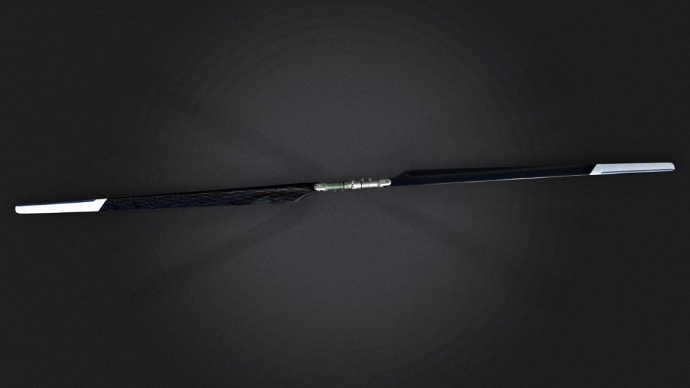

# UAVOS Expresses Gratitude to ALTER Technology for Successful Rotor Blade Testing

**UAVOS would like to extend its sincere appreciation to the ALTER Technology TÜV NORD S.A.U team for their highly professional work in conducting both overload and environmental testing of the helicopter rotor blades developed for our rotorcraft platforms. Successfully completing these tests will enhance confidence among potential partners and clients, further solidifying UAVOS’s reputation as a dependable OEM with a robust engineering culture.**

**Please see the test method in action: https://www.youtube.com/watch?v=nIoHuoyFktw**

The test campaign involved simulated overload centrifugal loads exceeding the nominal operational limit of 7,390 N (753.32 kg) and a dynamometer measurement of 389 N (39.65 kg), and confirmed the following key characteristics of the rotor blades:

- structural integrity under extreme stress

- resistance to deformation

- reliability of materials and manufacturing quality.

>
*"Our collaboration with the ALTER Technology team delivered not only solid data but also confidence that UAVOS' products meet the highest standards in the unmanned systems industry," - **said Aliaksei Stratsilatau, Founder and CEO of UAVOS.** "The results of the tests enable UAVOS to apply for security and defense grants, which impose strict requirements on unmanned platforms, and allow the company to confidently state that its blades are "designed and tested to exceed operational limits."*
      

#### About UAVOS

UAVOS Inc. develops and manufactures security and commercial solutions based on advanced Unmanned Systems with an international investor base. UAVOS technology, products, and tailored services include multi-role UAVs, unique proprietary autopilots, advanced communication systems, UAV components, and experiential training. UAVOS is involved in stratospheric R&D projects having developed the HiDRON meteo missions stratospheric glider and the HAPS ApusDuo autonomous aircraft.

#### About ALTER Technology

ALTER Technology TÜV NORD S.A.U. is Europe’s leading provider of testing, inspection, and certification services for aerospace and high-reliability industries, trusted by space, defense, and UAV companies worldwide.

*9 July 2025*
