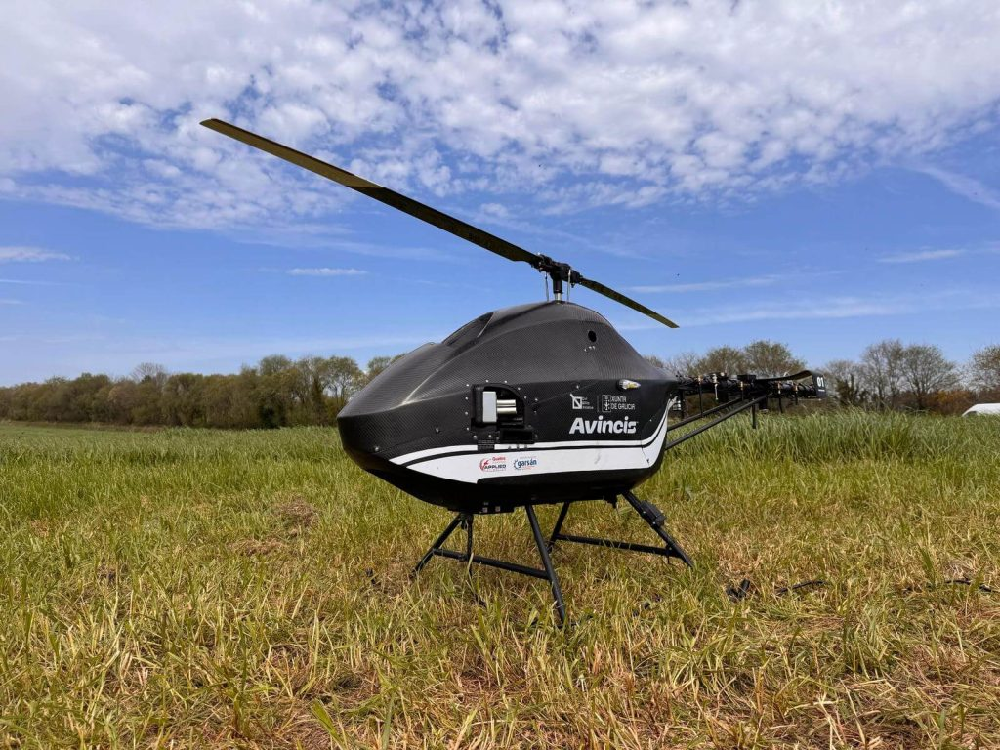

# UAVOS to Equip Spanish Avincis’ Unmanned Helicopters with Composite Main Rotor Blades

***The project is part of the Biodiversity Project, funded by the Xunta de Galicia within the framework of the Civil UAVs Initiative.***

**UAVOS has been selected by Avincis, a leading European company specializing in aerial emergency services and critical operations, to supply composite main rotor blades for its LUMES unmanned helicopter platform. This collaboration reinforces UAVOS’s position as a trusted OEM supplier of advanced rotorcraft components to international unmanned platform operators.**

The rotor blades delivered by UAVOS are engineered using advanced composite materials to ensure:

- High resistance to overload and fatigue.
- Reduced weight and enhanced aerodynamic performance.
- Long service life and low maintenance requirements.

> 
*“We are excited to support Avincis with our advanced rotor blade technology,” said **Aliaksei Stratsilatau, Founder and CEO** of UAVOS. “This delivery reflects our commitment to providing reliable unmanned system components that meet the highest safety and performance standards.”*

> ***John Boag, Group CEO, Avincis, said:** "We are committed to developing the latest technology to support and enhance the emergency aerial services we already provide to more than 50 customers across three continents. LUMES is one of the key products in the portfolio of innovations we are currently working on and UAVOS will be an important partner in the journey to bringing this unique UAS platform to market in the near future."*

#### About UAVOS

UAVOS Inc. develops and manufactures security and commercial solutions based on advanced Unmanned Systems with an international investor base. UAVOS technology, products, and tailored services include multi-role UAVs, unique proprietary autopilots, advanced communication systems, UAV components, and experiential training. UAVOS is involved in stratospheric R&D projects having developed the HiDRON meteo missions stratospheric glider and the HAPS ApusDuo autonomous aircraft.

#### About Avincis

Avincis is one of the world's largest providers of emergency aerial services, specializing in firefighting, medical evacuation, search and rescue and civil protection across Europe, Africa and South America. Committed to innovation, Avincis integrates cutting-edge UAS technologies into these essential missions to enhance effectiveness, safety, and responsiveness. Its proprietary rotary-wing LUMES UAS platform has been specifically designed to support firefighting and other emergency services, reinforcing the company’s dedication to deploying advanced technology to help protect lives and save communities wherever they serve.

*12 August 2025*