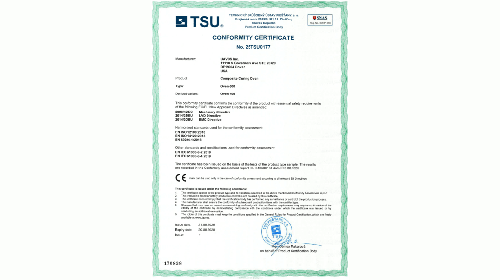

# UAVOS’ New Line of Composite Curing Ovens Awarded Conformity Certificate

***UAVOS Inc. has successfully completed a comprehensive conformity assessment of its composite curing oven, conducted by the Technical Testing Institute TSÚ Piešťany in Slovakia. Following the evaluation, the oven has been awarded a Conformity Certificate confirming its compliance with stringent international safety and quality standards.***

The certification process included a series of rigorous tests, all of which were successfully passed and documented in official Test Reports:

- Electromagnetic Compatibility Tests - ensuring compliance with EMC regulations for interference-free operation.
- Basic Safety and Essential Performance Tests - validating operational reliability and safety functions.
- Safety of Machinery Assessment - confirming compliance with EU directives for industrial machinery.

> 
*“The successful completion of these evaluations is strong validation of our engineering excellence and our commitment to safety and quality. For our customers, it means access to proven, reliable products that ensure precision, energy efficiency, and compliance with industry standards,“ said **Aliaksei Stratsilatau, Founder and CEO of UAVOS.***

*27 August 2025*