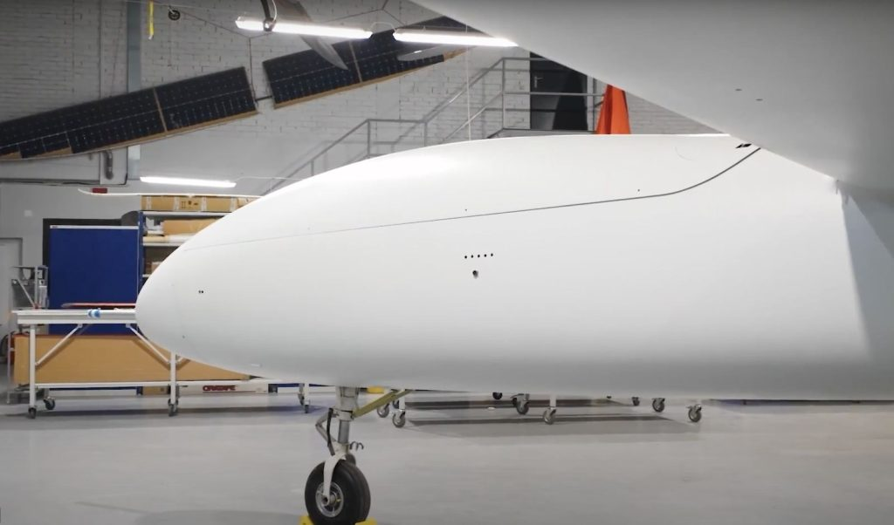

# UAVOS’ S1 V300 MALE UAS Demonstrates Fuel Efficiency and Flight Performance

***UAVOS has announced outstanding performance results for its advanced S1 V300 Medium Altitude Long Endurance (MALE) Unmanned Aircraft System (UAS). During a recent test flight, the 1,000 kg S1 V300 achieved 16 hours of continuous operation at a cruising speed of 130 km/h, consuming only 10 liters of fuel per hour, and covering a total distance of 2,400 kilometers.***

The impressive fuel efficiency and endurance of the S1‑V300 UAS are the result of UAVOS’ optimized aerodynamic design and engineering innovations. Equipped with fuel tanks totaling 500 liters, the aircraft is capable of operating non‑stop for more than 40 hours with a payload of 30 - 40 kilograms.

> 
*Aliaksei Stratsilatau, Founder and CEO of UAVOS, commented: “Excellent aerodynamic design was translated into following specific design elements that directly improve flight efficiency and endurance:*
1) the use of a high-aspect-ratio wing and winglets;
2) the use of advanced wing mechanization with air brakes and Fowler flaps;
3) a lightweight composite landing gear designed for minimal aerodynamic impact;
4) retractable air intakes that improve airflow during flight;
5) the placement of the engine behind the aircraft wing and the use of a long-shaft propeller drive system, allowing optimization for endurance flights;
6) a Y‑shaped empennage that minimizes aerodynamic resistance.”

These results reinforce UAVOS’ commitment to advancing endurance and efficiency in MALE UAS technology. The S1 V300 unmanned platform integrates advanced communication systems, autonomous operation capabilities, and multi sensor payload options, making it ideally suited for long range commercial, security, and ISR (Intelligence, Surveillance, and Reconnaissance) missions.

*13 October 2025*