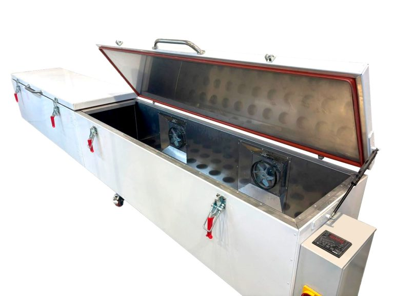

# UAVOS’ Composite Curing Oven for the Aerospace Industry

**UAVOS announced the shipment of an Electrically Heated Composite Curing Oven to a manufacturer in the aerospace industry. The basic design of the OVEN-700-2000 has been customized to the client's requirements and has become the largest version of the UAVOS ovens the company has ever produced.**

This top-loaded Oven-700-4000 will be used for composite curing parts and has a maximum oven operating temperature of 200°C. The work chamber dimensions of this oven are 700 mm wide x 4000 mm long x 700 mm high. Guaranteed temperature uniformity is ±5°C at set point 200°C.

The OVEN-700-4000 provides the highest standards of accuracy in PID temperature control, providing a smooth heating rate for the right product polymerization. The oven features a combination airflow, providing both horizontal and vertical upward airflow. This maximizes heating rates and product temperature uniformity.

Unique features of this composite curing oven include:

- Programmable logic controller with UAVOS software
- Intuitive touchscreen control system
- Program-operating mode with 19 pre-programmed options
- Aluminium and Stainless Steel construction
- Accurate temperature control and an integral overheating system
- Two independent vacuum supply inlets
- Programmable ramp and soak

This composite curing oven was thoroughly tested and adjusted at UAVOS' production center prior to shipment from its facility. All safety interlocks were checked for proper operation and the equipment was operated at the standard and maximum operating temperatures. An extensive quality assurance checklist was completed to ensure the equipment met all UAVOS Oven quality standards.

> 
***Aliaksei Stratsilatau, Founder and CEO of UAVOS:** “UAVOS' engineers have developed new software for its composite curing ovens. This control software plays an important role in optimizing curing technology and managing precise and efficient processes. Precise temperature control, low operating costs, and a practical workshop make our equipment incredibly useful in any composites production”.*

*17 March 2025*