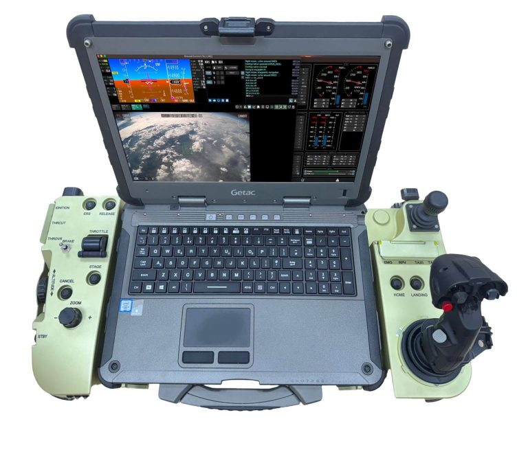

# UAVOS Releases Next-Generation Ground Control Station

**UAVOS has announced the availability of its next-generation Unmanned Ground Control Systems PGCS-4. The new PGCS-4 improves on the company’s previous generation, time-tested PGCS models, taking years of feedback from the clients and prospects to make a highly reliable ground control station for unmanned operations. The PGCS-4 features an advanced interface enabling operators to execute complex missions with enhanced situational awareness and safety.**

With an upgraded full-size keyboard, joysticks, buttons, and switches, the PGCS-4 enables the operator's performance, ease of use, and security of the operation. This advanced system creates a completely configurable interface for virtually any desired platform and also allows pilots to quickly and easily switch between multiple models of UAV to transfer data to an operator using one ground control station.

**Ground Control Key Features:**

- Customizable ground control station designed for different mission requirements
- Seamless integration with UAVOS' UAV systems
- Intuitive and user-friendly interface for precise control in complex environments

The PGCS-4 is now available with the powerful Getac X600 PC. This ground control station supports all UAVOS platforms and ground control software and is expandable to non-UAVOS UAS.

> 
***Aliaksei Stratsilatau, Founder and CEO of UAVOS:** “The combination of our decades of engineering expertise with the software knowledge and integration excellence means we can produce a powerful solution to not only meet customers' needs but provide a future-proof technology that supports growing requirements.”*