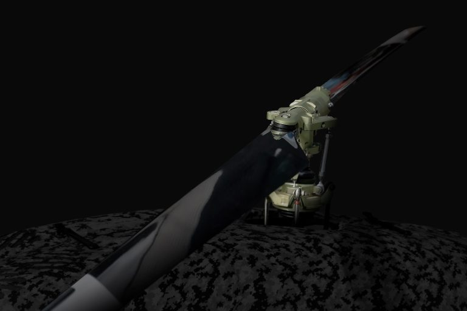

**UAVOS Inc., a developer of unmanned aerial systems, has announced the successful completion of overload structural testing of main rotor blades designed for helicopters with a maximum takeoff weight (MTOW) of up to 50 kg. The tests were conducted by ALTER Technology TÜV NORD S.A.U. and confirmed the exceptional structural integrity and manufacturing quality of UAVOS’ composite UAV blades, marking another milestone in the company’s expanding OEM program for third-party UAV manufacturers.**

Rigorous testing confirmed the blades’ performance under high centrifugal loads, simulating real-world loads well above standard operating limits.

During the tests, the rotor blade was subjected to a maximum simulated centrifugal load of 7,390 N (753.32 kg), a dynamometer measurement of 389 N (39.65 kg), and deformation was monitored at several points along the blade’s span. All measured deformations remained within the acceptable range of ±36.3 mm, and no visible damage was detected either during or after the tests.
Test result: PASSED - the rotor blade withstood the overload without structural damage.

>    
*"**Aliaksei Stratsilatau, Founder and CEO of UAVOS,** commented:
“Our blades are manufactured using carbon fiber prepreg under strict quality control, ensuring consistent reliability and safety in field conditions. We are end-users of our own products and verify their performance and safety daily during real-world UAV missions. Laboratory testing, in turn, provides our customers with confidence in the accuracy of the specifications we declare.”'"* 

UAVOS highly values the technical expertise and professionalism of the ALTA engineers and expresses its deep gratitude for their contribution.

### About UAVOS

UAVOS Inc. develops and manufactures security and commercial solutions based on advanced Unmanned Systems with an international investor base. UAVOS technology, products, and tailored services include multi-role UAVs, unique proprietary autopilots, advanced communication systems, UAV components, and experiential training. UAVOS is involved in stratospheric R&D projects having developed the HiDRON meteo missions stratospheric glider and the HAPS ApusDuo autonomous aircraft.

### About ALTER Technology

ALTER Technology TÜV NORD S.A.U. is Europe’s leading provider of testing, inspection, and certification services for aerospace and high-reliability industries, trusted by space, defense, and UAV companies worldwide.

*11 June 2025*