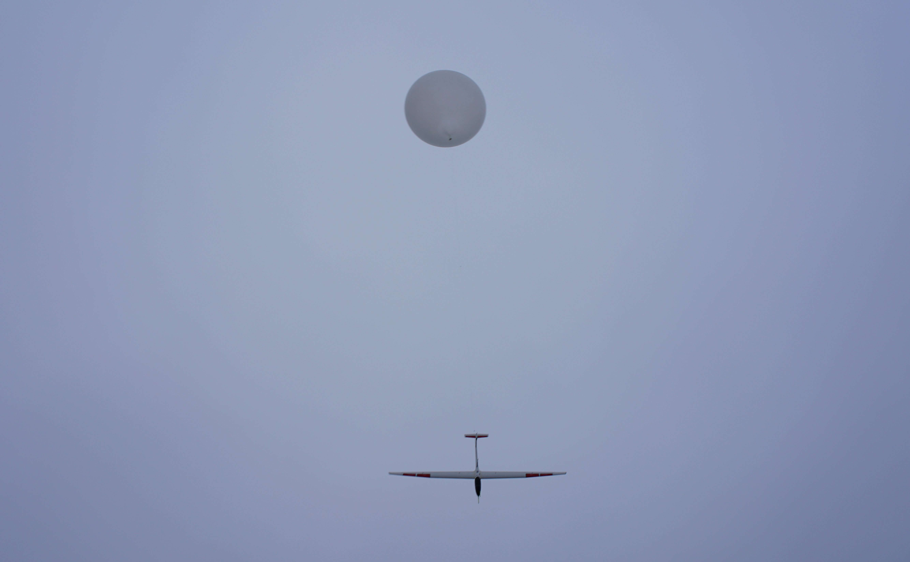

# STRATOSPHERIC AIRCRAFT HIDRON BY UAVOS AND STRATODYNAMICS AVIATION STARTED TEST FLIGHTS

**Joint project UAVOS Inc. and Stratodynamics Aviation Inc. - stratospheric aircraft HiDRON for collecting high-altitude atmospheric data – is now at a flight test program stage. The first flight lasted 1.5 hours and reached an altitude of 6000 m. The HiDRON’s vertical speed averaged 2 m/s down during the return flight, much slower than typical payload parachutes at 4 m/s or higher. The test program included; proving the stability of the communication commands of the primary radio link and the backup Iridium satellite system; stabilization and controllability of the aircraft after the balloon was released; testing of the balloon release systems; and monitoring the influence of icing conditions on the UAV controls.**

>
***Aliaksei Stratsilatau, UAVOS Lead developer:** “In general, the first test flight of the HiDRON was successful. All systems worked in a regular operation mode. By the decision of the development team, the unmanned aircraft is admitted to the next flight at an altitude of 25-30km with integrated equipment for weather measurement: an ozonesonde with pressure, temperature and humidity sensors. The collected data will also be integrated with the autopilot sensors; for example, GPS altitude and location, and wind speed.”*

During the flight, and with real-time monitoring of the telemetry data, the autopilot parameters were adjusted to ensure the safe execution of various flight modes. The development team designed two balloon release systems to ensure redundancy. The release system provides a controlled release of the HiDRON from the balloon at the targeted altitude, and can also be deployed to mitigate icing risk, for example when passing through cloud layers at low altitudes.

The HiDRON has a wing span of 3.4 m. The current maximum take-off weight is 4.5 kg with an integrated payload of 1 kg. Further development plans to increase the payload weight and integration with target vertical speeds of 3 - 4 m/s on the ascent and 3 m/s or lower on the descent, depending on the altitude.

**Gary Pundsack, CEO Stratodynamics Aviation Inc.:**
*“The HiDRON is a unique balloon-launched unmanned glider for collecting in-situ high-altitude atmospheric data, and capable of autonomous and soaring flight modes. We are pleased with the flight test results and the HiDRON’s agility to return home from 12 km away and a 6 km altitude. The HiDRON provides a new dynamic method for measuring and evaluating atmospheric phenomena at various altitudes in a variety of geographical locations. Stratodynamics offers an alternative to current lift-and-drift single-use meteorological balloon campaigns which, traditionally, pose a high probability of losing equipment, as well as limitations in quality and quantity of the observed data.”*

*November 13, 2018*