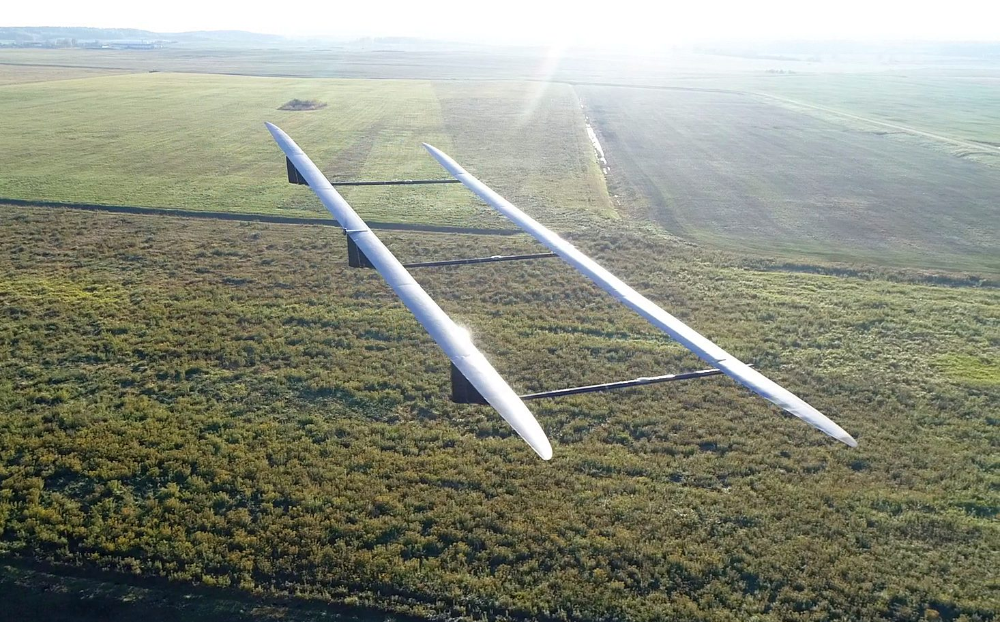

# UAVOS ApusDuo AIRCRAFT COMPLETED FLIGHT TESTS

**UAVOS Inc. has successfully completed the first stage of the flight tests of the 10-meter prototype of the High Altitude Pseudo Satellite (HAPS) ApusDuo, which was manufactured as part of the development program of ApusDuo solar aircraft with a wing span of 28m. That prototype was made for testing control algorithms, including take-off and landing, full-scale verification of HAPS aerodynamics. Test flights fully confirmed the flight characteristics of the UAV**

> [Video](https://www.youtube.com/watch?v=eBxWUZUXCKQ)

*October 5, 2018*