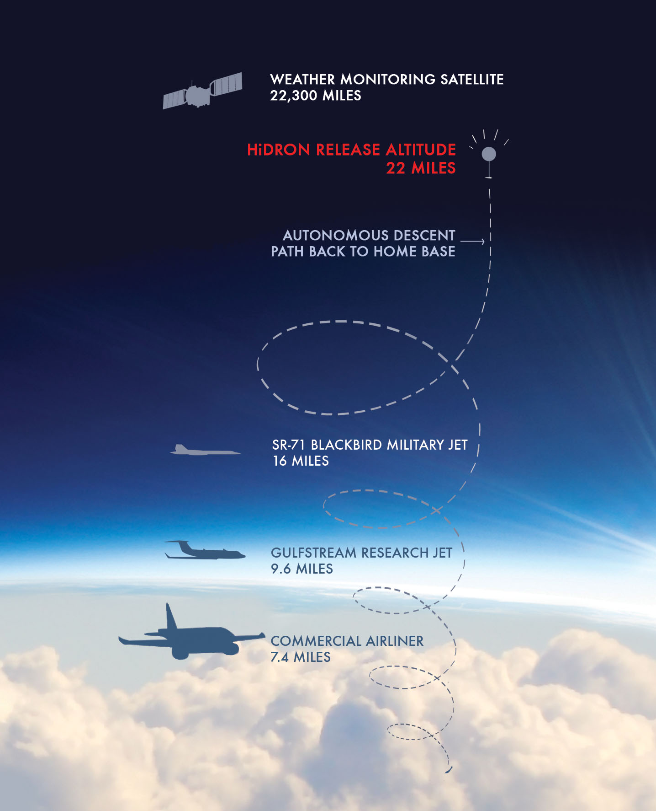

# UAVOS INC. AND STRATODYNAMICS AVIATION INC. PIONEER A HIGH-ALTITUDE ATMOSPHERIC MONITORING PROJECT

**UAVOS Inc. is finalizing manufacturing of the stratospheric aircraft HiDRON, commissioned by the Stratodynamics Aviation Inc. The HiDRON is a unique balloon-launched unmanned glider capable of autonomous and soaring flight modes, and designed for collecting high-altitude atmospheric data. The key objective of the HiDRON is to provide a new dynamic method for measuring and evaluating atmospheric phenomena at various altitudes in a variety of geographical locations. During the November campaign, the HiDRON will reach altitudes up to 25 km (82,000 feet).**

**The HiDRON fills a gap in current balloon-based lift and drift observation methods.**

The HiDRON is launched to the stratosphere via a helium-filled balloon. Once launched the autopilot and integrated atmospheric measurement system transmit data in real-time to a ground station. After reaching the desired altitude (or as directed by an operator on the ground) the HiDRON is released from the balloon and glides back to a pre-specified landing site. Unique autopilot flight algorithms can process in-situ data such as thermal or wave conditions, to increase flight duration or direct the flight path to specific areas.

Due to UAVOS technical solution HiDRON landing is fully automatic, and the autopilot selects one of the pre-specified landing sites. HiDRON communication to the ground station is maintained via the telemetry system and backup satellite link. In addition, emergency flight modes ensure flight safety. Fixed Wing drone HiDRON is capable of carrying a payload of up to 1.5 kg. Wingspan is 3.5 m.

Currently, atmospheric measurement equipment is also lifted to high altitudes by balloons. However, once the balloon bursts the equipment descends quickly by parachute and drifts uncontrolled. Often the equipment is lost or damaged and has high retrieval costs. The HiDRON extends the data collection period on the descent and brings the equipment back.

>***Vadim Tarasov, UAVOS investor and Board member:** “Experience in stratospheric flights and professional UAVOS autopilot technology allow our partners to implement sufficiently elaborate automation algorithms for meteorological research. The essence of this project is to develop a fully controlled process - from the moment of take-off, execution of the mission, and the landing of a reusable atmospheric sensor system. The HiDRON will be able to perform longer missions with a wide range of research tasks without the risk of losing expensive equipment. The fully controlled HiDRON will allow the adjustment of the mission and interaction with the ground air traffic control services from the lift-off to landing, which is very important taking into account the increased air traffic in all echelons.”*

>
***Gary Pundsack, CEO Stratodynamics Aviation Inc.:** “Stratodynamics is very excited to explore this frontier with the UAVOS team. The HiDRON provides a new dynamic platform for upper air observations and in-situ sampling at a fraction of the cost of typical high-altitude platforms. We look forward to further developing the aircraft and avionics to harness naturally occurring phenomena that create lift and extend flight duration, reduce costs, power requirements, and weight. We’re excited to be collaborating with the University of Kentucky and contributing to the understanding of climate change and its causes. For example, an atmospheric sensor system has been developed by Dr. Marcelo I. Guzman and T.J. Schuyler from the University of Kentucky. Their study aims to demonstrate how to perform accurate measurements of ozone chemical and physical properties using unmanned aerial vehicles (UAVs). The stratospheric ozone layer plays a key role in protecting the Earth surface from damaging UV radiation.”*

*October 18, 2018*