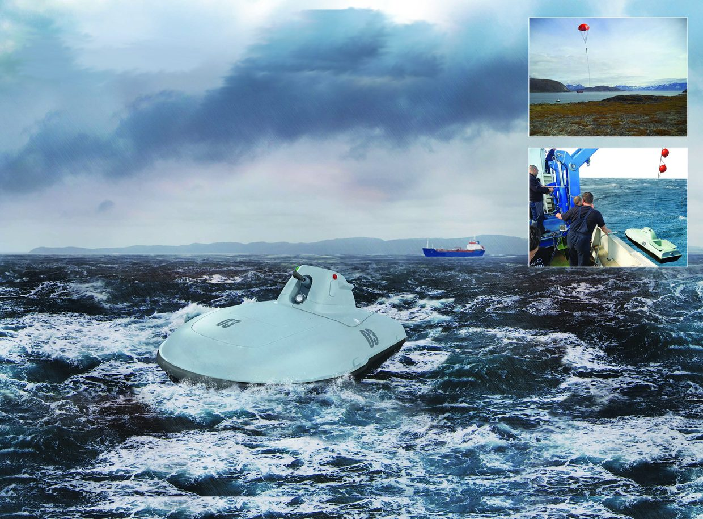

# UAVOS UNMANNED BOAT WILL ASSIST IN FUEL AND CARGO DELIVERY BY SEA

**UAVOS Inc. has completed the project of an Unmanned Surface Vehicle (USV) - a towing vehicle to deliver a refueling hose to the land in remote and offshore locations beyond inhabited areas. The newly developed solution will become an alternative to manned boats, which often can’t come near the coast due to a strong waves or other natural factors. Thus, the UAVOS unmanned boat will solve the problem of delivering fuel or cargo to hard-to-reach coastal areas.**

The unmanned boat is based on a SeaDoo water scooter. As part of the remodeling, the UAVOS automatic control system will be integrated into the water bike, and a hermetic upper casing and a pneumatic gun with an inertia-free coil for the cable will be manufactured.

Under the terms of the project, an unmanned boat hoists out from the ship's board in order to tow the cable to the shore, by which the fuel supply hose will be forwarded. Without reaching the shore, the cable is fired with a pneumatic gun and lands on a parachute at an appointed place. An on-shore team using winch pulls the fuel hose by the cable and carries out the filling of the tanks with fuel. Freight delivery can be performed in the same way. After completing the mission, the unmanned boat returns to the ship and with the help of the ship's crane beam gets aboard.

Currently, cable towing is carried out by manned boats. The main problem – quite often the ship can’t come close to the coastline, because safe distance to the shore can be up to 2 km. Besides, due to strong waves, surf and other factors in many cases refueling ships have to wait for favorable conditions for a long time, which complicates mission planning and also increases cost of operation.

According to **Vadim Tarasov, UAVOS investor and Board member**, such a solution will reduce the risks for the crews of transport ships when delivering cargo to hard-to-reach coastal areas.

UAVOS unmanned boat may be of interest to both special purpose services and companies that deliver cargo and fuel to remote and offshore locations on sea.

*1 November 2018*