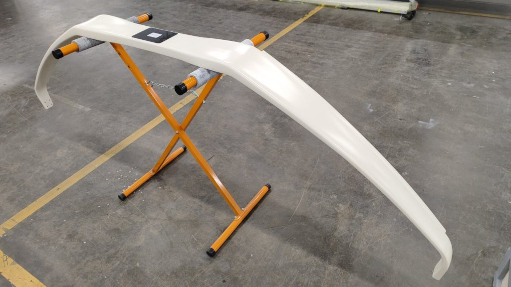

# UAVOS Unveils Reinforced Main Landing Gear Spring for Enhanced Unmanned Aircraft Performance

**UAVOS, a company in UAS engineering and manufacturing, announces the development of its latest Main Landing Gear Spring, designed to improve durability, performance, and safety for unmanned aircraft.**

The advanced landing gear spring incorporates high-strength composite material and precision engineering, offering superior shock absorption, reduced weight, and increased longevity compared to traditional steel components. The new design aims to enhance aircraft stability during landing and taxiing while reducing operators’ maintenance costs.

> 
*"Our goal was to create a landing gear solution that not only improves safety but also optimizes UAV efficiency," **said Aliaksei Stratsilatau, Founder and CEO at UAVOS.** "The main landing gear has been designed with a minimum weight of 16 kg, maximum performance, and longest service life."*

The reduction in landing gear mass does not affect the stiffness of the train or its deformations to operating demands. The train’s reduced thickness will directly influence the decrease of its drag. Its surface is smooth enough that a UAV at a maximum flight speed does not decrease the performance of the airplane.

This UAV component is made of prepreg carbon using the Inflatable Bladder Molding Composite Method. This technique involves impregnating sheets of fibers with a specialized resin, then placing them inside a mold for the desired part and sealing them.

**Key benefits of the new Main Landing Gear Spring include:**

- Enhanced Strength & Durability – Built to withstand high-impact landings and harsh operational conditions.
- Lightweight Design – Reduces overall aircraft weight, contributing to better fuel efficiency and payload capacity.
- Extended Service Life – Engineered for long-term reliability, minimizing replacement intervals.
- Improved Shock Absorption – Reduces stress on the airframe.

The new landing gear spring underwent rigorous initial overloaded testing of 1800 kg demonstrating deflection of the axis under the load is 160 mm, as well as durability. The test for torsional stiffness proved how resistant the gear is to twisting under load, which is crucial for preventing vibrations.

The first retrofit main landing gear has already been delivered to UAVOS' client to support its Medium Altitude Long Endurance (MALE) aircraft program. UAVOS included the brake lines installed into the leaf spring landing gear.

*6 February 2025*