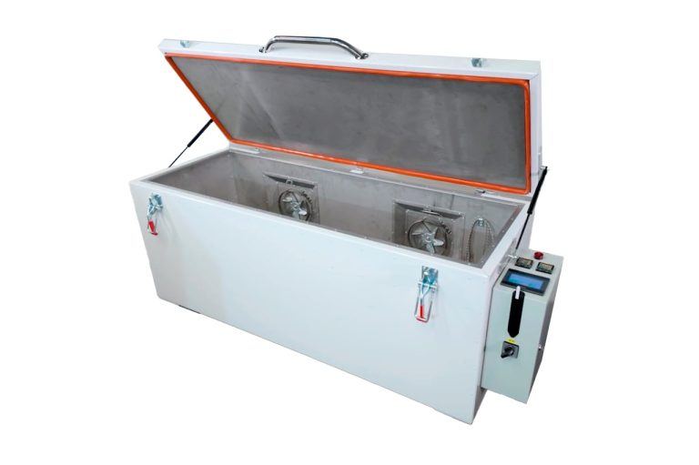

# UAVOS Curing Oven Upgraded With New Controller Software

**UAVOS is pleased to announce the development of the Controller Software for its Composite Curing Ovens. The new controller software provides the pre-programmed mode with 19 user-modifiable programs,a standard mode, and a user-intuitive interface controller. This controlling software is important in optimizing the curing technology and controlling accurate and efficient processes. The precise temperature control, low running costs and practical workshop make an incredibly useful piece of equipment in any composite facility.**

Video presentation - [https://www.youtube.com/watch?v=jOTGJBNunlc](https://www.youtube.com/watch?v=jOTGJBNunlc)

The controller offers a wide range of configurations, each of which can be custom-tailored to meet the needs of the material or product. This is where it is possible to configure units and points.

There is a standard operating mode and a program-operating mode with 19 pre-programmed options. The standard operating mode runs like a conventional oven and only targets a single set point of temperature, whereas the program mode enables configuring multiple steps in temperature, adjusting the rate of change, and creating complex cure profiles. UAVOS' ovens even boast full 'ramp and soak' temperature control for controlling heating rates (degrees per minute), holding for a specific length of time at set temperatures, and gradual heating mode. The programs and cycles are user-modifiable.

The intuitive 4.5-inch LED touchscreen interface provides unrivaled usability and process feedback. This screen comes with an independent automatic overheat safety control and an integral timer package.

UAVOS’ precision curing ovens are designed specifically for composite curing but are equally suited to a wide variety of industrial and scientific uses. UAVOS offers two modifications of the oven, OVEN 500 and OVEN 700, which are different in size. However, if a curing process requires a custom solution, UAVOS' team can create a configuration that meets the client's specific needs.

The oven panels are made using thermally isolated steel skins with a high performance insulated core, resulting in a highly efficient thermal performance. UAVOS supports vacuum-assisted composite curing (VACC) by equipping their composite curing ovens with a vacuum pump, thermocouple jacks, and vacuum ports.

These precision composite curing ovens are designed for a maximum operating temperature of 200°C. The combination airflow system delivers both horizontal and vertical upward airflows, ensuring optimal heating rates and consistent temperature distribution across the product.

> 
*"The curing oven market endures its growth avenue, boosted by augmenting demand in industries such as electronics, automotive, and aerospace. As the market grows, UAVOS continues to develop and expand its line of composite curing ovens. Technical innovations and rigid quality principles are key factors of UAVOS' ovens"- said **Aliaksei Stratsilatau, Founder and CEO of UAVOS.***

*14 January 2025*

