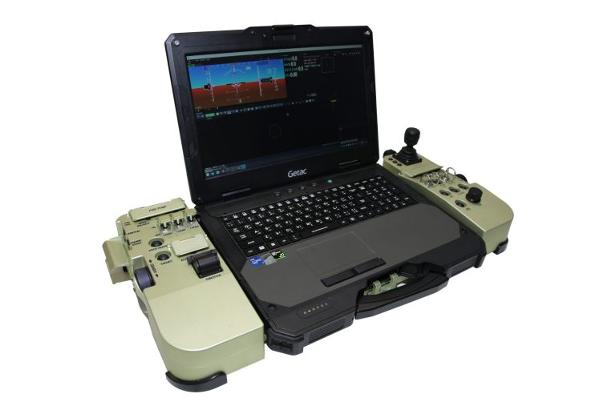

# UAVOS Releases Next-Generation Ground Control Station

**UAVOS has announced the availability of its next-generation Portable Ground Control Systems PGCS-7. UAVOS' new PGCS-7 improves on the company’s previous generation by taking years of feedback from clients and prospects to make a highly reliable GCS for unmanned operations. The PGCS-7 has a new generation powerful Getac X600 PC, an external redundant power supply, and an improved customizable I/O hardware interface.**

Featuring fully redesigned switch buttons, I/O panels allow users to customize to their exact design needs fully. With an upgraded full-size keyboard and buttons, the rugged purpose-built PGCS 7 enables intuitive and user-friendly control making it possible to reduce the likelihood of operator error during missions.

Compatible with preferred autopilots, PGCS 7 features flight and mission operation software, video-tracker software, payload sensor data, and information.

PGCS 7 supports all UAVOS platforms and ground control software and is expandable to non-UAVOS UAS. Launching multiple UAV types from a single hub and transferring data to an operator, all using one GCS. The system uses industry-standard protocols, hardware, and power sourcing simplifying operational compatibility.

Based on the fully-rugged notebook Getac 600, the PGCS 7 features a throttle lever and 3-axis joystick, Ethernet interfaces, and configurable switches and keyboard. The PGCS-7 comes up with a Getac X600 laptop modification to meet client requirements.

The GCS is built to withstand harsh environments, with IP65-rated construction and enhanced shock resistance. The system provides long battery life to support extended-duration missions.

> 
*“UAVs' ongoing evolution and crucial role in growing markets needs modern GCS capable of delivering accurate control, real-time data processing, and secure communication linkages to ensure mission success. UAVOS’ PGCS 7 with expanded capabilities delivers a blend of power, portability, and affordability opening new possibilities for mission success across various applications," **stated UAVOS CEO and Co-founder Aliaksei Stratsilatau***

*11 November 2024*

