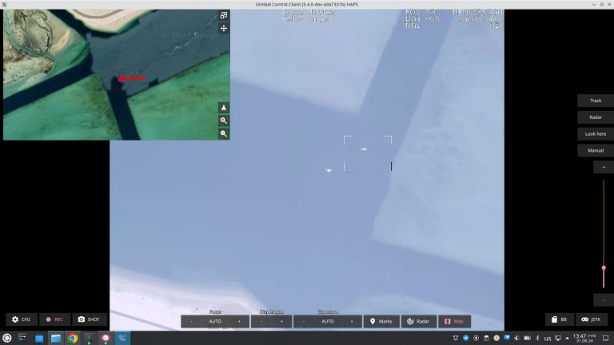

# UAVOS Payload Software Supported Mira Aerospace HAPS Mission

**UAVOS Inc., a joint venture with Bayanat, provided support to Mira Aerospace in a successful series of High Altitude Platform Station (HAPS) flights in the UAE. The UAVOS engineers provided software development and sustainment of an advanced Earth Observation payload on the Mira Aerospace HAPS. The mission objective was to test a variety of surveillance scenarios where an OE camera system demonstrated a major achievement for day imaging from the stratospheric altitude of 15000 m.**

Furnished with an array of sophisticated software attributes, this high-altitude camera distinguishes itself by delivering exceptional performance. The advanced software was written by UAVOS to meet the HAPS requirements for high-resolution (103mpx) stratospheric surveillance. The OE camera has been augmented with sophisticated image processing with electronic stabilization and object tracking, external GPS/INS integration with real-time target location at multiple ranges across various environments. Integrating with the AIS receiver, the software can identify tracking ships.

Its optimized SWaP profile, advanced day imaging, and embedded video processor enabled the engineers' team to acquire stunning visuals across visible spectrums, ultimately achieving mission success.

The UAVOS and Mira Aerospace collaboration converged to combine the high-altitude aerial platform with the advanced payload on the Abu Al Abyad Island in the UAE where the HAPS was launched in early September and flew at a stratospheric altitude for several days.

> 
***Aliaksei Stratsilatau, Founder and CEO of UAVOS:** “UAVOS' EO camera software is an advanced Earth Observation service designed to capture very high-resolution images and live video from the stratosphere. Our advanced software provides a valuable service to multiple HAPS use cases such as maritime surveillance, border monitoring, mapping, forest fires and emergency response in general”.*

*24 September 2024*