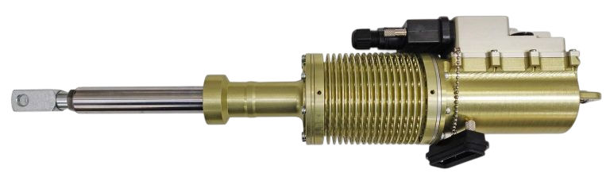

# UAVOS Launches New Series SDLM-04B Linear Servo Actuator

**UAVOS is excited to introduce the newest addition to its servos line - the [SDLM-04B Linear Servo Actuator](/products/esd/_2_sdr/). The [SDLM-04B](/products/esd/_2_sdr/) is engineered for applications that demand high forces and long-term reliability. With its robust construction and powerful side-by-side motor and gearbox design, this actuator sets a new standard for performance and versatility, making it an excellent choice for multiple industries including unmanned aircraft.**

The [SDLM-04B servo actuator](/products/esd/_2_sdr/) features a brushless DC motor-controlled high-performance FOC servo drive and one contactless multiturn absolute position encoder. The device features feedback data such as the actual position, velocity, torque, bus voltage, and active motor current. The [SDLM-04B](/products/esd/_2_sdr/) features a power stage, BLDC motor, temperature and humidity control inside the case. The high-quality construction with hardened steel gears and aluminum housing is rated IP66.

The [SDLM-04B Servo](/products/esd/_2_sdr/) stands out due to its compact size, high force output, and servo control. Here are some of the key features that make this actuator a valuable addition to your project:

- Zero backlash: Increase mechanical reliability and accurate motion control authority.
- Integrated Controller: This simplifies setup and reduces wiring complexity.
- Compact Design: Despite its size of 314 mm (12"), it does not compromise on performance, delivering the power and reliability you need for your projects.
- High Force and High Speed: Capable of forces up to 1000 N or speeds up to 150 mm/s depending on the model.

The [SDLM-04B Linear Servo Actuator](/products/esd/_2_sdr/) is designed for a variety of applications. Its compact size and integrated control make it particularly useful in:

- Robotics: It is ideal for powerful, precise movements in compact designs. Plug and Play compatibility simplifies integration.
- Industrial Automation: It enhances the efficiency and reliability of automated systems.
- High-reliability UAV control: The SDLM-04B linear actuator is designed to excel in harsh shock/vibe environments with IP65 dynamic and IP67 static ingress protection ratings. 

UAVOS has successfully installed its SDLM-04B servo drives into the Albatross Medium Altitude Long Endurance (MALE) aircraft flight control system and in the heavy-lift UVH 500 helicopters. The advanced actuators greatly extend the unmanned platforms’ reliability and safe steering while increasing operational flexibility.

> 
*"As the demand for compact and efficient actuators grows, the SDLM-04B is supposed to be used in various industries. UAVOS is committed to continuous improvement and innovation, ensuring that our products meet the evolving needs of our customers. The integration of advanced technologies and the focus on miniaturization will drive the future development of actuators, offering even more precise and efficient solutions for complex applications", - said **Aliaksei Stratsilatau, Founder and CEO of UAVOS***.

*October 8, 2024*