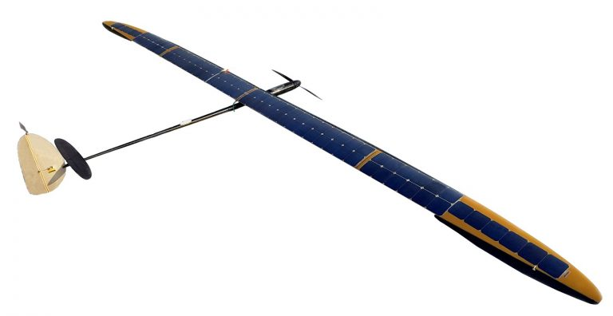

# UAVOS’s Solar-Powered SAT-i Aircraft Completed Ten Hour Continuous Aerial Surveying

**UAVOS Inc., a Mountain View-based company specialized in unmanned solutions, has completed flight tests of the solar powered unmanned SAT-i aircraft, designed to perform monitoring and aerial photography during daylight hours. The new unmanned aircraft has demonstrated high performance, successfully completing a non-stop 10-hour mission for aerial photography of the surface landscape with a payload of a 600-gram mirrorless camera.**

SAT-i has a fixed wing with a wingspan of 7.3 meters. The weight of the aircraft is 6.2 kg. The UAV is equipped with a Li-Ion battery that allows flying without solar energy for 2 (optionally 4) hours with payload up to 600 grams. The aircraft is hand-launched, the flight and landing are performed in fully autonomous mode. For UAV landing a flat level surface of 200 m long is suitable, with a touchdown accuracy of about 100 m. The landing trajectory calculations are carried out in an automatic mode taking into account the current weather conditions. Low landing speed of 7 m/s allows to keep the aircraft intact after numerous landings.

> 
***Vadim Tarasov UAVOS investor and board member said,** “Based on UAVOS experience, to achieve high quality aerial photography, work has to be done in the daytime with a good level of illumination. Using solar-powered aircraft for such missions is, in our opinion, most promising, since solar energy is sufficient to perform a continuous flight throughout the daylight hours. Especially effective is the use of such UAVs for high-resolution orthomosaic imagery in large areas with a long flight time. For example, to successfully solve communication problems during long-distance monitoring missions of electrical power lines UAVOS uses the Iridium data satellite transceiver module.”*

The UAVOS SAT-i UAV technology offers cost-effective services for a wide range of customer needs, including prospecting, mapping, monitoring of important lines of communication in remote areas, while using only solar energy during the day. Backup batteries allow to perform short missions for 2-4 hours without solar activity, in case of need extending the operations.

*12 July 2018*