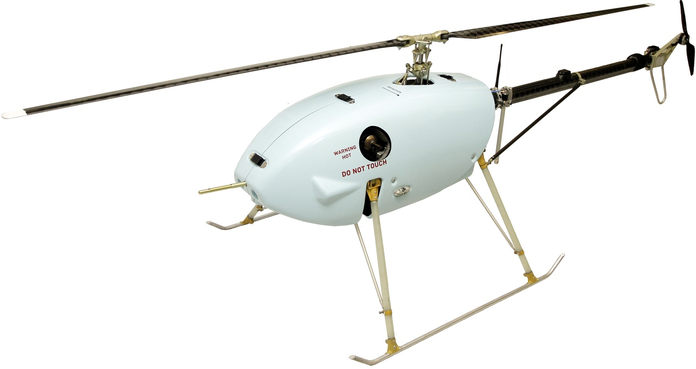

# UAVOS HELICOPTER DRONES TO GET BRAND NEW ROTOR BLADES

**UAVOS Inc., a Mountain View-based company specialized in unmanned solutions, has created a qualitatively new main rotor blade to be installed on helicopters with 77 lbs (35 kg) take-off mass and rotor diameter of 102,36" (2600 mm). New product development and production were carried out by UAVOS rotor blade specialists in its production facilities. The one-step blade molding technology using polymer composite materials and an improved aerodynamic shape affected dramatically the entire flight performance of the machine.**

Usually, when mass produced, the main rotor blade is made by gluing together the lower and upper surfaces. UAVOS’ innovative solution uses a technology consisting of hot forming a composite ‘prepreg’ material, which involves the manufacture of a blade airfoil in a single step molding. This method eliminates the delamination of the lower and upper planes, since there is no glue seam. In addition, the design allows for the warping and narrowing of the blade, thus by increasing strength and rigidity while offering high aerodynamic characteristics, . increasing lifespan, reducing production costs, improving the performance, and making flights more reliable in warm climates.

> 
***Aliaksei Stratsilatau, UAVOS Lead developer:** “We had to develop and manufacture a blade of our own because we were unsatisfied with what the market had to offer. Firstly, during tests it turned out that the blades have a rather low efficiency; secondly, there was no available documentation with off-the-shelf blades to confirm their reliability and quality. During project development, our team used calculations based on their experience of blade testing for our high-altitude aircraft. Bench tests confirmed our calculations to be correct and demonstrated that the efficiency of the UAVOS blade is higher by 20%.”*

*30 May 2018*