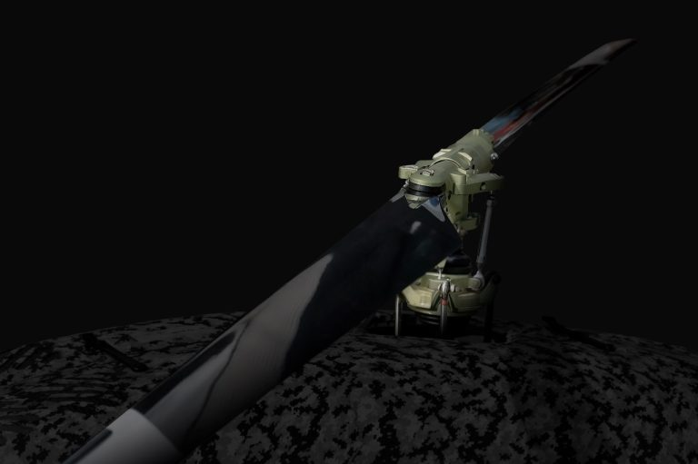

# UAVOS's OEM Program Offers Rotor Blades with High Resistance and Greater Efficiency

**UAVOS developed a new version of a cost-effective composite rotor blade for helicopter installation with up to 140 kg take-off mass, lower maintenance costs, and higher performance than its previous blades. UAVOS' retrofit rotor blade includes a glued stainless steel edging into the leading edge, high twist distributions, and modern airfoil to improve the performance of UAVs dramatically. A steel leading edge provides better protection blades operating in sand, rain, saltwater atmospheres, and harsh environments.**

The blades were designed with multiple layers of composites, each layer applied in a specific pattern and orientation using a curing oven. UAVOS’ advanced technology ensures maximizing strength and matches the mechanical properties of the composite design.

UAVOS’s composite blades deliver:

- An improved production cycle
- A reduced initial and lifecycle operating costs
- Fuel savings and performance gains

> 
*“Rotor blades are subjected to the toughest stresses during operation. They must be able to withstand any weather conditions. For this reason, the highest quality requirements apply to the manufacturing process - especially to the materials”, - **said Aliaksei Stratsilatau, CEO of UAVOS***.

UAVOS' capabilities include bringing a rotor blade project through preliminary design, prototyping, bench testing, test certification, and manufacturing. UAVOS’ facilities include a composite fabrication shop, a fatigue test rig capable of testing blades, a CNC machine shop, ovens, a heated press, automatic ply cutting, and a large material freezer enabling UAVOS to develop rotor blades internally quickly.

> 
*“The UAVOS' OEM program shows our commitment to innovation and next-generation programs for the unmanned platforms. As an OEM provider and UAV operator, UAVOS continues to push the envelope to find new and reliable solutions to keep our customers flying longer, safer, and always for the best price,” - **explains Aliaksei Stratsilatau, CEO of UAVOS.***

*10 September 2024*