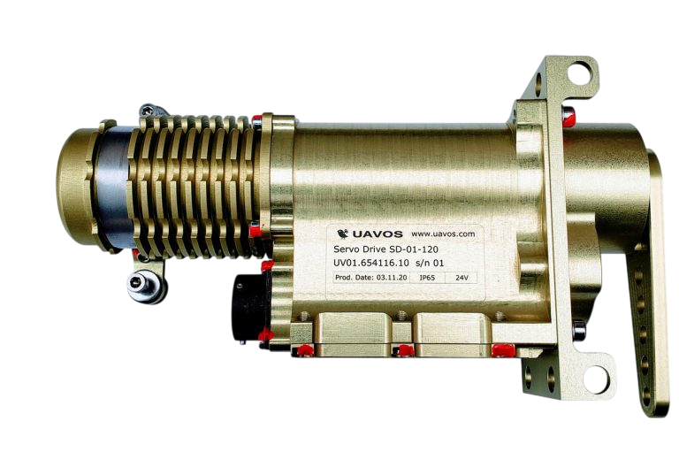

# UAVOS SD-1 Actuator Achieves Certificate of Conformity from TSU Notified EU Body

**UAVOS, Inc., an unmanned systems manufacturer, has announced that its servo actuator SD-01 has renewed its Certificate of Conformity from the TSU Notified EU Body. This confirms that the product fully complies with the rigorous EU Low Voltage and Electromagnetic Compatibility Directive.**

Engineered for a wide range of applications within unmanned platforms, the SD-1 servo drive is a rugged and durable rotating type servo capable to withstand harsh environments and conditions involving high shock and vibration, as well as Electromagnetic interference (EMI) and electromagnetic compatibility (EMC) interference.

The SD-01 servo actuator features a brushless DC motor-controlled high-performance FOC servo drive and two contactless absolute position sensors. The device features feedback data such as the actual position, velocity, torque, bus voltage, and active motor current. The SD-01 features a power stage, BLDC motor, temperature and humidity control inside the case. The high-quality construction with hardened steel gears and aluminum housing is rated to IP66.

> 
*"The certification is an important requirement for any OEM manufacturer selling components for autonomous platforms in Europe," said **Aliaksei Stratsilatau, founder and CEO of UAVOS.** "We are proud that the SD-1 actuator is engineered and assembled by our in-house specialists".*

UAVOS has successfully been installing its SD-1 servo drives into the Albatross and Saker Medium Altitude Long Endurance (MALE) aircraft flight control system and in the heavy-lift UVH 500 helicopters. The advanced actuators greatly extend the unmanned platforms’ reliability and safe steering while increasing their operational flexibility.

*18 September 2024*