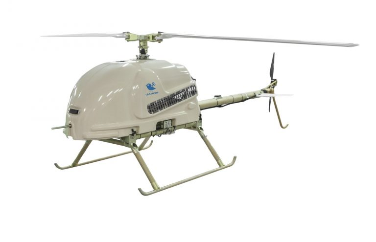

# The Conceptual Approach To The Robotization Of The Army Will Be Presented At ‘UAV INDIA 2018 CIVIL & MILITARY’ By Bharat Drone Systems And Its Technological Partner UAVOS

**At the annual Indian exhibition UAV INDIA 2018 CIVIL & MILITARY, which will be held in New Delhi, Bharat Drone Systems Pvt together with UAVOS Inc., a company specialized in unmanned solutions, will demonstrate new examples of unmanned aerial systems (UAS): unmanned vertical takeoff and landing vehicles (VTOL), airplane-type UAV (Fixed Wing). All presented unmanned platforms successfully passed the tests under the control of the UAVOS automatic control system for mobile objects and military equipment.**

**UVH-290E** is the latest modification of UAVOS helicopters with a gasoline rotary engine. The new unmanned helicopter in the "tractor" modification has MTOW of 236lbs (107kg). Extended telemetry of the constitutive parameters makes it possible to monitor the basic indicators during the flight, thereby contributing to enhanced reliability and safety. The flight time of the helicopter is 5 hours with a payload of 11lbs (5kg), the operational ceiling is 6800ft (2100m). Moreover, the aircraft can operate in high air temperatures - up to +122 ºF (+50°C). UVH-290E is intended to be used in reconnaissance, patrolling and observation flights and aerial photography of areas in a radius of up to 249 miles (400km). The aircraft can be used for fire cover (i.e. it is possible to equip it with weapons).

**UVH-EL**, equipped with an electric engine unit, is a multipurpose helicopter designed to carry a payload of 11lbs (5kg) with a maximum take-off weight of only 55lbs (25kg). The flying time in this configuration is 1.5h. The practical range of the unmanned helicopter is 93 miles (150km), the maximum static ceiling is 11500ft (3500m). The UAV can reach speeds of up to 74,5 mi/h (120 km/h). The radius of data transmission in direct radio visibility in the basic configuration is 43,5 miles (70 km). The complex implements retransmission of data on the command line, which significantly increases the area of safe operation of the complex. The unmanned helicopter complex is meant to be used in surveillance operations, monitoring of long sections of the earth's surface, water surface, communications, and anti-drone protection.

**Fixed wing Borey-10** is a compact UAV, designed according to the "flying wing" scheme. The wingspan is 9,8ft (3.5m). It can take off from unequipped sites, and land at any given point of the terrain, which does not require special training of operators. Take-off is carried out with the help of a rubber rope or a catapult, landing with a parachute. The range of Borey-10 for transmitting video information in difficult meteorological operating conditions is at least 18,6 miles (30km), and for control - at least 43,5 miles (70km). A big advantage is the high duration of continuous flight - 4 hours with a payload of 1,1lbs (0.5kg).

All UAVOS UAVs are equipped with EW countermeasure systems, which makes it possible to carry out research operations in the absence of GNSS signals. They also have an emergency parachute system for safe recovery.

Takeoff, flight along the route and landing are performed in fully automatic mode. The presented unmanned systems are based on the unified Automated Control System developed by UAVOS. The value of the automatic control system is in the possibility of integrating the system into unmanned platforms of different operating environments with a wide range of mass-size characteristics. The main feature of the Autopilot is the distributed architecture. The configuration of the automatic control system allows to do without the central processor and to distribute control tasks throughout all components of the system. There is no limit to the number of modules of the same type, which makes it possible to implement multiple redundancy at all levels. By adding interface modules, it is possible to integrate almost any payload, ready-made third-party modules and entire systems into the system.

> 
***According to Vadim Tarasov, UAVOS investor and Board member,** “The possibility to team control a formation of unmanned ground and air based aerial systems opens new opportunities for rapid response to tactical set-up, improves the quality of information and general situational awareness.”*

**Col (Retd) N C Gupta, Bharat Drone Systems Pvt Ltd Director** says: *"Today India, like other Asian countries, is actively implementing programs for the modernization and re-equipment of its armed forces. The export potential of unmanned systems is traditionally high here. Taking into account the growing influence by the countries of the Asian region, Bharat Drones Systems together with its technology partner UAVOS will demonstrate at UAV INDIA 2018 CIVIL & MILITARY its capabilities to supply the best examples of dual-purpose and military-purpose UAVs, as well as readiness for mutually beneficial cooperation."*

*August 28, 2018*