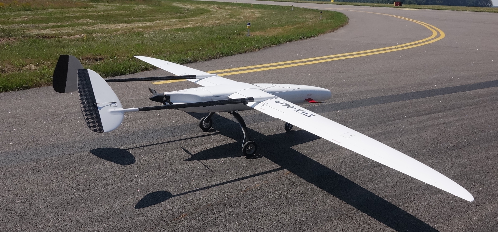

# UAVOS FIXED-WING UAV SITARIA COMPLETED FLIGHT TESTS

**UAVOS Inc. has completed a series of test flights of a new unmanned Sitaria fixed - wing UAV. The new UAV is designed for patrol and observation missions, for aerial photography of terrain area with a radius of up to 120 km. Among other tasks, the unmanned aircraft is purposely designed to work with the LIDAR airborne laser scanning equipment as payload.**

UAV Sitaria has a wide range of speeds (stall speed 65 km/h, maximum speed 150 km/h), which allows the aircraft to carry out missions at minimum flight speeds close to 70 km/h. For example, taking into account a tailwind of 6 m/s, the minimum operational speed of the aircraft will be about 90 km/h. To fulfill a mission using LIDAR it is important to maintain a certain speed of the aircraft relative to the ground. When the UAV performs monitoring while moving against the wind, it shall keep high air speed, and moving upwind – lower speed.

> 
***Vadim Tarasov, UAVOS investor and board member** comments: “During monitoring missions, a wide range of speeds allows Sitaria fixed - wing drone to quickly reach the object and return back at the optimal speed. Takeoff and landing is carried out at low speeds, which makes it possible to use short runways. All these features directly affect safety, and also optimize operating costs.”*

The weight of Sitaria is 35 kg, the wingspan is 5.2 m, the length of the fuselage is 2.8 m. Flight time with a payload of 4 kg is 3 hours, operating altitude is up to 6000 m. The range of the video transmission can be up to 60 km; the backup Iridium command line is unlimited in range. The EW countermeasure function provides an opportunity to carry out research under jamming of satellite radio navigation signals and the command line channel. Sitaria fixed-wing drone is a part of the unmanned aerial system Sitaria, which includes a ground control system.

The UAV is equipped with an electric motor, which is less noisy and more reliable; low vibration level does not affect the stable work of the payload.

Sitaria unmanned airplane has a unique aerodynamic design allowing to quickly adjust the position of the wing relative to the fuselage when the weight of the payload changes. The minimum tail weight has a positive effect on the control and stability of the aircraft.

*“Technical solutions, implemented in Sitaria, provide the high level of fail-safety, reliability and security that is required for operation in diverse areas of commercial applications of the UAV," says **Vadim Tarasov.***

*September 26, 2018*