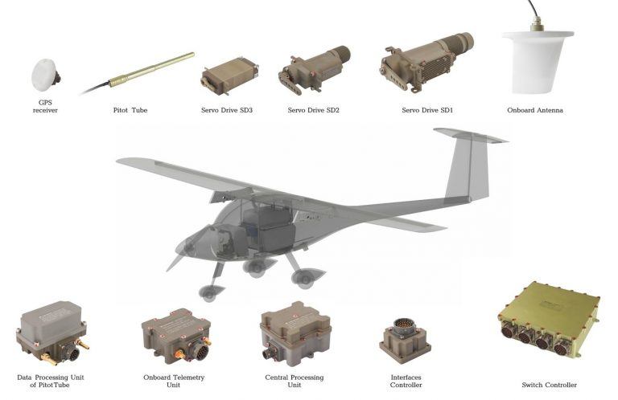

# The Conceptual Approach To The Robotization Of The Army Will Be Presented At ‘UAV INDIA 2018 CIVIL & MILITARY’ By Bharat Drone Systems And Its Technological Partner UAVOS

**At the annual Indian exhibition UAV INDIA 2018 CIVIL & MILITARY, which will be held in New Delhi, UAVOS Inc., a company specialized in unmanned solutions, will demonstrate Unmanned systems based on the Unified Automatic Control System (Autopilot) developed by UAVOS. All presented aerial systems (UAS): unmanned vertical takeoff and landing vehicles (VTOL), airplane-type UAV (Fixed Wing) successfully passed the tests under the control of the UAVOS automatic control system for mobile objects and military equipment.**

The significance of the Autopilot developed by UAVOS is the possibility of integrating the system into unmanned platforms of different operating environments with various mass-size characteristics.

Uniqueness of the Autopilot is in its distributed architecture. Each component of the system has its own microcontroller which provides data processing and communication with other components in the CAN network. The configuration of the automatic control system allows to function without the central processor and to distribute control tasks throughout all components of the system. At the same time there is no limit to the number of modules, which makes it possible to implement multiple redundancy at all levels. By adding interface modules, it is possible to integrate almost any payload, ready-made third-party modules and entire systems into the system.

The Autopilot is organized in such a way that unmanned platforms (can be of different purposes) are able to interact in a single group. Being within a communication coverage range, unmanned systems automatically synchronize and form a common network. Land-based special task groups, having portable control stations on their hands, can quickly receive information from Unmanned complexes taking part in the operation, including taking over the control of them. For example, homing them on target as a barraging explosive unit.

> 
*According to **Vadim Tarasov**, “The possibility to team control a formation of unmanned ground and air based aerial systems opens new opportunities for rapid response to tactical set-up, improves the quality of information and general situational awareness. The number of telemetry parameters during the flight, for example, can reach up to 200, and their analysis in real time goes beyond the bounds of human capabilities. The possibility to team control a formation of unmanned ground and air based aerial systems opens new opportunities for rapid response to tactical set-up, improves the quality of information and general situational awareness.”*

*September 3, 2018*