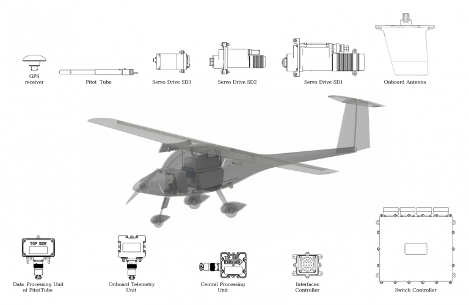

import ap1 from "./assets/autopilot-aircraft-1-300x223.jpg"
import apMotor from "./assets/autopilot-motorboat-300x223.jpg"
import vtol from "./assets/vtol-ap10-300x223.jpg"

## AP 10.1

Automatic Control System for UAV with a takeoff weight of 100 kg up to 4000 kg

### OVERVIEW

The Automatic Control System (AP) provides the hardware and vehicle control abstraction layer for the host platform enabling fully autonomous operation. All flight systems including take-off, landing, navigation and mission execution can be instigated with a single keystroke. All diagnostics, flight mission planning and remote control can be achieved wirelessly.

A notable feature of the AP is its distributed architecture. Each component of the system has a dedicated microcontroller providing data and communication with other components within the CAN bus. This decentralized configuration helps to manage central processor loading by distributing routine management tasks across all system components. Additionally, there are no restrictions on the number of same-type modules connected to one system, enabling multiple redundancy on all levels. With nearly all payloads or ready-made third-party modules, entire systems can be connected to the AP.

> FLEXIBILITY & SCALABILITY

Thanks to the AP’s distributed architecture, the system can be used in a wide variety of vehicles ranging from small quadcopter to full size converted piloted aircraft. The redundant layering provides basic functionality while ground control software is multi-platform and functions across multiple workstations in a both a wide or local area network configuration. Specific payloads/sensors can be integrated by scripting custom protocols through onboard Virtual Machines (VMs).

> COMPATIBILITY

The AP is compatible with almost any vehicle configuration (VTOLs, USVs, UGVs, etc.), including non-traditional aircraft concepts. The flight control algorithm relies on Total Energy Control System (TECS) for improved reliability and response to malfunction including automatic landing with engine failure, auto-rotation for helicopters and parachute deployment. The AP is resilient against jamming and features precise dead-reckoning navigation in absence of a GNSS signal.

Payload of almost any type can be connected and controlled using the interfaces:

-  1-Wire
- RS-232
- RS-485
- UART
- CAN

### KEY FEATURES

- control of actuating mechanisms
- engine control
- semi-automatic control with automatic stabilization of the vehicles
- manual control using the main 928MHz communication channel
- from ground control station (GCU)
- control of the vehicles object in emergency mode
- payload control
- payload feedback
- control of rotating platforms in gyro-stabilization mode using AP10.1
- receipt and transfer of telemetric data between GCU and the vehicles
- simulation mode
- flight simulator
- onboard power control
- power stabilization
- conversion
- power distribution, including emergency power supply mode
- onboard power monitoring

### SPECIFICATIONS

*Available Interfaces:*

- up to 15 x servo drives (PWM control)
- 2x inputs for RPM sensor (Hall-effect sensors)
- 1-Wire interface
- TTL UART interface
- RS-485 interface
- Controller area network - CAN
- RS-232 interface
- Low-side power output (3.7A, @ 20V, 68MOhm)
- 3x digital inputs (timing, level)
- 5x general purpose inputs-outputs (remappable on MCU)

*Technical specifications:*

| Operating temperature | IP rating | Housing material | Connector                                                                 |
|-----------------------|-----------|------------------|---------------------------------------------------------------------------|
| −40°C to +60°C        | IP67      | Aluminium alloy  | Amphenol PT02E12-10P Amphenol PT02E8-4P Amphenol PT02E13-32P SMA |

| Power supply | Protection – logic I/O                                  | Protection – ESD | Protection – reverse-polarity                 |
|--------------|----------------------------------------------------------|------------------|-----------------------------------------------|
| 7–27 V       | All digital logic inputs and outputs are protected       | ESD protection   | Power supply reverse-polarity protection      |

### APPLICATION CASES

<Cards num="4">
    <Card 
    title="Fixed Wing UAS" 
    image={ap1}
    >
    </Card>
    <Card 
    title="VTOL Drone" 
    image={vtol}
    >
    </Card>
    <Card 
    title="Unmanned Surface Vessel (USV)" 
    image={apMotor}
    >
    </Card>
</Cards>

AP 10.1 system configuration for airplanes example:

| #    | Item                                                                 | Designation | Part number             | Weight, g |
|:----:|-----------------------------------------------------------------------|:-----------:|-------------------------|----------:|
| 1    | **AP 10.1 Kit**                                                       |             |                         |           |
| 1.1  | Onboard Telemetry Unit                                                | OTU         | UV01.431329.100.310     |       170 |
| 1.2  | Interfaces Controller                                                 | IFC         | UV01.431329.100.332     |       100 |
| 1.3  | Onboard Antenna                                                       | OA          | UV01.431329.100.315     |       300 |
| 1.4  | GPS Receiver                                                          | GPS         | UV01.431329.100.346     |        67 |
| 1.5  | Central Processing Unit                                               | CPU         | UV01.431329.102.330.00  |       160 |
| 1.6  | Pitot Tube                                                            | PT          | UV01.468839.80.341      |        62 |
| 1.7  | Data Processing Unit of Pitot Tube                                    | DPU-PT      | UV01.431329.100.320     |       230 |
| 1.8  | CAN-HUB                                                               | CAN-HUB     | UV01.468353.01          |           |
| 1.9  | Angle of Sideslip Transmitter                                         | AST         | UV01.431329.05          |       180 |
| 1.10 | Power distribution, switch unit                                       | PSU         | UV01.431329.07          |           |
| 1.11 | Flight recorder                                                       | FR          | UV01.431329.15-01       |           |
| 1.12 | Emergency rescue system controller                                    | ERSC        | UV01.431329.06          |           |
| 1.13 | Onboard antenna                                                       | OA          | UV01.431329.100.315     |           |
| 2    | **Optional airborne equipment**                                       |             |                         |           |
| 2.1  | Antivibration mounting for CPU (for UAVs MTOW more than 200 kg)       |             | UV431329.90.330-10.00   |     4600 |
| 2.2  | Laser Altimeter (0–100 m altitude)                                    |             |                         |           |
| 2.3  | Radio Altimeter (0.3–400 m altitude)                                  |             |                         |           |
|      | _All housings are hermetic._                                          |             |                         |           |
| 3    | **Ground control unit**                                               |             |                         |           |
| 3.1  | GCU ground telemetry unit                                             | GCU-GTU     | UV01.431329.100.211     |       110 |
| 3.2  | GCU antenna                                                           | GCU-A       | UV01.431329.80.215      |       400 |
| 3.3  | Portable ground control station *                                      | PGCS        | UV01.468323.01          |    19500 |

* Exploitation of Uavos PGCS is optional. Required software (GCU) can be installed on any computer under Linux OS control.

### DOWNLOADS

<DownloadLinks
files={[
    { name: "Download archive 3D-models", path: "/products/AP10.1-models.zip" },
    { name: "Download archive drawings", path: "/products/AP10.1-drawings.zip" },
    { name: "Download brochure", path: "/products/AP10.1Datasheet_R03-2021-900MHz.pdf" },
]}
/>