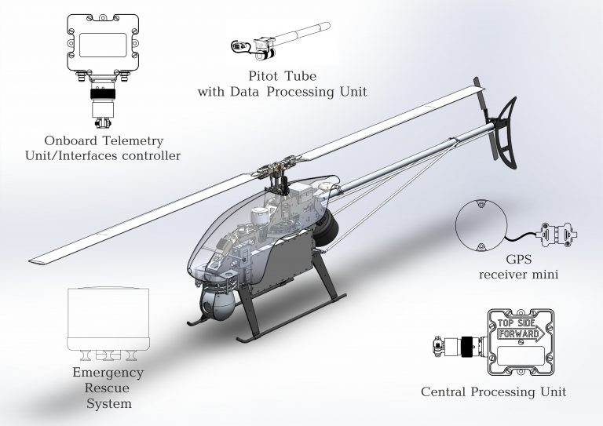

import Aircraft from "./assets/tandem-300x223.jpg"
import Helicopter from './assets/UVH-ap102-300x223.jpg'

import CentralProcessingUnit from './assets/cpu-300x248.jpg'
import PitotTubeMini from './assets/pitot-tube-mini.jpg'
import GPSUnitMini from './assets/gps-300x239.jpg'
import OnboardTelemetryUnitMini from './assets/otu-300x242.jpg'
import ServodriveSD3 from './assets/sd3-300x205.jpg'

## AP 10.2

Automatic Control System for UAV with a takeoff weight of 15 kg up to 100 kg

### OVERVIEW

The AP 10.2 system is designed to control a surface, ground or airborne platform automatically, semi-automatically or manually.
The system is configurable for the following platforms:

- Standard airplane for automatic take-off and landing
- Rotor-wings for automatic take-off and landing
- Balloons, Blimps
- USVs (boats)
- UGVs (cars)

The AP 10.2 was designed for small platforms and has the following advantages:

- reduced form factors (avionics weight less then 350 g)
- reduced energy consumption

Most payload can be interfaced through:

- 1-Wire
- RS-232
- RS-485
- TTL UART
- CAN

### KEY FEATURES

- Very small size and lightweight
- ESD protection
- Leading edge components and technologies
- Dead-reckoning, flight and navigation without GPS
- Automatic take-off and automatic landing
- Operating/flight mechanisms controls
- Engine/power plant control
- Semi-automatic control with automatic stabilization
- Manual control over 928MHz from ground control station
- Emergency mode
- Payload control
- Payload feedback
- Gyro-stabilization mode for rotating platforms
- Telemetry 10Hz with compressed stream, 100km LOS
- Ground simulation mode – flight simulator
- Operator training on flight simulator
- Pre-flight and flight assignment testing
- Onboard power control and monitoring
- Power stabilization
- Distribution, including emergency power supply mode

### SPECIFICATIONS

*Interfaces and characteristics:*

- 12x servo drives (PWM outputs)
- 12x RPM sensor inputs (hall effect sensor)
- 1-Wire interface
- TTL UART interface
- RS-485 interface
- Controller area network - CAN
- RS-232 interface
- 4x Active-ground switched power output (4.7a, @ 27V, 68mOhm)
- 12x digital inputs (timing, level)
- 12x general purpose inputs-outputs (remappable on MCU)

*Technical specifications:*

| Operating temperature | IP rating | Housing material | Connector                                                                                   |
|-----------------------|-----------|------------------|---------------------------------------------------------------------------------------------|
| −40°C to +60°C        | IP67      | Aluminium alloy  | Harwin 300-3240696M1 Amphenol PT02E14-19P Amphenol PT02E8-4P Harwin M80-9420605   |

| Power supply | Protection – logic I/O                     | Protection – ESD | Protection – reverse-polarity            |
|--------------|--------------------------------------------|------------------|------------------------------------------|
| 7–27 V       | Gated logic on all digital I/O pins        | ESD protection   | Power supply reverse-polarity protection |

### APPLICATION CASES

<Cards num="4">
    <Card 
        title="Aircraft" 
        image={Aircraft}
    >
    </Card>
    <Card 
        title="VTOL Drone" 
        image={Helicopter}
    >
    </Card>
</Cards>

AP 10.2 system configuration for helicopter example:

Basic modules of AP 10.2 system:

<Cards num="4">
    <Card 
        title="Central Processing Unit" 
        image={CentralProcessingUnit}
    >
    </Card>
    <Card 
        title="Pitot Tube Mini" 
        image={PitotTubeMini}
    >
    </Card>
    <Card 
        title="GPS Unit Mini" 
        image={GPSUnitMini}
    >
    </Card>
    <Card 
        title="Onboard Telemetry Unit Mini" 
        image={OnboardTelemetryUnitMini}
    >
    </Card>
    <Card 
        title="Servo drive SD3" 
        image={ServodriveSD3}
    >
    </Card>
</Cards>

### AP10.2 KIT

| #    | Item                                                                 | Designation | Part number           | Weight, g |
|:----:|-----------------------------------------------------------------------|:-----------:|-----------------------|----------:|
| 1    | **AP 10.2 Kit**                                                       |             |                       |           |
| 1.1  | Central Processing Unit                                               | CPU         | UV.431329.102.330     |       160 |
| 1.2  | Onboard Telemetry Unit Mini                                           | OTUM        | UV.468339.100.311     |       120 |
| 1.3  | Pitot Tube Mini                                                       | PTM         | UV.468339.90.345      |        74 |
| 1.4  | GPS Receiver Mini                                                     | GPSM        | UV.431292.102.365     |        49 |
|      | _All housings are hermetic._                                          |             |                       |           |
| 2    | **Optional airborne equipment**                                       |             |                       |           |
| 2.1  | Laser Altimeter (0–100 m altitude)                                    |             |                       |           |
| 2.2  | Emergency Rescue System ERS-25 (ballistic)                            |             |                       |           |
| 2.3  | Video transmission channel (30 km range, FullHD, 1 Watt)              |             |                       |           |
| 3    | **Ground control unit**                                               |             |                       |           |
| 3.1  | GCU ground telemetry unit                                             | GCU-GTU     | UV.431329.90.211      |       110 |
| 3.2  | GCU antenna                                                           | GCU-A       | UV.431329.80.215      |       400 |
| 3.3  | Portable ground control station *                                      | PGCS        | UV.468323.01          |    19500 |

* Exploitation of Uavos PGCS is optional. Required software (GCU) can be installed on any computer under Linux OS control.

### DOWNLOADS

<DownloadLinks
files={[
    { name: "Download archive 3D-models", path: "/products/AP10.2-models.zip" },
    { name: "Download archive drawings", path: "/products/AP10.2-drawings.zip" },
    { name: "Download brochure", path: "/products/AP10.2.pdf" },
]}
/>