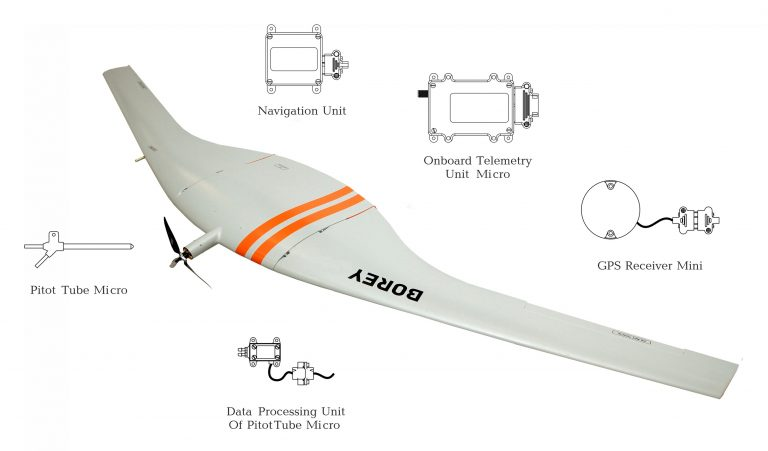

import Quadcopter from "./assets/quaduavos-300x220.jpg"
import Helicopter from './assets/UVH-ap102-300x223.jpg'

import NavigationUnit from './assets/ap103-micro-square-1-300x300.jpg'
import Onboard from './assets/ap103-micro-square2.jpg'
import GPSUnitMini from './assets/gps-300x239.jpg'
import DataProcessingUnit from './assets/data-proc-pt-micro-300x250.jpg'

## AP 10.3

Automatic Control System for UAV less then 15 kg

### OVERVIEW

The AP 10.3 system is designed to control a surface, ground or airborne platform automatically, semi-automatically or manually.

- Fixed-wing aircraft
- Rotary-wing aircraft

AP 10.3

- reduced form factors (avionics weight less then 130 g)
- reduced energy consumption
- 1-Wire
- RS-232
- RS-485
- TTL UART
- CAN

### KEY FEATURES

- Very small size and lightweight
- ESD protection
- Leading edge components and technologies
- Dead-reckoning, flight and navigation without GPS
- Automatic take-off and automatic landing
- Operating/flight mechanisms controls
- Engine/power plant control
- Semi-automatic control with automatic stabilization
- Manual control over 928MHz from ground control station
- Emergency mode
- Payload control
- Payload feedback
- Telemetry 10Hz with compressed stream, 100km LOS
- Ground simulation mode – flight simulator
- Operator training on flight simulator
- Pre-flight and flight assignment testing

### SPECIFICATIONS

| Operating temperature | IP rating | Housing material | Connector                                                                             |
|-----------------------|-----------|------------------|---------------------------------------------------------------------------------------|
| −40°C to +60°C        | IP67      | Aluminium alloy  | Harwin M300-3240696M1 Harwin M80-9420605                                         |

| Power supply | Protection – logic I/O                    | Protection – ESD | Protection – reverse-polarity            |
|--------------|-------------------------------------------|------------------|------------------------------------------|
| 7–27 V       | Gated logic on all digital I/O pins       | ESD protection   | Power supply reverse-polarity protection |

### APPLICATION CASES

<Cards num="4">
    <Card 
        title="Quadcopter" 
        image={Quadcopter}
    >
    </Card>
    <Card 
        title="VTOL Drone" 
        image={Helicopter}
    >
    </Card>
</Cards>

AP 10.3 system configuration for Fixed Wing UAV:

Basic modules of AP 10.3 system:

<Cards num="4">
    <Card 
        title="Navigation Unit" 
        image={NavigationUnit}
    >
    </Card>
    <Card 
        title="Onboard Telemetry Unit Micro" 
        image={Onboard}
    >
    </Card>
    <Card 
        title="GPS Unit Mini" 
        image={GPSUnitMini}
    >
    </Card>
    <Card 
        title="Data Processing Unit of Pitot Tube Micro" 
        image={DataProcessingUnit}
    >
    </Card>
</Cards>

### AP10.3 KIT

| #    | Item                                         | Designation | Part number           | Weight, g |
|:----:|----------------------------------------------|:-----------:|-----------------------|----------:|
| 1    | **AP 10.3 Kit**                              |             |                       |           |
| 1.1  | Navigation Unit                              | NU          | UV01.468339.103.323   |        30 |
| 1.2  | Pitot Tube Micro                             | PTMicro     | UV01.468339.103.346   |        10 |
| 1.3  | Data Processing Unit Of Pitot Tube Micro     | DPU-PTM     | UV01.431329.103.320   |        18 |
| 1.4  | GPS Receiver Mini                            | GPSM        | UV01.431329.102.365   |        49 |
| 1.5  | Onboard telemetry unit micro                 | OTUMicro    | UV01.468339.103.324   |        60 |
|      | _All housings are hermetic._                 |             |                       |           |
| 2    | **Ground control unit**                      |             |                       |           |
| 2.1  | GCU ground telemetry unit                    | GCU-GTU     | UV01.431329.100.211   |       110 |
| 2.2  | GCU antenna                                   | GCU-A       | UV01.431329.80.215    |       400 |
| 2.3  | Portable ground control station *            | PGCS        | UV01.468323.01        |    19500 |

* Exploitation of Uavos PGCS is optional. Required software (GCU) can be installed on any computer under Linux OS control.

### DOWNLOADS

<DownloadLinks
files={[
    { name: "Download archive 3D-models", path: "/products/AP10.3-models.zip" },
    { name: "Download archive drawings", path: "/products/AP10.3-drawings.zip" },
    { name: "Download brochure", path: "/products/AP10.3.pdf" },
]}
/>