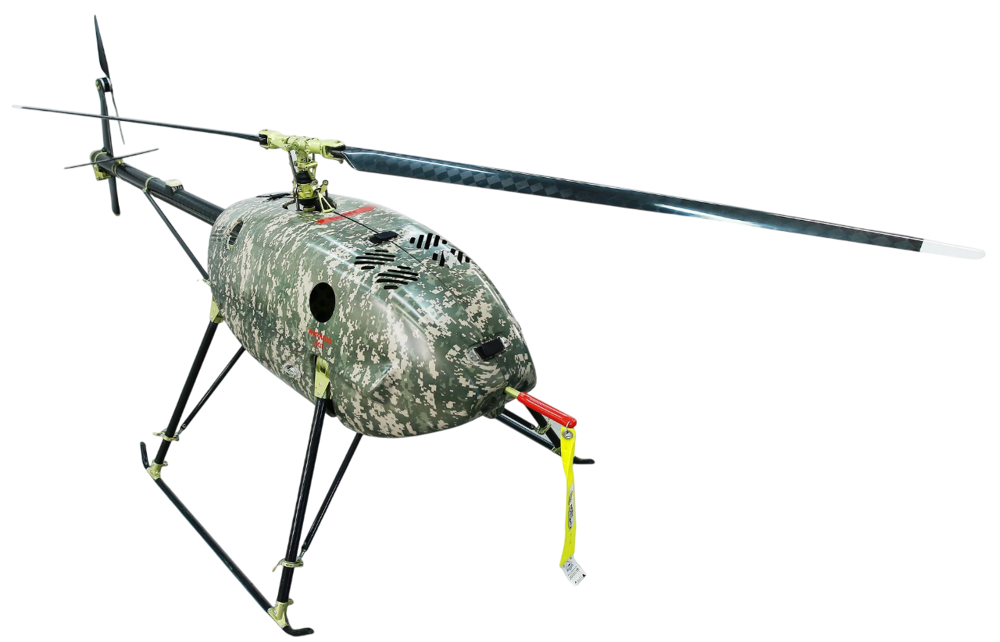
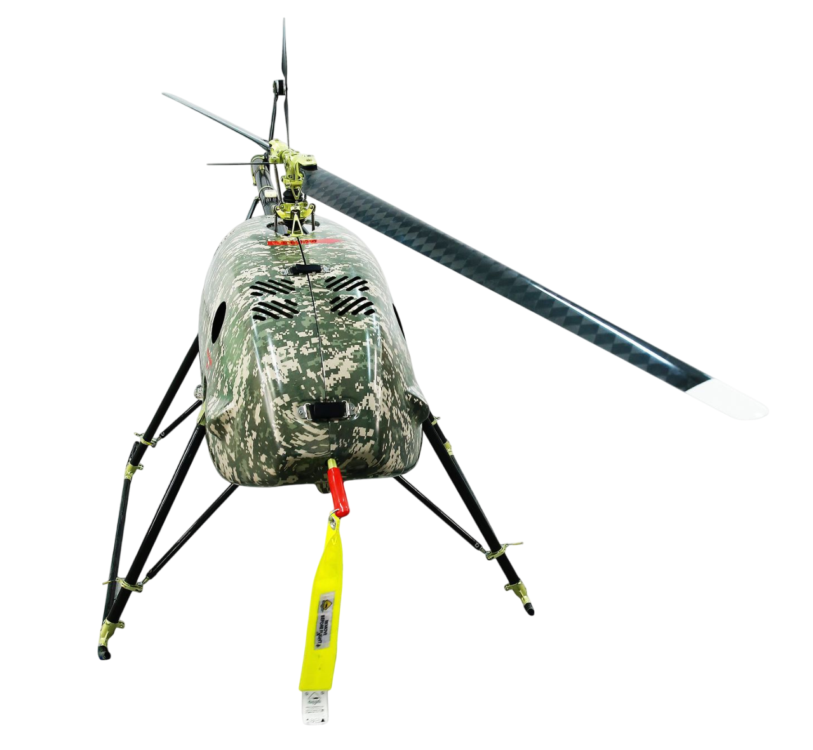
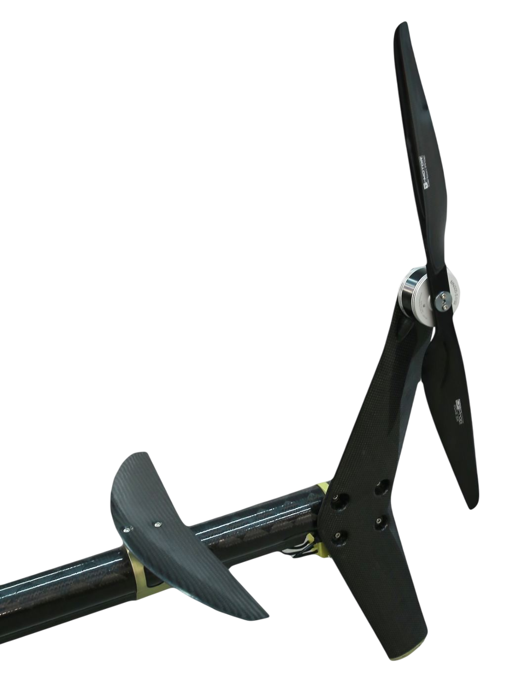
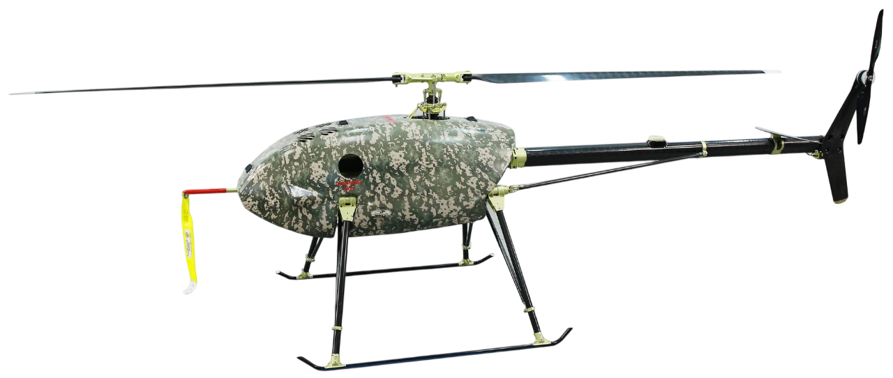

## UVH 170

4-stroke gasoline engine Helicopter with MTOW up to 45 kg

- <ModalLink type="gallery" title="Gallery">      </ModalLink>
- <ModalLink href="https://www.youtube.com/watch?v=YKoEyURO1GA&t=1s" type="video">Video 2</ModalLink>

### OVERVIEW

The UVH 170 is an industrial grade helicopter with a four-stroke gasoline engine equipped with an injector and a generator – starter.
Take-off and landing as well as mission are carried out automatically.
Optional semi-automatic control.
Emergency operation modes.
Diagnostics, flight planning and remote control can be performed via a wireless network connection.
Proprietary Autopilot.
The UVH 170 was specially designed with better engine cooling to perform in a tropical climate in a hot and moist environment.

### APPLICATION

- Video surveillance and monitoring
- Payload delivery
- Radio link range extension and retransmission
- R&D flying laboratory (meteorology, hydrology, earth monitoring, etc.)

### OPERATION

| **Parameters** | **Data** |
|---|---|
| Temperature range | −35°C to +40°C (−31°F to +104°F) |
| Base | Takeoff and landing area 15×15 m (49×49 ft) |
| Control modes | Fully automatic; Semi-automatic; Emergency |
| Takeoff and landing | Fully automatic |
| Emergency landing | Parachute and/or autorotation |
| Ground landing equipment | Not required |
| Engine start | Starter onboard |
| Storage/transportation container dimensions | 1570×960×520 mm (61.8×37.8×20.5 in) |
| Storage/transportation container weight | Box – 27 kg (59.5 lb) |

---

### SPECIFICATIONS

| **Parameters** | **Data** |
|---|---|
| Cruising speed | 60 km/h (37 mi/h) |
| Maximum speed | 120 km/h (74 mi/h) |
| Length | 3285 mm (129.3 in) |
| Main rotor diameter | 2600 mm (102.3 in) |
| Height | 851 mm (33.5 in) |
| Wheelbase | 875 mm (34.4 in) |
| Engine type | 4-stroke single engine |
| Fuel feed | Injection system |
| Power | 7 kW |
| Max. payload | 15 kg (33 lb) |
| MTOW | 45 kg (99 lb) |
| Empty weight | 28 kg (61.7 lb) |
| Fuel tank (max) | 10 kg / 13 l (22 lb / 3.43 gal) |
| Average fuel consumption | 2.5 l/h (0.7 g/h) in mixed flight mode w. 11 lb payload |
| Max. climbing capacity | 3 m/s (5.8 kts) |
| Max. wind speed during taking off or landing | 14 m/s (27 kts) |
| Practical range | 350 km (217 mi) |
| Practical ceiling | 5000 m (16400 ft) |
| Flight time (max with 4 kg payload) | 5 hours (ISA) |
| Parachute | ballistic |
| Onboard power supply | 12V |
| Battery type (included) | Li-Fe |
| Altimeter | laser |
| TBI (planned maintenance) | 400 h |
| Power available for payload | 21–29.5 VDC 400 W |

### DOWNLOADS

<DownloadLinks
files={[
    { name: "Download archive drawings", path: "/products/uvh170.pdf" },
    { name: "Download brochure", path: "/products/UVH-170.pdf" },
]}
/>