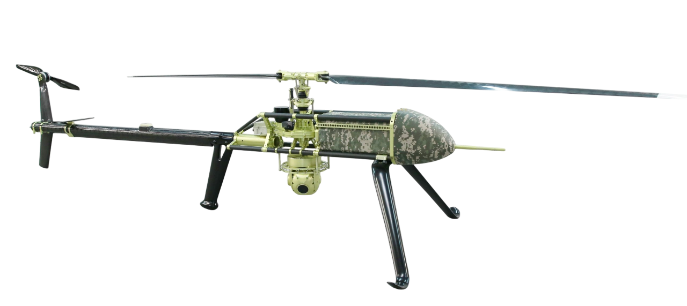
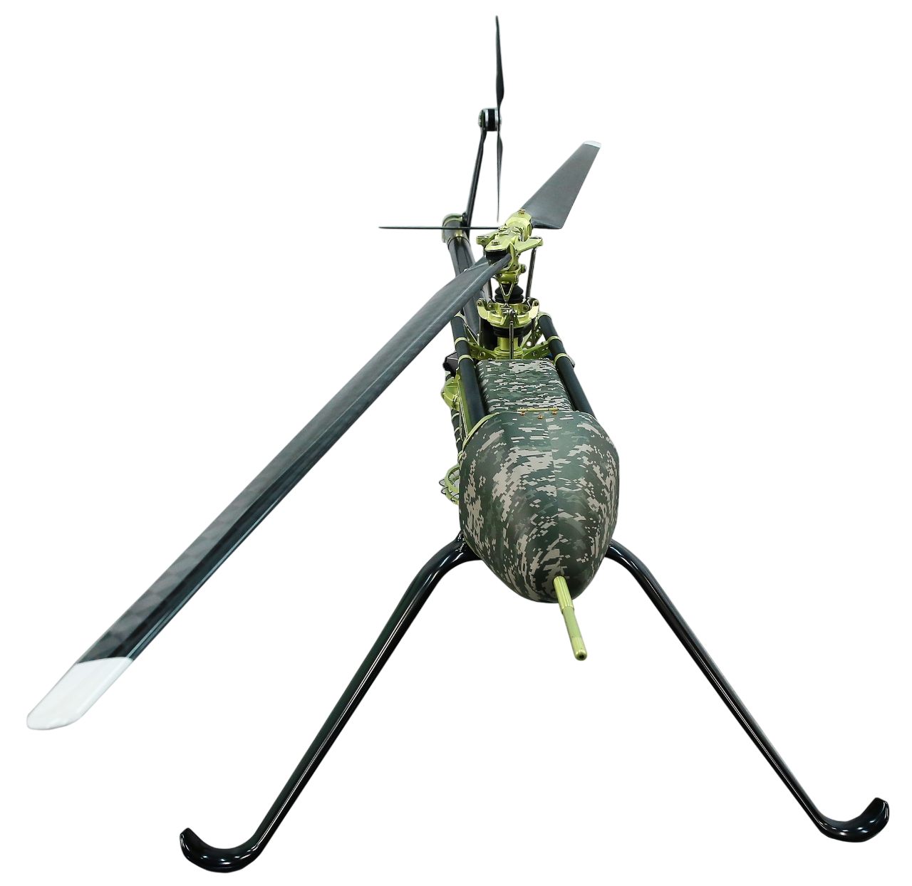
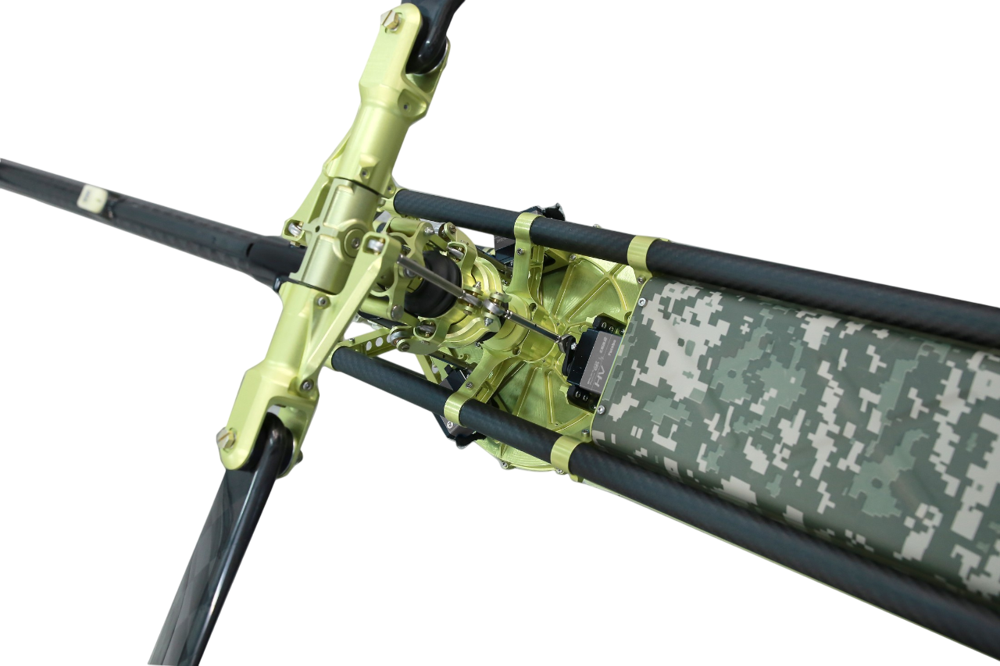

## UVH 25EL
The unmanned helicopter has increased performance with carrying capacity, flying range and extended temperature range

- <ModalLink type="gallery" title="Gallery">    </ModalLink>
- <ModalLink href="https://www.youtube.com/watch?v=2tsF5yMdwag" type="video">Video 1</ModalLink>
- <ModalLink href="https://www.youtube.com/watch?v=g8qm7qEeDrA" type="video">Video 2</ModalLink>
- <ModalLink href="https://www.youtube.com/watch?v=zXAzvYJgHRg" type="video">Video 3</ModalLink>

### OVERVIEW

The UVH 25EL is an industrial grade helicopter with an electric motor and Li-Ion rechargeable batteries.
Take-off and landing as well as mission are carried out automatically.
Optional semi-automatic control.
Emergency operation modes.
Diagnostics, flight planning and remote control can be performed via a wireless network connection.
Proprietary Autopilot.

### APPLICATION

- Video surveillance and monitoring
- Payload delivery (max. 5 kg)
- Radio link range extension and retransmission
- R&D flying laboratory (meteorology, hydrology, earth monitoring, etc.)

### OPERATIONS SPECIFICATIONS

| **Parameters** | **Data** |
|---|---|
| Operating temperature | −20°C…+40°C |
| Base | Takeoff and landing area 10 m × 10 m |
| Control modes — Main | Fully automatic |
| Control modes — Assisted | Semi-automatic |
| Control modes — Emergency situations | Emergency |
| Takeoff and landing | Fully automatic |
| Emergency landing | Parachute |
| Ground-based landing equipment | Not required |
| Storage | 1) Heli in box — 42 kg (1700×300×500 mm) 2) Portable GCS (PGCS) — 32 kg 3) Payload box — GSG-185 — 8.5 kg (350×350×350 mm) |

### SPECIFICATIONS

| **Parameters** | **Data** |
|---|---|
| Cruising speed | 45 km/h |
| Maximum speed | 100 km/h |
| Length | 2670 mm |
| Main rotor diameter | 2600 mm |
| Height | 670 mm |
| Wheelbase | 790 mm |
| Engine type | BLDC Electric |
| Motor power | 5 kW |
| Battery type | Li-Ion |
| Onboard power supply | 12V |
| Max. payload | 5 kg |
| MTOW | 25 kg |
| Max. climbing capacity | 3 m/s |
| Max. wind speed during taking off or landing | 14 m/s (27 kts) |
| Operational range | 67 km |
| Practical ceiling | 3500 m |
| Endurance | 1.5 h |
| Parachute (optional) | ballistic |
| TBI (inspections, maintenance) | 500 h |
| Altimeter | radio |

### DOWNLOADS

<DownloadLinks
files={[
    { name: "Download archive drawings", path: "/products/UVH25EL-drawing.pdf" },
    { name: "Download brochure", path: "/products/UVH-25EL.pdf" },
]}
/>