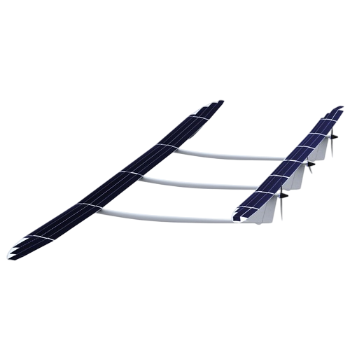

## ApusDuo aircraft

ApusDuo is a solar-powered stratospheric High Altitude Pseudo Satellite (HAPS), developed by UAVOS. Its persistence enables a capability of flying continuously for months at a time, at around 20,000 m, above weather and conventional air traffic.

ApusDuo relies on solar energy, with the batteries charged in daylight to power overnight flight.

ApusDuo is aimed to provide a wide scope of applications in Connectivity, Earth observation, Weather, Security, Natural Resources and Emergency Disaster management.

The ApusDuo HAPS project became part of Mira Aerospace.

To find out more about ApusDuo visit [Mira Aerospace](https://miraaerospace.com/).