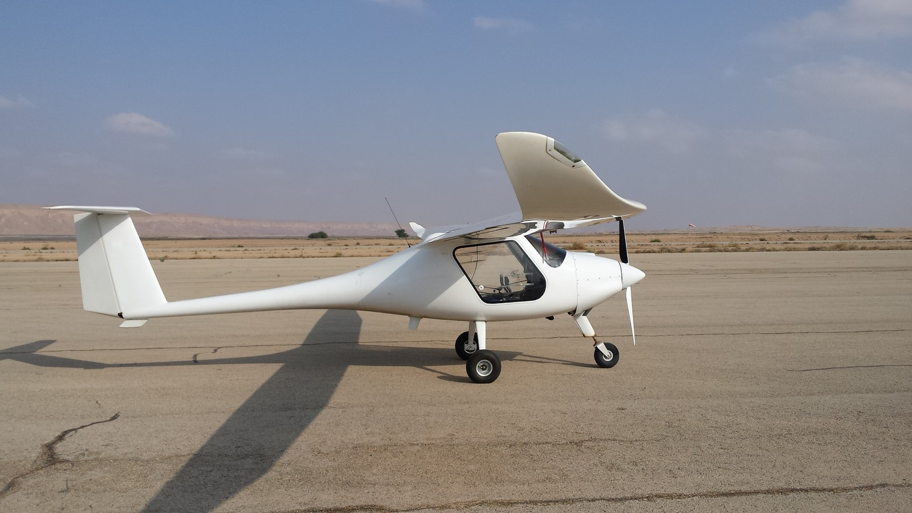

## ALBATROSS 2.2
Fixed Wing UAV

- <ModalLink type="gallery" title="Gallery">  </ModalLink>
- <ModalLink href="https://www.youtube.com/watch?v=KYlh-ESQtkg&t=116s" type="video">Video</ModalLink>

Medium Altitude Long Endurance (MALE) UAS with a long flight duration about 20h with 88 lb (40 kg) payload.

### OVERVIEW

The aircraft is designed for long-endurance missions in conditions of high turbulence and overloads.
The reinforced fuselage and landing gear are engineered for harsh landings, including on grass airfields or prepared sites.
Take-off, route flight, and landing are carried out in fully automated mode.
Proprietary Autopilot.
The ALBATROSS UAV is equipped with satellite communication data link for Beyond Line of Sight (BVLOS) operation.
Resistance to jamming.

### BENEFITS

- Low cost of flying hour
- The reliability of certified devices increases the reliability of the entire UAV system as a whole
- The availability of a large network of dealer centers and spare parts stores
- The conversion reduces the production time for an UAV

### APPLICATION

- Day and Night operations
- Cargo delivery
- Locating poachers and unauthorised activity in National Parks and other wildlife areas
- All kinds of Surveillance including communications interception
- Disaster Help – Civilian Support
- Maritime/Coastal Patrol
- SAR Operation and Victim discovery

### OPERATIONS SPECIFICATIONS

| **Parameters** | **Data** |
|---|---|
| Operating temperature | −40°C…+40°C (−40…104°F) |
| Base | Paved runway |
| Takeoff ground roll | 132 m (430 ft) |
| Takeoff total distance over 50 ft obst. | 232 m (760 ft) |
| Landing distance over 50 ft obst. | 270 m (885 ft) |
| Rolling touchdown accuracy range | 2–250 m (6.5–820 ft) |
| Pitch touchdown accuracy | 2–10 m (6.5–32 ft) |
| Runway length (min. touchdown accuracy) | 770 m (2526 ft) |
| Runway width (min. touchdown accuracy) | 25 m (82 ft) |
| Takeoff and landing on runway | Fully automatic |
| Ground support equipment | Not required |

### SPECIFICATIONS

| **Parameters** | **Data** |
|---|---|
| Wingspan | 14.97 m (49.1 ft) |
| Length | 6.5 m (21.32 ft) |
| Height | 1.82 m (6 ft) |
| Cockpit width | 1.12 m (44 in) |
| Aspect ratio | 18.3 |
| Empty weight | 300 kg (661 lb) |
| MTOW | 550 kg (1210 lb) |
| Fuel capacity | 150 l (40 gal) |
| Max payload | 250 kg (551 lb) |
| Parachute | Ballistic |

### PERFORMANCE

| **Parameters** | **Data** |
|---|---|
| Cruising speed (75% power) | 205 km/h (127 mi/h) |
| Range distance | 2255 km (1401 mi) with 30 min reserves |
| Nominal endurance | 11 hours, with 30 min reserves |
| Maximum endurance | 20 hours |
| Service ceiling | 7,200 m (23,600 ft) |
| Max load factor permitted (×1.8) | +4 g – 2 g |
| Fuel consum. at cruise speed | 13 l/hour |
| Engine | ROTAX 912iS |
| Generator | 3 kW – 12 V |