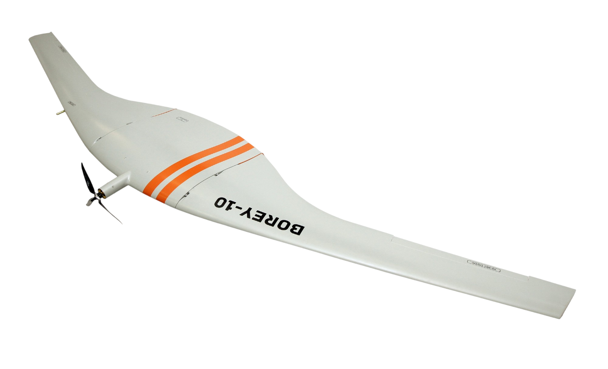

## BOREY 20
Fixed-wing unmanned aircraft

- <ModalLink type="gallery" title="Gallery">  </ModalLink>
- <ModalLink href="https://www.youtube.com/watch?v=OLsfN-urL2Y" type="video">Video 1</ModalLink>
- <ModalLink href="https://www.youtube.com/watch?v=3BWY-ohjv40" type="video">Video 2</ModalLink>
- <ModalLink href="https://www.youtube.com/watch?v=oMsJHVXnxBw" type="video">Video 3</ModalLink>

### OVERVIEW

The Fixed Wing BOREY 20 UAV is designed for different long-range missions, security solutions, and commercial applications.

- The BOREY 20 UAV covering 400 km (248 mi) in a single mission
- Long-range performance capabilities with a flight time of up to 5 hours
- GPS data embedded recording of video or images
- Live streaming up to 120 km (80.8 mi)
- Resistance to jamming
- Takeoff and landing is fully automatic
- Proprietary Autopilot

The unique mobility of the system allows for quick Borey 20 transportation and deployment in minutes. The modular UAV design makes exchanging of various function modules easy.

### ADVANTAGES

Low operating costs
Any terrain launch
Long operational lifespan
Speedy task execution
Simple maintenance
Easy deployment and recovery
Large areas

### APPLICATION

- Aerial mapping and surveying
- Monitoring of facilities in areas of natural and man-made disasters
- Monitoring of power lines, industrial facilities, oil and gas pipelines
- Search and rescue operations (SAR)
- Disaster area reconnaissance
- Rail & Road monitoring
- Borders control

### PERFORMANCE

| **Parameters** | **Data** |
|---|---|
| Cruising speed | 20 m/s (65.6 ft/s) |
| Maximum speed | 30 m/s (98.5 ft/s) |
| Max. payload | 4 kg (8.8 lb) |
| MTOW | 26 kg (57.3 lb) |
| Max. climbing capacity | 4 m/s (7.8 kts) |
| Max. wind speed while take-off or landing | 10 m/s (19.5 kts) |
| Flight time | 5 hours |
| Operational range | 400 km (249 mi) |
| Practical ceiling | 3,500 m (11,483 ft) ISA |
| Digital data link | up to 120 km (up to 74.5 mi) |
| Telemetry and control data link | up to 120 km (up to 74.5 mi) |

### PHYSICAL SPECIFICATIONS

| **Parameters** | **Data** |
|---|---|
| Wingspan | 4,370 mm (172 in) |
| Length | 875 mm (34.5 in) |
| Height | 347 mm (13.6 in) |
| Empty weight | 8.7 kg (19 lb) |
| Emergency landing | Parachute |
| Onboard power supply | 24V, Li-Ion |
| Powered by | Electric motor 2000 W |
| Level surface | Takeoff 100×100 m and Landing plot 100×100 m |
| Ground support equipment | Not required |
| Takeoff technique | Mechanical catapult |
| Recovery system | Parachute landing |
| Operating temperature | −20°C…+40°C |

### DOWNLOADS

<DownloadLinks
files={[
    { name: "Download archive drawings", path: "/products/borey20-drawing.pdf" },
    { name: "Download brochure", path: "/products/borey.pdf" },
]}
/>