## GROUND CONTROL STATION GCS.A

20' container

- <ModalLink type="gallery" title="Gallery">  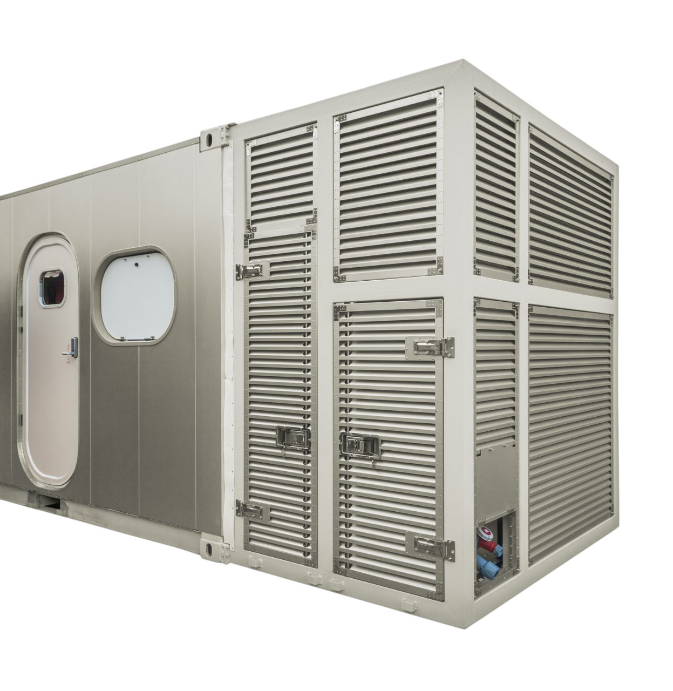 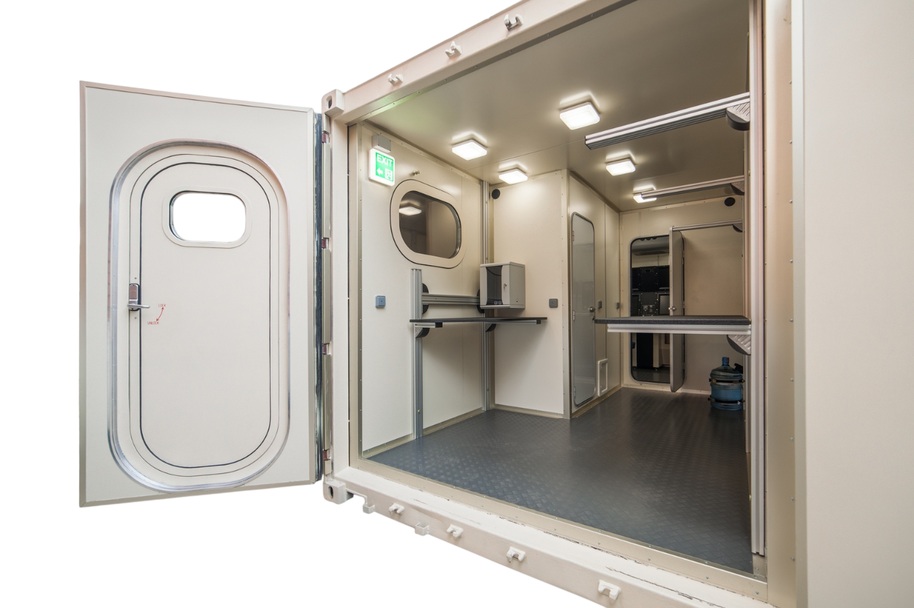 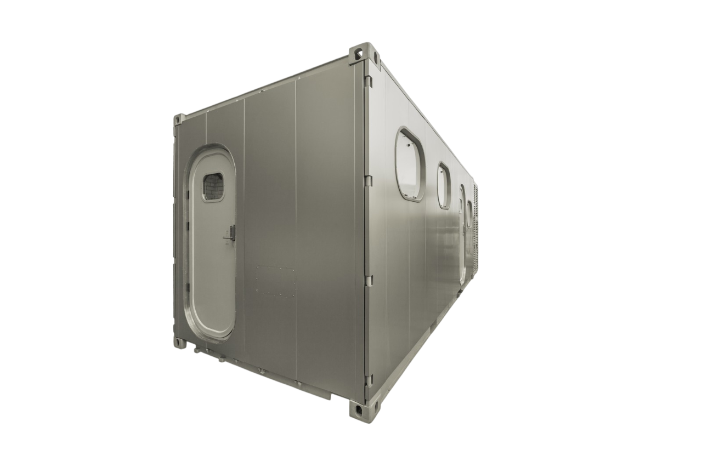 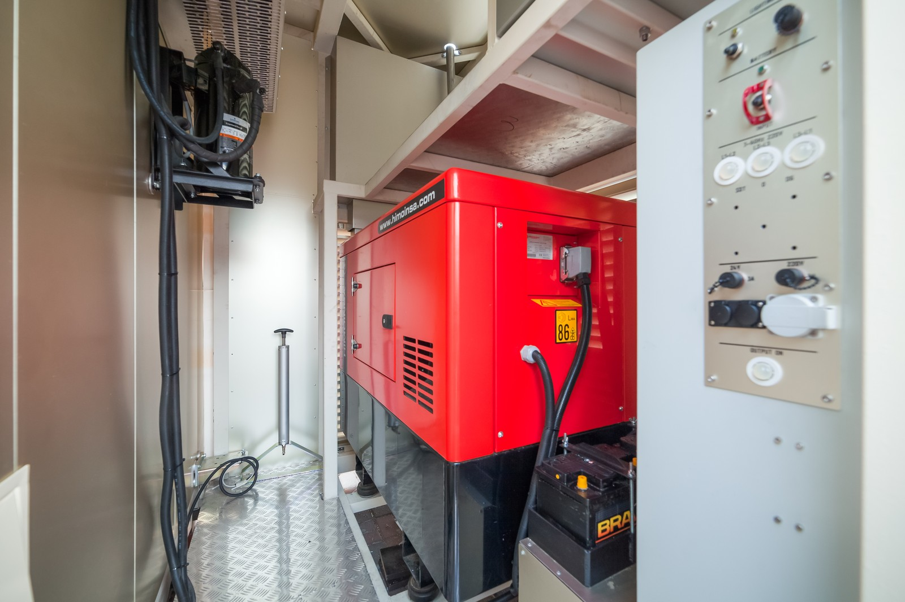 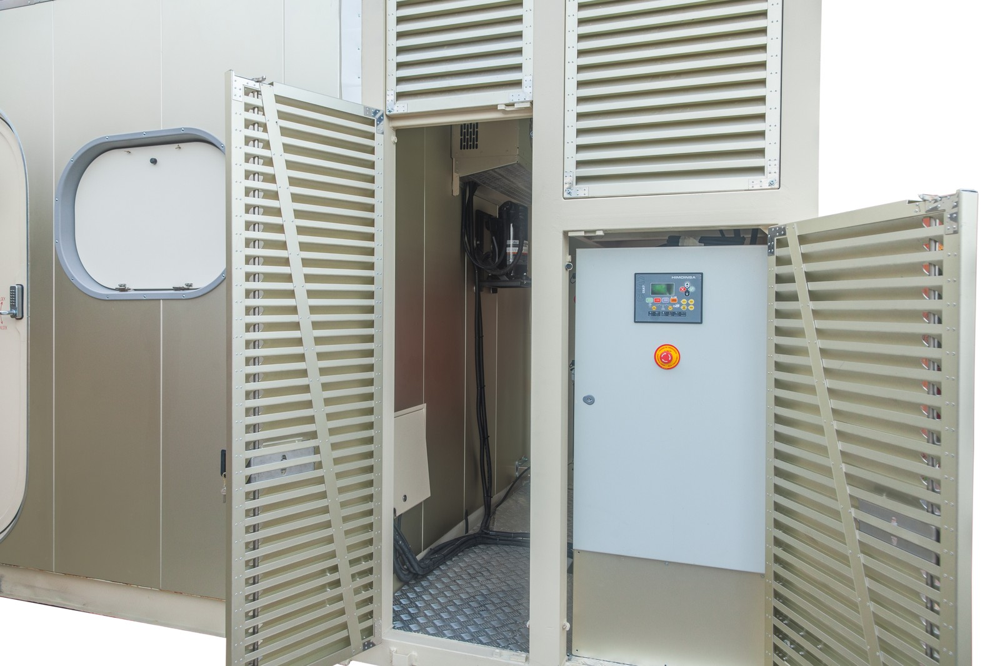 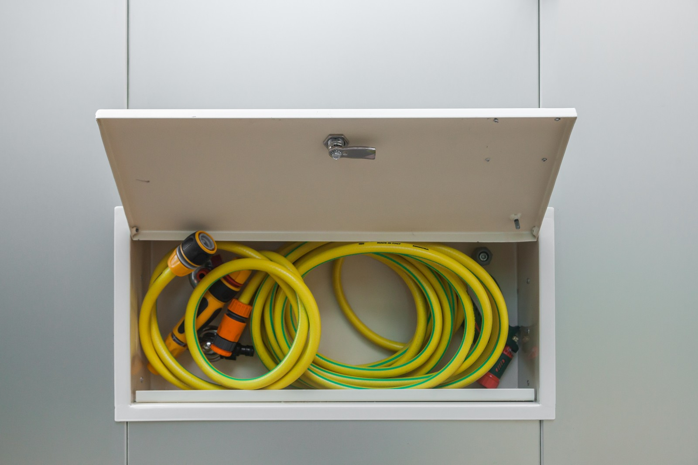 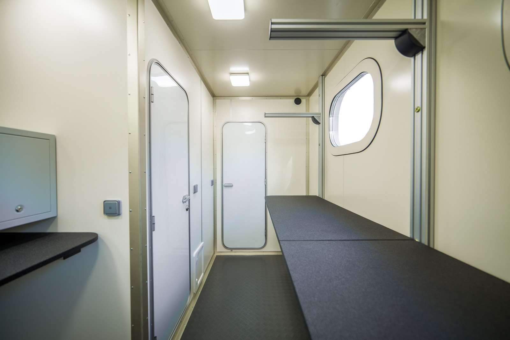 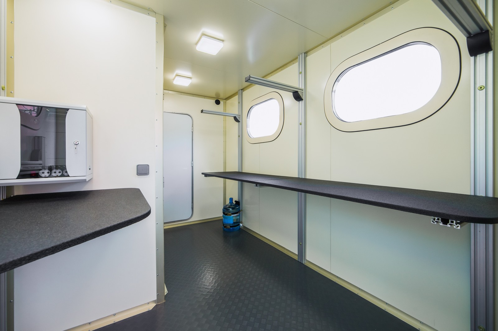  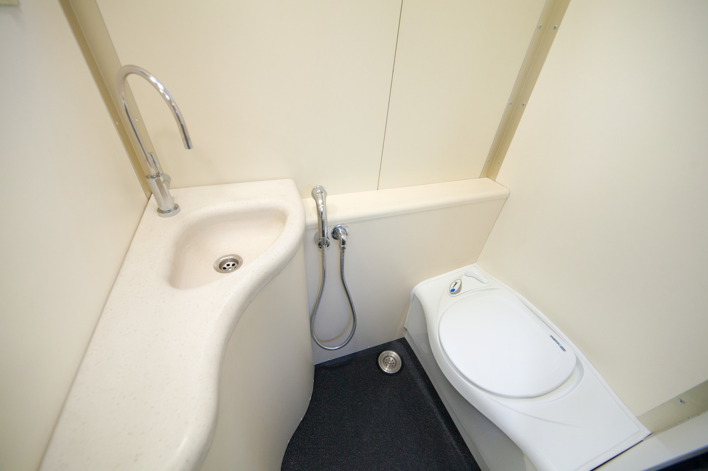 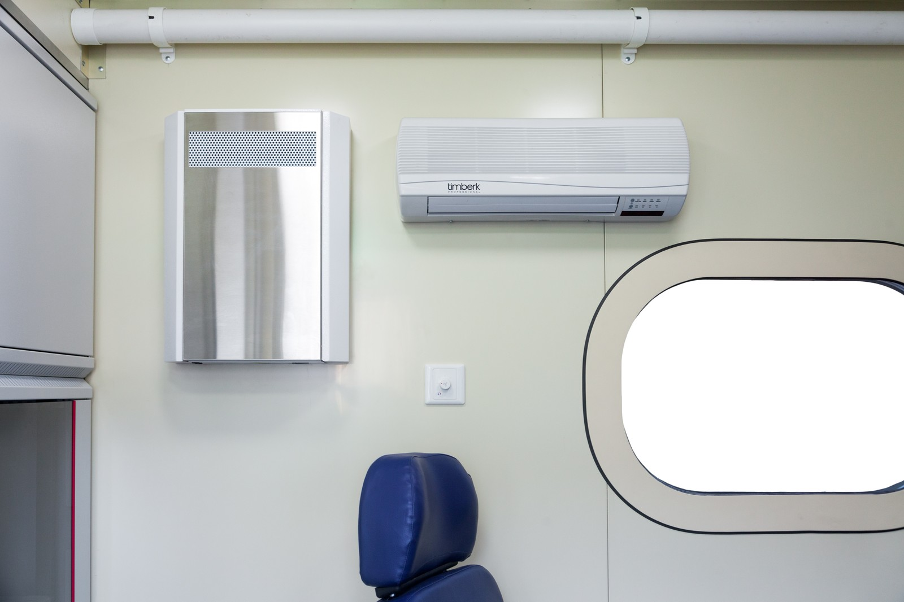  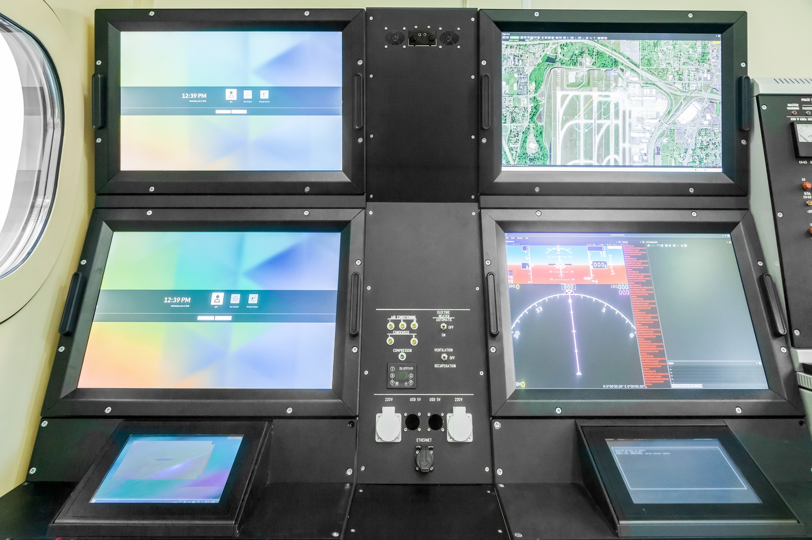</ModalLink>
- <ModalLink href="https://www.youtube.com/watch?v=VHiQs2l2PHY" type="video">Video 1</ModalLink>

### OVERVIEW

The GCS.A is installed into a modified 20-foot container, enhanced with a generator section.

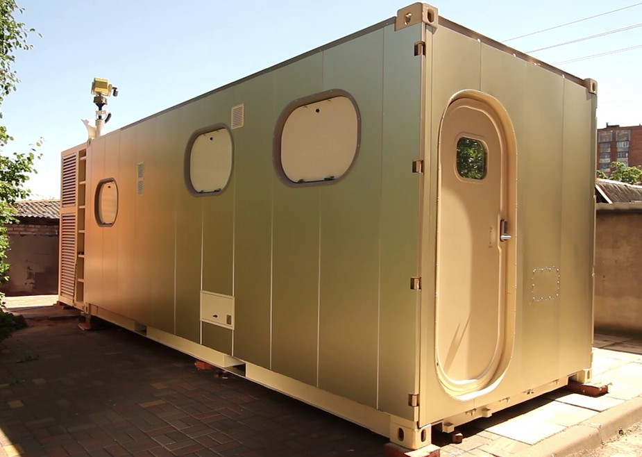

The GCS.A unmanned systems command center provides everything required for operators to undertake missions in complete comfort and safety, including climate control, redundant power and communications.

State-of-the-art features and amenities include:

- Autonomous operating time up to 48 hours
- Housing for the communication and control equipment
- Three workplaces for the pilots and the payload operators
- Directional antenna for telemetry and communication
- Directional antenna for video and data links
- Support Equipment for the unmanned aerial system (transport module)

### SPECIFICATIONS

| Temperature range: | -40°F to +131°F (-40°C to +55°C) |
|---|---|
| **Dimensions:** | Length 295 in (7500 mm), width 98 in (2492 mm), height 102 in (2585 mm) |
| **Transportation:** | truck tractor |
| **Generator:** | 15 kW |
| **Autonomous operating time:** | 48 h |
| **Automated workplaces:** | 2+1 |
	

The GCS.A is divided into technical sections:

- Control compartment (operator);
- Service and supply compartment;
- Generator compartment.

Design options

Customization is possible upon request.

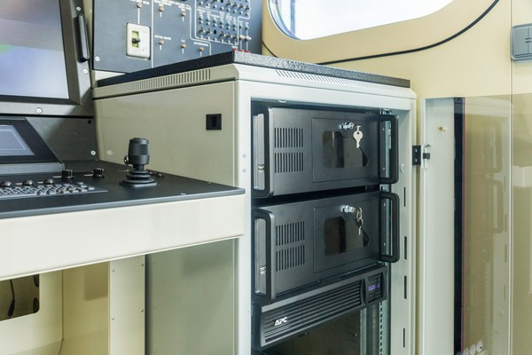

**Control compartment (operator)**

Equipped with two Automated Workstations (AWS). The first is the workplace for the operator of the UAV, the second – for the operator of the payload.

Each AWS is equipped with a control panel, three monitors (two main and one auxiliary) connected to a separate computer. The panel can be customized/adapted for a tactical or operational radio station, intercom and other equipment.

A central console controls the air conditioning and is equipped with 220V connectors, 5V USB ports and speakers.

**The repair and technical compartment:**

— shelves and workbenches can be adjusted in height
— a water closet equipped with a 17 gallon (65 liters) water tank, a faucet and a bio-toilet bowl)
— an air conditioning system

**The control compartment:**

— ground station control panel
— power supply cabinet with PC
— continuous power supply
— a heater, recuperator, an internal air-conditioning module, a minibar with kettle and a coffee machine, a mini-fridge, a filing cabinet make for a comfortable stay in the compartment even over long periods of time

**The generator compartment is equipped with:**

— a 15 kW power generator,
— external air conditioning modules,
— a telescopic pneumatic mast,
— an AC/DC transformer,
— a power generator control cabinet,
— batteries for continuous operation of the 27 V electric power supply.

### DOWNLOADS

<DownloadLinks
files={[
    { name: "Download brochure", path: "/products/GCS.A.pdf" },
]}
/>