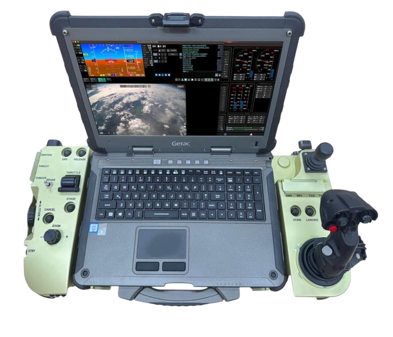
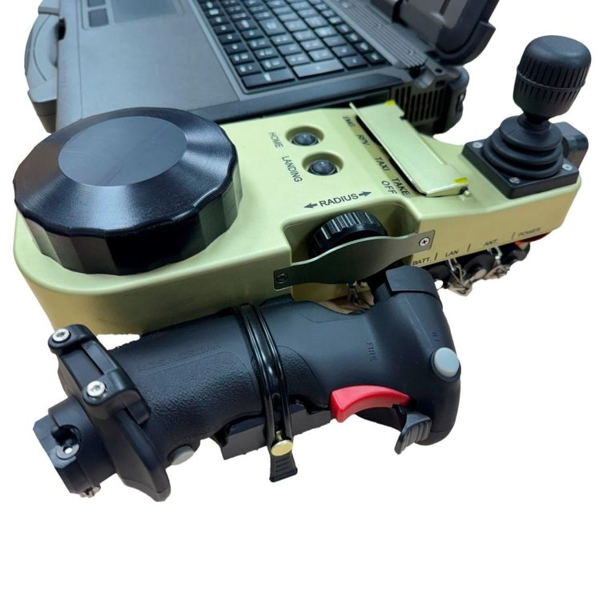
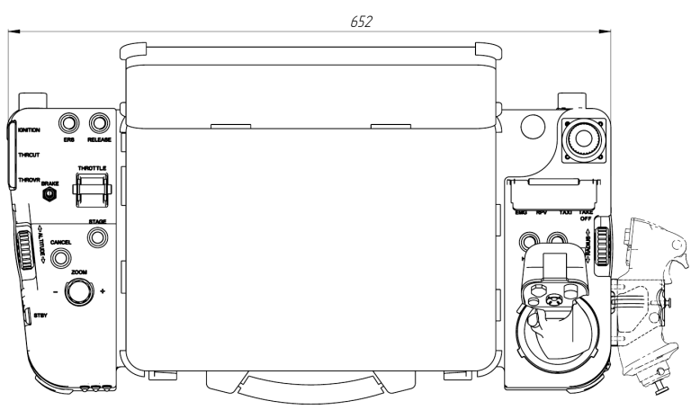
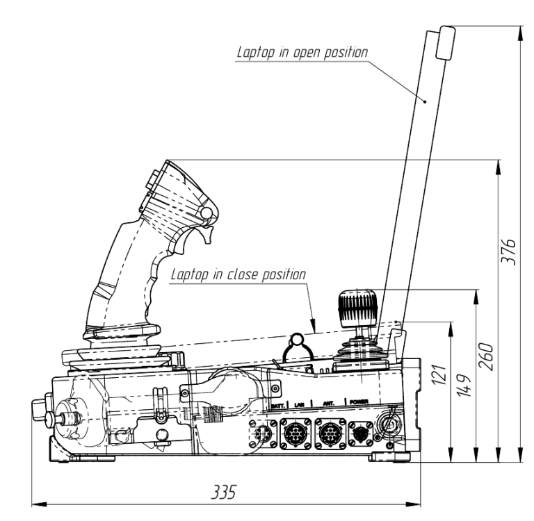

## PGCS.4
Portable Ground Control Station for UAS

### OVERVIEW

The PGCS.4 has a new generation powerful Getac X600 PC, an external redundant power supply, and an improved customizable I/O hardware interface.

With a full-size keyboard and buttons, the rugged purpose-built PGCS.4 enables intuitive and user-friendly control making it possible to reduce the likelihood of operator error during missions.

Compatible with preferred autopilots, PGCS.4 features flight and mission operation software, video-tracker software, payload sensor data, and information.

Launching multiple UAS types from a single hub and transferring data to an operator, all using one GCS. The system uses industry-standard protocols, hardware, and power sourcing simplifying operational compatibility.

The PGCS.4 is built to withstand harsh environments, with IP65-rated construction and enhanced shock resistance.

### PGCS.4 provides:

- Real-time telemetry information from the UAS
- Payload control
- Reception, recording, storage and playback of payload information with real time display
- Preparation and upload of the mission
- Real-time platform health monitoring
- Preflight and post-flight inspection
- Registering target coordinates
- Flight mission control
- Flight mission protocol logging
- Flight mission simulation

### KEY FEATURES

- Rugged design to IP65
- Throttle lever and 3-axis joystick
- Configurable switches and keyboard
- Weight: 9.3kg including laptop
- Dimensions: length 652 mm, width 335 mm, height 149 mm
- Comes up with a Getac X600 laptop modification to meet client requirements
- Shock resistant construction ensures reliability in harsh conditions

### EXTERNAL CONNECTORS

- Amphenol PT02E-8-4P (Input Power 30V DC)
- Amphenol PT02E-10-6P (External Battery)
- Amphenol PT02E-12-10P (Output power 30V DC, RS232,100Mb Ethernet)
- Amphenol PT02E-12-10P (Output power 30V DC, 100Mb Ethernet)

### DOWNLOADS

<DownloadLinks
files={[
    { name: "Download brochure", path: "/products/UV01.468323.03.00-01_1-gcs4.pdf" },
]}
/>
