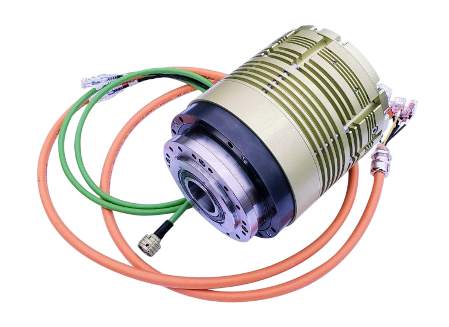

## SERVO ACTUATOR XSERVO140

- <ModalLink href="https://www.youtube.com/watch?v=VHiQs2l2PHY" type="video">Video</ModalLink>

### OVERVIEW

Xservo-Series lightweight, Hollow Shaft Servo Actuators features embedded CANopen / EtherCAT servo drive.

The advantage of this series is:
— the built-in motion controller, which allows the customer to skip the complex stage of mechanical and electrical integration of a passive servo actuator with an external servo drive controller
— a versatile hollow shaft that makes it easy to pass power supply cables, shafts or laser beams directly through the servo actuator.

New actuators are immune to shock and vibration and designed for use in harsh conditions.

### APPLICATIONS

- Automation and robotics
- Power movement of UAV control surfaces and elements

### SUPPORTED CONTROL MODES

- Cyclic Synchronous Position
- Cyclic Synchronous Velocity
- Cyclic Synchronous Torque
- Profile Position
- Profile Velocity

### SERVO ACTUATOR TELEMETRY DATA

- Position, speed
- Supply Voltage
- Current (RMS, Phase)
- Motor & power stage temperature

### SERVO ACTUATOR FEATURES

- Hollow shaft1
- Electromagnetic brake
- Shunt braking resistor
- Reverse polarity protection

### TECHNICAL SPECIFICATIONS

| **Parameter** | **Value** |
|---|---|
| Supply Voltage (rated) | 48 VDC |
| Supply Voltage Range¹ | 18–75 VDC |
| Standby Current at rated voltage | 0.2 A |
| Rated Current at rated voltage | 30 Arms |
| Peak Current at rated voltage | 60 Arms |
| Rated Torque at rated speed² | 118 Nm |
| Average Torque² | 167 Nm |
| Peak Torque at rated voltage² | 304 Nm |
| No Load Speed at rated voltage² | 58 rpm |
| Rated Speed at rated torque² | 44 rpm |
| Default Travel Angle | n × ±360° |
| Backlash (mechanical) | ~0° |
| Final system accuracy | ≤90 arcsec |
| Feedback system | Absolute (from 17-bit to 20-bit singleturn and 16-bit multiturn) |
| Storage Temperature Range | −40 °C … +90 °C |
| Operating Temperature Range | −40 °C … +60 °C |
| Protection | IP65 |
| Weight | 8.5 kg |
| Size | 147 mm × 185 mm |
| Holding Brake | Power-off electromagnetic brake |
| Shunt braking resistor | Built in |
| Protocol | CANopen (CiA-402 (4.0) compliant), EtherCAT, protocol over RS422 (RS485) (available at option) |

¹ Limited by parameter “Shunt enable voltage”.  
² Data given for reduction ratio 80 (available reduction values: 30, 50, 80, 100, 120, 160).

### DOWNLOADS

<DownloadLinks
files={[
    { name: "Download brochure", path: "/products/xservo140-drawing.pdf" },
]}
/>
