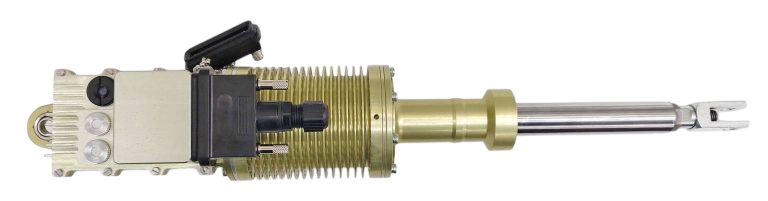

## SERVO ACTUATOR SDLM-04B

Rugged and Durable Rotating Type Servo for Professional Intensive Applications

- <ModalLink href="https://www.youtube.com/watch?v=BtzDkmwEiBA" type="video">Video</ModalLink>

### APPLICATION

- Conversion of manned aircraft into UAV
- Equipping of manned aircraft with automatic piloting system (APS)
- Power movement of UAV control surfaces and elements
- Other types of unmanned vehicles

### MAIN FEEDBACK DATA FROM SERVO-DRIVE

- Actual position, actual velocity
- Bus voltage, active motor current
- Power stage & BLDC motor temperature
- Humidity control inside the case

### OPERATIONAL DATA

| **Parameter** | **Value** |
|---|---|
| Recommended power supply range, VDC | 9 to 40 |
| Max. consumption current at rated voltage 24 VDC, A | 14 |
| Rated speed, mm/s | up to 150 |
| Stroke length, mm | 100 |
| Force (peak), N | 1100 |
| Force (continuous), N | 1600 |
| Resolution, µm | 19 |
| Weight, g (lb) | 1500 (3.3) |
| Control interface | CAN 2.0B (CANAerospace) / option – CANopen CiA-402 / option – Ethernet (EtherCAT) |
| Protection class | IP67 |
| Operating Temperature Range, °C | −40 to +80 |
| Size | 336.95 mm × 67 mm × 87.7 mm |

### PHOTOS

### DOWNLOADS

<DownloadLinks
files={[
    { name: "Download brochure", path: "/products/UV01.654116.51.000ВО-Linear-Servo-Actuator-SDLM-04B_2.pdf" },
]}
/>
