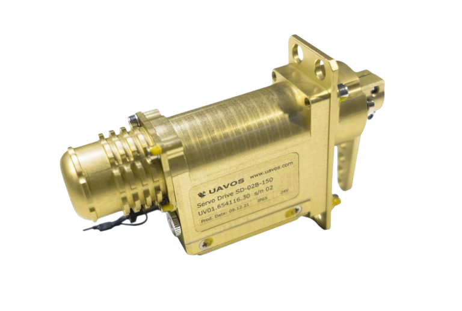

## SERVO ACTUATOR SD-02B

Rugged and Durable Rotating Type Servo for Professional Intensive Applications

- <ModalLink href="https://www.youtube.com/watch?v=BtzDkmwEiBA" type="video">Video</ModalLink>

### APPLICATION

- Conversion of manned aircraft into UAV
- Equipping of manned aircraft with automatic piloting system (APS)
- Power movement of UAV control surfaces and elements
- Other types of unmanned vehicles

### MAIN FEEDBACK DATA FROM SERVO-DRIVE

- Actual position, actual velocity
- Bus voltage, active motor current
- Power stage & BLDC motor temperature
- Humidity control inside the case

### OPERATIONAL DATA*

| **Parameter** | **Value** |
|---|---|
| Rated voltage | 24 VDC |
| Absolute supply voltage range (min.–max.)¹ | 9–52 VDC |
| Recommended power supply voltage range | 12 VDC–36 VDC |
| Standby Current at rated voltage | 0.12 A |
| Rated Current at rated voltage | 2.277 A |
| Peak Current at rated voltage | 3.12 A |
| Rated Continuous Torque at rated speed | 4.3 Nm |
| Intermittent torque | 5.3 Nm |
| Peak Torque at rated voltage | 6 Nm |
| Rated Speed at rated torque | 278 °/s |
| Maximum Speed | 400 °/s |
| Travel Angle | 179° |
| Max. Travel Angle | ≤ 360° |
| Backlash (mechanical) | ≤ 0.6° |
| Position Error under Temperature | ≤ 0.1° |
| Operating Temperature Range | −40°C…+85°C (−40°F…+185°F) |
| Storage Temperature Range | −40°C…+90°C (−40°F…+194°F) |
| Weight (including match connector) | 480 g (16.9 oz) ±10% |
| IP Ratings (Ingress Protection) | IP65 |
| Size | 140 mm × 89 mm × 36 mm |
| Control interface | CANaerospace; UAVCAN (DRONECAN) |

¹ Data is related to SD-02B-24-15D modification.

### MODIFICATIONS

### DOWNLOADS

<DownloadLinks
files={[
    { name: "Download drawing", path: "/products/1628259703558665.pdf" },
    { name: "CANaerospace protocol description", path: "/products/UAVOS_CANaerospace_protocol_description_1.pdf" },
    { name: "UAVOS servomotor studio. User manual", path: "/products/UAVOS-servomotor-studio-User-manual.pdf" },
    { name: "SD-02B Datasheet", path: "/products/SD-02B-Datasheet.pdf" },
]}
/>