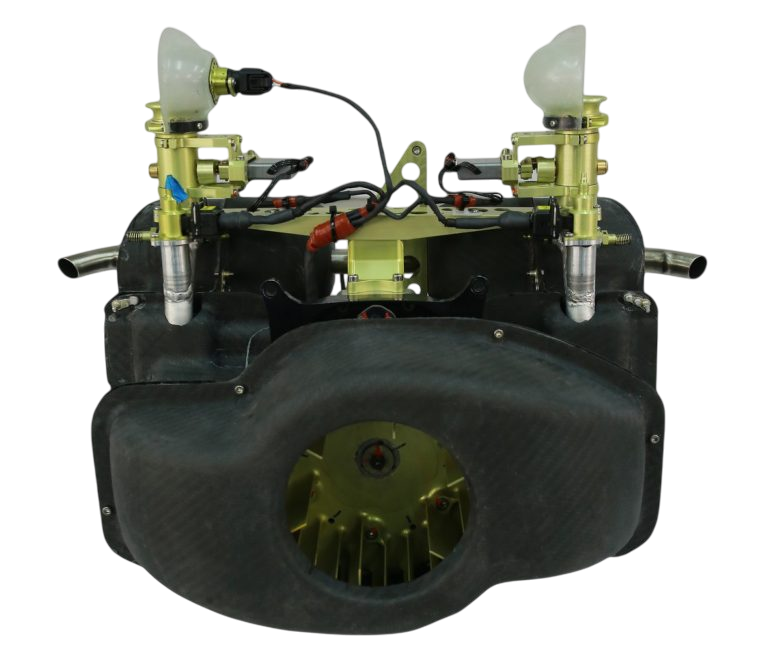
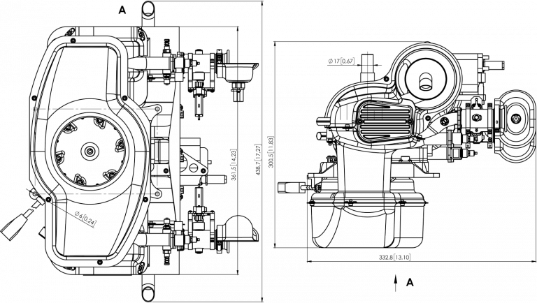
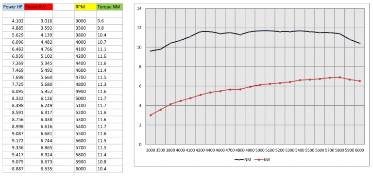
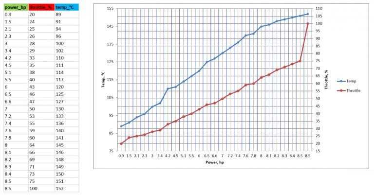
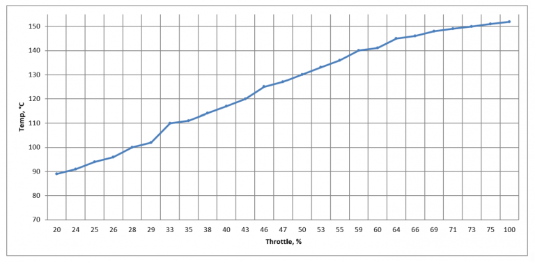
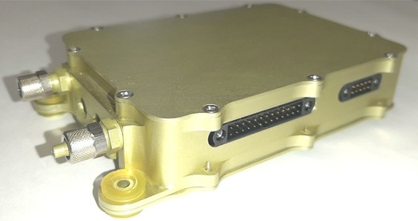

## UAV-170 Engine

### OVERVIEW

The UAV-170 engine based on the Fiala PROP. company FM 170 B2 – FS power plant is a 4-stroke gasoline motor with volume 170 ccm designed for being integrated in UAV.

It is a 4-stroke propulsion system with OHV and 2 valves per cylinder. The engine is equipped with a microprocessor ignition for easy starting and smooth running in all modes of engine speed.

The power plant has been modified by UAVOS to improve performance :

- Air cooling and a two-nozzle fuel injection system have been made.
- A brushless generator-starter is installed on the engine.

UAVOS's injection system can be very precisely tuned with a lambda probe depending on the operating conditions.

### FEATURES

- The engine is equipped with a fuel injection system
- 95-octane petrol + Valvoline 2T SynPower 30:1
- Maximum engine power: 9.3 HP (6.8 kW)
- Nominal engine power: 6.1 HP (4.5 kW)
- Fuel consumption: 320 g/kWh
- Forced air-cooling
- Equipped with starter-generator, 27V 3-phase AC motor. Generator power 500W up to 4800 rpm
- Total engine weight with ECU (engine control unit): 8.5 kg
- Maximum CHT operating temperature: 165 °C

### GENERAL DIMENSIONS

### PERFORMANCE PLOTS

Power to Torque relationship plot (OAT 15 °C, Atm.pressure 1013 mbar).

CHT to Power relationship plot at nominal RPM (OAT 15 °C, Atm.pressure 1013 mbar).

CHT to Throttle Position relationship plot at nominal RPM until overheating (OAT 15 °C, Atm.pressure 1013 mbar).

### ENGINE CONTROL UNIT

Engine is equipped with Engine Control Unit (ECU) UV01.6401.06.63.00.
This unit is intended for processing information from sensors:

- calculates the optimal amount of the fuel input;
- determines the moment of ignition (based on the operating conditions of the engine and its mode).

The unit is equipped with a digital data line, which allows the flight controller to transmit sensor readings, as well as receive ignition commands and gas levels.
The main functions of the Engine Control Unit (ECU) UV01.6401.06.63.00:

- adjustment of the amount of fuel input;
- ignition timing adjustment;
- power supply control of the fuel pump;
- temperature measurements EGTх2, CHTх2, AT;
- the formation of control pulses of the gas servo drive;
- data exchange with a software navigation system.

**Electrical characteristics of the engine control unit**

| **Parameter** | **Value** |
|---|---|
| Supply voltage | 12 ± 0.5 V |
| Consumption current (no more) *(excluding nozzle current and fuel pump)* | 0.5 A |
| Ambient temperature | −40°C to +60°C |
| Relative humidity | up to 98% at 25°C |
| Data transmission channels | CAN bus, discrete signal management |

### DOWNLOADS

<DownloadLinks
files={[
    { name: "Download brochure", path: "/products/uav170engine-3.pdf" },
    { name: "Download UAV-170 engine drawing", path: "/products/uav170drawing.pdf" },
]}
/>