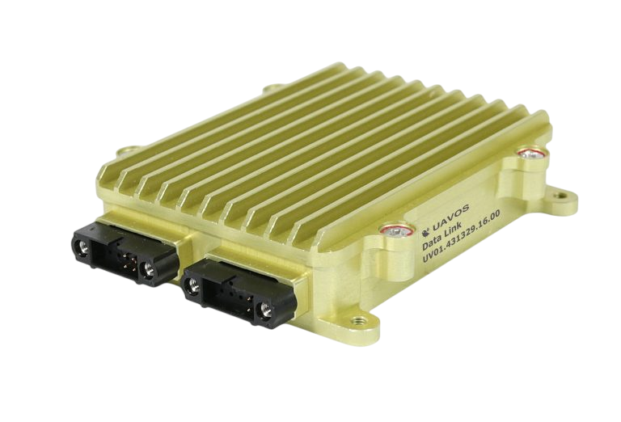

## pMDDLRadio DATA LINK SYSTEM

an advanced high power  
long range broadband COFDM  
communication system for UAV  

### OVERVIEW

The pMDDLRadio Digital Data Link is a miniature, high power, long range broadband COFDM complete wireless solution. Based on the new Microhard pMDDL core, it provides the bandwidth and range needed for complex data intensive applications. The pMDDLRadio features 1W 2X2 MIMO 2.4GHz, using Maximal Ratio Combining (MRC), Maximal Likelihood (ML) decoding and Low-Density Parity Check (LDPC) to achieve robust RF performance.

The miniature, lightweight and rugged design is a reliable communication partner for unmanned applications, both UAS and USV. The high speed, long range capabilities of the pMDDLRadio allow simultaneous high quality duplex transmission of full HD video and control \ telemetry data.

Typical range with skew planar wheel antennas is 9 km [6 mi], longer range (up to 200 km [124 mi]) is available using high gain antennas / RF amplifiers / automatic tracking masts.

Typical set for 8-9 km range includes:

- 2x on-board omni-directional 5 dBi antennas (30 g x 2 / 0.066 lb x 2)

- 2x ground panel LAN antennas 14 dBi (430 g x 2 / 0.95 lbs. x 2)

- Drone and ground modems in the same design

- Required companion connectors

- Antenna cables

- Required LAN / RS cables (details TBD with customer)

### APPLICATIONS

- Unmanned BVLoS missions
- Emergency communication deployment
- Ethernet Wireless Extension
- Wireless Telemetry
- Wireless Video
- Wireless Control Systems

### FEATURES

- 2X2 MIMO high power 1W COFDM RF output
- External RF amplifiers support
- Rigid-Flex IMU board support
- Automatic tracking antenna support
- MicroSD for telemetry data recording (aka Black-box)
- RTC Clock with battery backup (200 hrs)
- Data Rates > 25 Mbps
- Adjustable Total Output Power (up to 1W)
- Maximal Ratio Combining (MRC)
- Maximal Likelihood (ML) decoding
- Low-Density Parity Check (LDPC)
- Small Footprint
- Lightweight
- Point-to-Point, Point-to-Multipoint
- Master, Remote, Relay (Future) Modes
- Low Power Consumption
- Simultaneous IP & Serial Data

### MODEM SPECIFICATION

- Duplex transmitter and receiver (2xMIMO)
- Dual MIMO antenna ports
- Operating range up to 8 km [5 mi] line-of-sight (The range depends on an ambient condition, electromagnetic situation, radio interference within the area. In case automatic tracking mast is not used, the range is guaranteed only within the HFOV of antenna)
- Frequency range: 2.402 - 2.478 GHz
- Encryption: 128-bit AES (Optional)
- Software selectable output power from 7 dBm to 30 dBm
- Up to 25 Mbps IPerf Throughput @ 8 MHz channel (-78 dBm)
- Up to 2 Mbps IPerf Throughput @ 4 MHz channel (-102 dBm)
- Software selectable MIMO on/off

### INTERFACES AND PORTS

- Serial Data/Console: 1 x transparent 3.3V TTL UART 300bps to 921kbps (Pixhawk support)
- Ethernet: Dual 10/100BaseT IEEE802.3 (LAN/WAN)
- Serial data prioritized over video data and has better sensitivity (additional modulation codes)
- STM32H743/53 onboard system controller with 4Mbit MRAM (allows customization of interfaces)
- Designated controller for automatic directional tracking antenna system (2 or 3-axes)
- External RF amplifiers support (provision for manual or automatic Tx/Rx switching)
- SPI interface: Rigid-Flex IMU board connection support (AHRS for tracking antenna & autopilot)
- Firewall: Port Forwarding, Access Control, IP/MAC List
- Diagnostics: Remote Diagnostics, Ping, Traceroute, ARP table, DHCP active leases, IPerf, RSSI
- Management: Local Serial Port Console, Telnet, WebUI, SNMP, FTP Upgrade, TFTP, CLI
- Designated interfaces for communication with autopilot, control system and ground station:
    - 2 x CAN
    - 1 x RS422
    - 1 x RS485/RS232
    - 1 x USB2.0
    - GPIO: 8 x GPIO through transceiver, 4 x GPIO through level shifter
    - Differential analog input: 1

### MECHANICAL AND ENVIRONMENTAL FEATURES

ENCLOSED VERSION

- Weight, modem only: 90 g [0.198 lb]
- Dimensions: 90.5x70.7x18.2 mm [3.56x2.79x0.72 in]
- Sealed enclosure: rugged anodized aluminum-alloy
- Integrated pressure balance valve
- Ingress protection: meets IP65
- Temperature: -40°C to +50°C [-40°F to +122°F]
- Humidity: 95%, non-condensing
- Military connectors: Harwin M80 and RF - Hirose

### POWER FEATURES

- Full modem output power (30 dBm) at wide range of input voltage: 5-58 VDC
- Maximum power consumption @30 dBm in 2xMIMO mode and full process load: 10W
- Overvoltage protection: 58-80 V @5s of stable operation.

### DOWNLOADS

<DownloadLinks
files={[
    { name: "Download brochure", path: "/products/pMDDLRadio-DATA-LINK-SYSTEM.pdf" },
    { name: "Download pMDDLRadio modem drawing", path: "/products/pMDDLRadio.pdf" },
    { name: "Download Radio Data Link pMDDLRadio manual", path: "/products/pMDDLRadio_technical_manual_3_2_2023.pdf" },
]}
/>