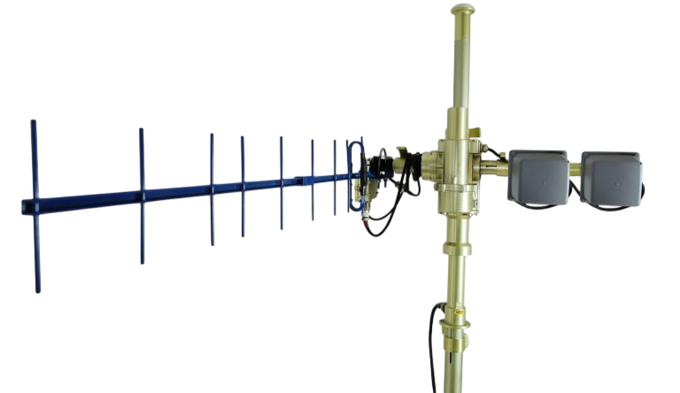

## Automatic Tracking System

### OVERVIEW

ARM Antenna Tracking System (ATS) allows use of directional antennas with higher gain compared to omni-directional ones. Directional antennas with high gain are useful to maintain long range radio links to mobile objects. With rugged design for harsh environment operation UAVOS ATS provides accurate antenna tracking to support High-Capacity-Line-Of- Sight (HCLOS) radio links for a variety of airborne, ground and maritime applications.

**High throughput, long-range HCLOS data communications**

The UAVOS ATS works with the UAVOS (MHX and pMDDLRadio) radio transceivers to support real - time aerial data links for the reconnaissance missions and high-bandwidth demand of GCU-to-UAS operations. The system provides continuous data communication about the signal strength and GPS location information for real-time alignment of antenna direction with LOS.

### FEATURES

- Rugged to operate in the harsh environments

- Supports mobile High-Capacity-Line-Of-Sight (HCLOS) radio links to marine, aerial and terrestrial mobile objects

- Reliable direction tracking to maintain the highest signal strength

Interfaces: 10/100BaseT, CAN, RS232, RS422 
Antenna mounting height: 5.3 m

Azimuth plane: 
rotation range: 360° 
maximum torque: 11.6 N*m 
maximum angular velocity: 52 rpm 

Elevation plane: 
rotation range: from +110° to -15° 
maximum torque: 1.5 N*m 
maximum angular velocity: 12 rpm 

### POWER REQUIREMENTS

Supply voltage: 12 V - 30 V 
Max. power consumption: 150 W at 24 V 
Weight: 14 kg 
Operating temperature range: -40 … +50°C 
Protection: IP65

### DOWNLOADS

<DownloadLinks
files={[
    { name: "Download brochure", path: "/products/antenn-uavos.pdf" },
]}
/>
