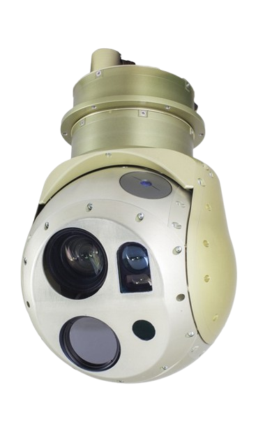
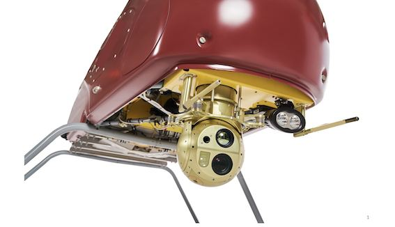
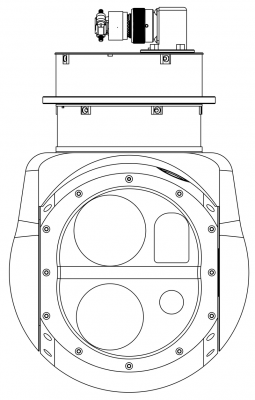

## GSG 201

Gyro-stabilized two-axis gimbal for day and night surveillance,
with Laser Rangefinder

- <ModalLink type="gallery" title="Gallery"></ModalLink>
- <ModalLink href="https://www.youtube.com/watch?v=hfrcAtPSA1U" type="video">Video</ModalLink>

### OVERVIEW

Gyro-stabilized two-axis gimbal with integrated 30x Optical Zoom Full HD (1080/ 60p) Block Camera, Thermal LWIR 1024x768 cameras, Laser rangefinder 2500 m and Onboard Processing Unit. The optoelectronic onboard unit is designed to perform complex missions and is ideally suited for a wide range of applications, including prospecting, surveillance, and mapping.

### FEATURES

- Weight: 3.5 kg
- Size: 323 x 200mm
- Super rugged design: Precision machined aluminium structure
- Antivibration frame
- Environmental protection: IP65
- Drying cartridge
- Direct drive stabilization
- Absolute encoder
- Rotation limits: 360°+
- Fully integrated video auto-tracker
- Operational temperature range: -40 … +50°C
- Supply voltage: 12-27V
- Power consumption: 60W
- High-quality onboard video record
- Removable flash card

### SENSORS

**Day Camera Parameters**

| **Parameter** | **Value** |
|---|---|
| Sensor type | Global shutter |
| Video output | H.264/H.265 RTSP Ethernet |
| Max field of view | 50° |
| Resolution | 1920×1080 |
| Heated protective glass | Optional |
| Zoom | 30× optical zoom lens + digital zoom |
| Effective elements | 3.19 Mpix |
| Focus | Auto |
| Lens | f = 6.5 to 195.0 mm |

**IR Camera Parameters**

| **Parameter** | **Value** |
|---|---|
| Sensor type | LWIR |
| Video output | H.264/H.265 RTSP Ethernet |
| Lens | 50 mm f/1.4 |
| Wavelength band | 8–14 µm |
| Resolution | 1024×768 |

### OPTIONAL

**Laser Rangefinder Parameters (Optional)**

| **Parameter** | **Value** |
|---|---|
| Total measurement range | 50–1500 m |
| Measurement accuracy | ≤ 0.5 m |
| Measurement frequency | 1–10 Hz |
| Resolution | 0.1 m |
| Transmitter | Diode laser |
| Laser classification | Laser Class 1 |

### DOWNLOADS

<DownloadLinks
files={[
    { name: "Download brochure", path: "/products/GSG-201.pdf" },
    { name: "Download GSG 201 drawing", path: "/products/GSG-201-1.pdf" },
]}
/>