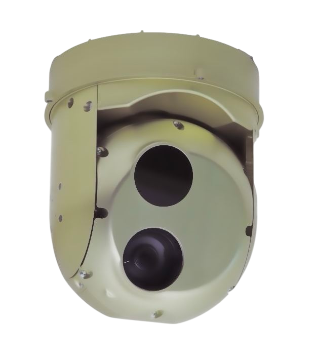
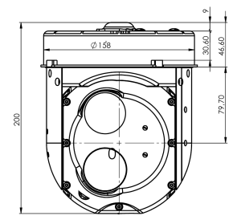

## GOS-155D/T Gimbal
Gyro-stabilized optical gimbal with advanced image processing, a 30x zoom RGB camera, and a high-resolution thermal camera.

### OVERVIEW

The GOS-155D/T Gyro-Stabilized, Two-Axial, Optical Gimbal sets new standards for the weight, size, and performance of professional thermal and RGB camera gimbals. It utilizes a built-in video processor to enable advanced image processing and several industry- standard communication interfaces while keeping the weight and power consumption low.

The built-in RGB camera offers up to 30x optical zoom and recording in HD which helps to capture and record vital details, maximizing the value of your operations. In addition to the RGB camera, the gimbal offers a high-performance thermal LWIR camera, built into the module offering a resolution of 1280х1024.

The optoelectronic onboard unit is designed to perform complex missions and is ideally suited for a wide range of applications, including prospecting, surveillance, rescue missions, maritime operations and object tracking, targeting.

### FEATURES

- Dimensions: Diameter 157 mm, Height 200 mm
- Weight: 1.8 kg
- Temperature Range: -40°C to +55°C
- IP Rating: IP65
- Body: Anodized aluminum alloy
- Anti-Vibration Frame (optional)
- Drying Cartridge
- Direct Drive
- Absolute Encoder
- Yaw: 360º+
- Pitch: +10º to -90º
- Digital 3-Axis Stabilization
- Digital Video Stabilization
- Heated Protective Glass (optional)
- Altitude Range: 0 to +8000 m
- Supply Voltage: 12-27V
- Fully Integrated Video Auto-Tracker
- Integrated CPU
- Imaging Output: H.264 / H.265 Ethernet
- Transfer of Target Coordinates to GCU
- Accuracy of Coordinates: 20-30 m (around 5 meters using UAVOS' Ground Control Station software)
- Power consumption at 24V is 60W max
- Removable One Terabyte Flash Drive
- High-Quality Onboard Uncompressed Raw Video Recording

### SENSORS

**EO Sensor**

| Parameter | Value |
|---|---|
| Sensor type | Industrial CMOS |
| Resolution | HD (1280×720) at 30 fps |
| Effective pixels | Approx. 1.58 Megapixels |
| Digital zoom | 12× (360× with optical zoom) |
| Optical zoom | 30× |
| Lens value | f = 4.6–152 mm; F1.6–F4.8 |
| Horizontal viewing angle | 60.08° (W) – 2.08° (T) |
| Focus system | Auto (Sensitivity: normal, low), One-push AF, Manual, Interval AF, Zoom Trigger AF, Focus compensation in ICR on Wide-Dynamic Range and Auto ICR |
| Exposure control | Auto, Manual, Priority mode (shutter priority & iris priority), Bright, EV compensation, Slow A |
| Additional features | Wide-Dynamic Range and Auto ICR |

**Thermal Sensor**

| Parameter | Value |
|---|---|
| Thermal imager | LWIR detector |
| Matrix resolution | 1280×1024 |
| Lens | 35 mm F1.0 |
| Zoom | ×8 digital zoom |
| Operational spectral band | 8.0–14 µm |
| Pitch | 12 µm |

### DOWNLOADS

<DownloadLinks
files={[
    { name: "Download drawing", path: "/products/UV01.6402.07.11.00-03.pdf" },
]}
/>