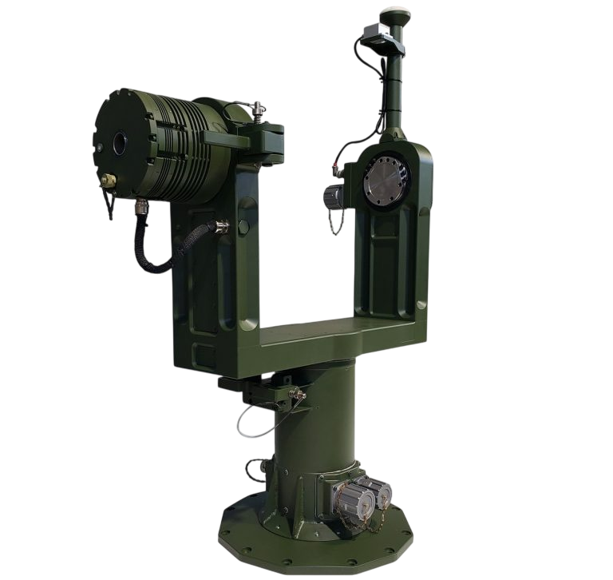

## PTP140
Pan Tilt Platform

- <ModalLink href="https://www.youtube.com/watch?v=rEhuHeqfp3o" type="video">Video 1</ModalLink>
- <ModalLink href="https://www.youtube.com/watch?v=22JpTYAQK-g" type="video">Video 2</ModalLink>
- <ModalLink href="https://www.youtube.com/watch?v=7FqcQm_O7D4" type="video">Video 3</ModalLink>

### OVERVIEW

The heavy-duty precision Pan Tilt Platform is a two - axis positioning system designed to withstand harsh and extreme environmental and weather conditions.

State-of-the-art built-in control electronics and algorithms provide precise, smooth motion at all speeds, while an integrated slip ring allows continuous rotation of the pan axis.

The body of the unit is made of high quality painted aluminum (or Saltwater Resistant Aluminum Alloy) with rugged hermetic circular military connectors.

### APPLICATION

- Two-axes platform for balanced payloads up to 130 kg
- Payloads types: EO/IR, Antenna, Laser and similar systems

### SUPPORTED CONTROL INTERFACES & PROTOCOLS

- Ethernet (EtherCAT)
- CAN (CANopen, CANaerospace)
- RS422/485 (Modbus)
- Profile Position
- Profile Velocity

### FEATURES

- Hollow shaft for cables
- Electromagnetic brake for each of the axes
- Two-axes Gyro Stabilization (possible on request)
- GPS/GNSS True Heading (possible on request)

### TECHNICAL PERFORMANCE

| **Parameter** | **Value** |
|---|---|
| Supply Voltage (rated) | 48 VDC |
| Absolute Supply Voltage Range | 18–60 VDC |
| Standby Current at rated voltage | 0.35 A |
| Rated Current at rated voltage | 20 Arms for one axis |
| Peak Current at rated voltage | 60 Arms for one axis |
| Rated Torque at rated speed | 118 Nm |
| Average Torque | 167 Nm |
| Peak Torque at rated voltage | 304 Nm |
| Speed at rated torque | ±100 deg/sec |
| Acceleration | ±200 deg/sec (depends on the payload mass) |
| Angular freedom Azimuth / Elevation | Continuous |
| Backlash (mechanical) | ~0° |
| Final system accuracy | ≤90 arcsec (0.25 mrad) |
| Feedback system | Absolute (from 17-bit to 20-bit singleturn and 15-bit multiturn) |
| Storage Temperature Range | −40°C…+90°C |
| Operating Temperature Range | −40°C…+55°C |
| Protection | IP65 |
| Platform weight | 45 kg ±10% |
| Size | 990 mm × 740 mm × 340 mm |
| Holding Brake | Power-off electromagnetic brake for each of the axes |
| Payload weight¹ | 130 kg centered, balanced |
| Command / Remote Control | via CAN (CANopen CiA-402 (4.0) compliant) or Ethernet (EtherCAT) or custom protocol over RS422/485 & CAN |

¹ The system can be delivered with special adaptation to the customer’s payload. Payload can be provided by the customer or by UAVOS and integrated at UAVOS facilities.

### DOWNLOADS

<DownloadLinks
files={[
    { name: "Download datasheet", path: "/products/PTP140-Datasheet.pdf" },
]}
/>