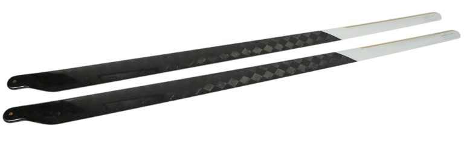

## Unmanned Helicopter Main Rotor Blades

High-Performance Composite Solutions for Unmanned Helicopters

<TextWrapper className="main-desc" as="p">

Tested for overload and environmental reliability by ALTER TECHNOLOGY, part of the TÜV NORD GROUP

</TextWrapper>

UAVOS designs and manufactures advanced composite main rotor blades for unmanned helicopters with take-off weights of up to 50 kg and up to 140 kg. Engineered for maximum flight efficiency, safety, and endurance, our blades combine carbon-fiber composites, innovative aerospace-grade production methods, and extensive flight testing to meet the toughest mission requirements of civil, commercial, and defense UAV operators worldwide.

### PRODUCT OVERVIEW

**Service Life**: 3,000 hours

**Construction**: Latest carbon multi- cross-layer technology using a curing oven, blade core milled from approved aviation-grade foam

**Leading Edge Protection (optional)**: glued-on stainless-steel edge strip

**Airfoil Design**: NACA 23012 

### MAIN ROTOR BLADES SPECIFICATIONS

| **Drawing Number** | **Diameter Length, mm** | **Width (Root Chord – Tip Chord), mm** | **Root Thickness, mm** | **Twist** | **Max. RPM** | **Mounting Hole Q-ty** | **Mounting Hole Size, mm** | **Weight per Blade, kg** | **Price per Blade (USD)** |
|---------------------|--------------------------|----------------------------------------|-------------------------|------------|--------------|-------------------------|-----------------------------|---------------------------|----------------------------|
| UV01.29038.02 CCW UV01.29038.01 CW all-metal leading edge | 1230 | 75–40 | 11 | 6° | 1300 | 2 | 5 Hole lateral spacing: 24 | 0.35 | 900 |
| UV01.29039.02 CCW UV01.29039.01 CW all-metal leading edge | 1230 | 75–40 | 11 | 6° | 1300 | 1 | 6 Hole lateral spacing: 24 | 0.35 | 900 |
| UV01.29040.02 CCW UV01.29040.01 CW all-metal leading edge | 1230 | 75–40 | 11 | 6° | 1300 | 2 | 5 Hole lateral spacing: 24 | 0.35 | 700 |
| UV01.29061.02 CCW UV01.29061.01 CW without all-metal leading edge | 1230 | 76–38 | 12.5 | 10° | 1300 | 1 | 6 | 0.38 ± 0.02 | 875 |
| UV01.29060.02 CCW UV01.29060.01 CW without all-metal leading edge | 1230 | 76–38 | 12.5 | 10° | 1300 | 1 | 6 | 0.42 ± 0.02 | 1062.5 |
| UV01.29140.02 CCW UV01.29140.01 CW without all-metal leading edge | 1423 | 100–50 | 16.5 | 9.5° | 1300 | 1 | 12 | 0.78 ± 0.05 | 1675 |
| UV01.29141.02 CCW UV01.29141.01 CW all-metal leading edge | 1423 | 100–50 | 16.5 | 9.5° | 1300 | 1 | 12 | 0.78 ± 0.05 | 1925 |

<ToggleBlock title="Download Manual & Docs">
<DownloadLinks
files={[
    { name: "Download UV01.29140.01 CW Drawing (PDF)", path: "/products/UV01.290140.01.pdf" },
    { name: "Download UV01.29140.02 CCW Drawing (PDF)", path: "/products/UV01.290140.02.pdf" },
    { name: "Download UV01.29141.01 CW Drawing (PDF)", path: "/products/UV01.290141.01.pdf" },
    { name: "Download UV01.29141.02 CCW Drawing (PDF)", path: "/products/UV01.290141.02.pdf" },
    { name: "Download UV01.29060.01 CW Drawing (PDF)", path: "/products/UV01.29060.01.pdf" },
    { name: "Download UV01.29060.02 CW Drawing (PDF)", path: "/products/UV01.29060.02.pdf" },
    { name: "Download UV01.29161.01 CCW Drawing (PDF)", path: "/products/UV01.29061.01.pdf" },
    { name: "Download UV01.29161.02 CCW Drawing (PDF)", path: "/products/UV01.29061.02.pdf" },
]}
/>
</ToggleBlock>

### KEY BENEFITS

**Extended Service Life**: Reinforced stainless steel leading edges significantly increase wear resistance, delivering up to twice the operational life of standard blades.

**Superior Efficiency**: Optimized aerodynamic profiles improve lift-to-drag ratios, leading to higher fuel economy and increased payload capabilities.

**Cost-Effectiveness**: Streamlined production processes and durable construction reduce both initial procurement costs and lifecycle operating expenses. 

**Reliability in Harsh Environments:** Carbon fiber prepreg construction with stainless-steel leading edges ensures resilience against sand, dust, rain, and saltwater conditions.

**Proven Safety:** Every rotor blade undergoes exhaustive internal fatigue and overload testing as well as real-world UAV flight trials, ensuring structural integrity and consistent performance. 

**UAVOS Rotor Blades Successfully Pass Overload and Environmental Testing by ALTER Technology**

The test campaign involved simulated overload centrifugal loads exceeding the nominal operational limit of 7,390 N (753.32 kg) and a dynamometer measurement of 389 N (39.65 kg), and confirmed the following key characteristics of the rotor blades:

- structural integrity under extreme stress
- resistance to deformation
- reliability of materials and manufacturing quality

Environmental tests were conducted to verify the rotor blades’ reliability, durability, and safety under extreme climatic conditions ranging from -55 °C to +70 °C.

**Innovation in UAV Rotor Blade Manufacturing**

Unlike conventional glued-shell rotor blades, UAVOS uses one-step hot-molding technology with carbon fiber polymer composites. This advanced method eliminates glued joints, minimizes delamination risks, and provides superior structural strength. Multiple composite layers are applied with precise orientation and cured under controlled conditions, achieving the ideal balance of stiffness, durability, and aerodynamic efficiency.

**OEM & Customized UAV Rotor Blade Solutions**

UAVOS supports both proprietary UAV platforms and OEM collaborations, offering rotor blades tailored to exact mission needs. With complete in-house capabilities - from aerodynamic design and rapid prototyping to testing - UAVOS ensures short manufacturing and delivery cycles.

**Proven in the Field**

As both a manufacturer and UAV operator, UAVOS validates its rotor systems in real-world missions. This dual expertise guarantees that our rotor blades not only pass rigorous laboratory testing but also consistently perform in demanding operational environments. UAVOS’ customers benefit from a product that is field-tested, mission-proven, and globally trusted.

**Why Choose UAVOS Composite Main Rotor Blades?**

- Industry-grade UAV helicopter rotor blades with superior aerodynamics and reduced lifecycle costs
- Field-proven rotor solutions tested in real UAV operations
- OEM and custom rotor blade options for specialized unmanned helicopter platforms
- Expertise spanning the full product lifecycle, from design through flight testing.
