## DRONE PARACHUTE SYSTEMS

for UAVs ranging from 5kg to 1000 kg. These systems are designed for deployment at speeds between 20km/h and 220km/h, extension feasible

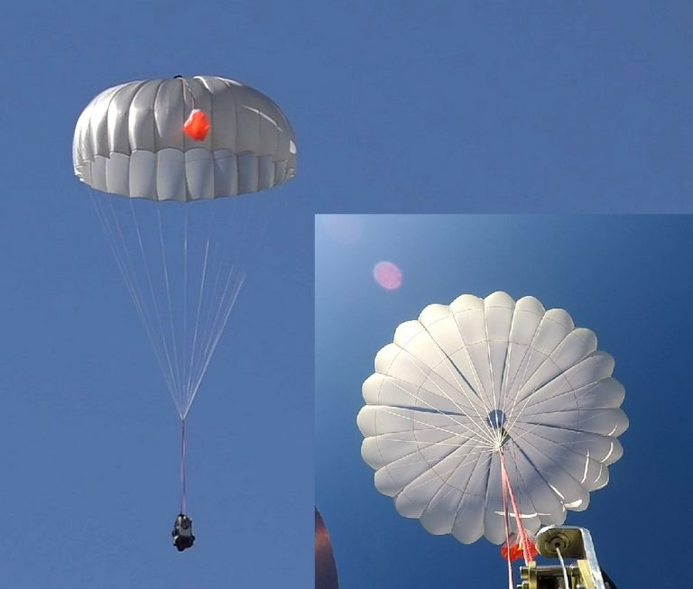

- <ModalLink href="https://www.youtube.com/watch?v=CrDTF-2SLrQ" type="video">Video</ModalLink>

### OVERVIEW

UAVOS' family of parachute systems has been specially designed both for UAV recovery and as a safety measure that can be used in case of UAV catastrophic failure.

UAVOS parachutes benefit from an automatic cord-cutter system that releases the parachute once the air vehicle has landed, minimizing the potential for damage due to high wind.

Hand-sewn from high-grade parachute materials, the parachutes feature a variety of designs that offers the best compromise between packed volume and parachute drag coefficient, providing a safe and low-impact landing for your drones and payloads. The system has been thoroughly tested on UAVOS' drones.

### FEATURES

Key advantages of UAVOS’ Drone Parachute Systems are:

- High speed-range for initial phase of deployment: 20km/h to 220km/h tested, extension feasible
- Moderate G-load throughout total deployment-range due to configurable slider system: standard 
- Quick stabilization after deployment
- Low tendency of oscillation
- Extreme low weight and dimensions resulting in low effect on payload: standard 1.5-2.0kg with 4-6.5 liter volume
- Re-useable: 10+ deployments possible
- Development and production in accordance with aeronautical engineering regulations
- Verification of required parameters through special measuring equipment and video documentation during airdrop-tests
- Low adaptation and development efforts while in design phase to consider specific requirements.

| RS name | type | 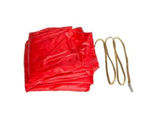 75 System of Standard Parachute Landing | 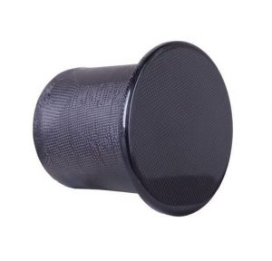 75 Parachute Systems |  100 Parachute Systems | 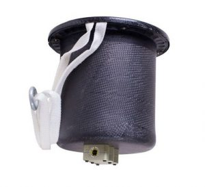 200 Parachute Systems | 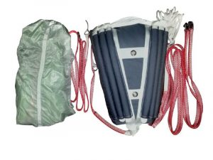 350 Parachute Systems | 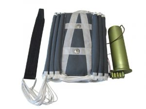 1000 System of Standard Parachute Landing |
|:--|:--:|:--:|:--:|:--:|:--:|:--:|:--:|
| **UAV type (aircraft, helicopter, multi-rotor)** | type | airplane | airplane / helicopter / multi-rotor | airplane / helicopter / multi-rotor | airplane / helicopter / multi-rotor | airplane | airplane / helicopter |
| **RS type (standard, accident, emergency)** | type | standard | standard / emergency | standard / emergency | standard / emergency | standard / emergency | standard / emergency |
| **Commissioning principle (self-extracting, ballistic, ballistic-exhaust)** | type | self-extracting | ballistic | ballistic | ballistic | self-extracting | ballistic-exhaust |
| **Type of the pilot chute (exhaust, brake, stabilizing)** | type | stabilizing | – | – | – | exhaust / brake / stabilizing | exhaust / brake / stabilizing |
| **The number of attachment points for the lanyard on the UAV** | pcs | 4 | 1 | 1 | 1 | 1–4 | 1 |
| **Maximum allowable load** | kg | 15 | 15 | 20 | 35 | 60 | 60 |
| **The maximum speed of the UAV when the RS is triggered, without a braking parachute** | m/s | up to 16 | up to 33.3 | up to 20 | up to 33.3 | up to 33.3 | up to 33.3 |
| **The maximum speed of the UAV when the RS is triggered, with a braking parachute** | m/s | – | – | – | – | up to 300 | up to 300 |
| **The maximum speed of the UAV when the RS is triggered** | km/h | 20 | 0 | 0 | 0 | 5 | 5 |
| **Min. RS response time** | s | 3 | 2 | 1 | 3 | 3 | 2 |
| **Minimum altitude when the RS is triggered at minimum speed** | m | 50 | 50 | 10 | 50 | 50 | 50 |
| **Operating temperature** | °C | −20°C / +30°C | −40°C / +50°C | −40°C / +50°C | −40°C / +50°C | −20°C / +30°C | −40°C / +50°C |
| **Technical resource of the parachute, number of applications** | times | 50 | 30 | 30 | 30 | 30 | 10 |
| **Technical resource of the charge** | times | 1 | 1 | 1 | 1 | 1 | 1 |
| **Technical resource of the cartridge tube** | times | – | 3 | 3 | 3 | – | 3 |
| **Service life** | mos | 12 | 12 | 12 | 12 | 12 | 12 |
| **Overall dimensions L×W×H of the parachute compartment** | mm | 300×120×40 | 142×130×130 | 142×130×130 | 136×136×175 | 260×220×80 | 260×220×80 |
| **Overall dimensions L×W×H of the ballistic compartment** | mm | – | – | – | – | – | 214×80×70 |
| **Weight** | kg | 0.3 | 0.8 | 0.7 | 1.3 | 2.5 | 3 |
| **Maximum overload with max. load** | g | 1.2 | 6 | 6 | 6 | 6 | 6 |
| **Descent rate with max. loading** | m/s | up to 4 | up to 6 | up to 6 | up to 6 | up to 6 | up to 6 |
| **Slider** | – | no | no | no | no | yes | no |
| **Container type (soft / hard)** | – | – | hard | hard | hard | soft / hard | soft / hard |
| **Actuation** | – | – | application of power supply | application of power supply | application of power supply | – | application of power supply |
| **Operating supply voltage** | V | – | 5 | 5 | 5 | – | 5 |
| **Operating current of charge actuation, not less** | mA | – | 500 | 500 | 500 | – | 500 |
| **Possibility to install a lock** | No. | No.1 | No.2–No.3 | No.2–No.3 | No.2–No.3 | No.3 | No.3 |
| **Square** | m² | 6.3 | 6.5 | 7 | 15 | 35 | 35 |
| **Repacking interval** | days | 60 | 60 | 60 | 60 | 60 | 60 |

| RS name | type |  75 System of Standard Parachute Landing |  75 Parachute Systems |  100 Parachute Systems | 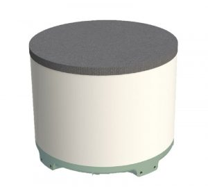 200 Parachute Systems | 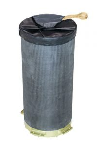 350 Parachute Systems |  1000 System of Standard Parachute Landing |
|:--|:--:|:--:|:--:|:--:|:--:|:--:|:--:|
| **UAV type (aircraft, helicopter, multi-rotor)** | type | airplane | airplane | airplane / helicopter | airplane / helicopter | airplane / helicopter | airplane |
| **RS type (standard, accident, emergency)** | type | standard / emergency | standard / emergency | emergency | emergency | emergency | emergency |
| **Commissioning principle (self-extracting, ballistic, ballistic-exhaust)** | type | self-extracting | ballistic-exhaust | ballistic-exhaust | ballistic | ballistic | ballistic-exhaust |
| **Type of the pilot chute (exhaust, brake, stabilizing)** | type | exhaust / brake / stabilizing | exhaust / brake / stabilizing | exhaust / brake / stabilizing | – | – | exhaust / brake / stabilizing |
| **The number of attachment points for the lanyard on the UAV** | pcs | 1–4 | 1–4 | 1 | 1–4 | 1 | 1–4 |
| **Maximum allowable load** | kg | 80 | 80 | 120 | 220 | 360 | 1300 |
| **The maximum speed of the UAV when the RS is triggered, without a braking parachute** | m/s | up to 10 | up to 33.3 | up to 33.3 | up to 97 | up to 97 | up to 100 |
| **The maximum speed of the UAV when the RS is triggered, with a braking parachute** | m/s | up to 300 | up to 300 | up to 110 | – | – | up to 300 |
| **The maximum speed of the UAV when the RS is triggered** | km/h | 20 | 20 | 5 | 0 | 0 | 50 |
| **Min. RS response time** | s | 1.5 | 1.5 | 3 | 3 | 4 | 5 |
| **Minimum altitude when the RS is triggered at minimum speed** | m | 70 | 70 | 80 | 50 | 200 | 500 |
| **Operating temperature** | °C | −20 / +30 | −40 / +50 | −40 / +50 | −40 / +50 | −40 / +50 | −50 / +60 |
| **Technical resource of the parachute, number of applications** | times | 30 | 10 | 30 × 10 × 10 | 10 | 10 | 5 |
| **Technical resource of the charge** | times | 1 | 1 | 1 | 1 | 1 | 1 |
| **Technical resource of the cartridge tube** | times | – | 3 | 3 | – | – | 3 |
| **Service life** | mos | 12 | 12 | 12 | 12 | 12 | 12 |
| **Overall dimensions L×W×H of the parachute compartment** | mm | 300×240×80 | 300×240×80 | 350×300×100 | 300×300×275 | 210×210×510 | × |
| **Overall dimensions L×W×H of the ballistic compartment** | mm | – | 214×80×70 | 214×80×70 | – | – | – |
| **Weight** | kg | 2.7 | 3 | 3.5 | 4.5 | 5.7 | × |
| **Maximum overload with max. load** | g | 12 | 12 | 10 | 5 | 5 | 16 |
| **Descent rate with max. loading** | m/s | up to 6 | up to 6 | up to 6 | up to 6 | up to 6 | up to 6 |
| **Slider** | – | no | no | no | yes | yes | yes |
| **Container type (soft / hard)** | – | soft | soft | soft | hard | hard | hard |
| **Actuation** | – | – | power supply | power supply | power supply | power supply | power supply |
| **Operating supply voltage** | V | – | 5 | 5 | 5 | 5 | 5 |
| **Operating current of charge actuation, not less** | mA | – | 500 | 500 | 500 | 500 | 500 |
| **Possibility to install a lock** | No. | No. 3 | No. 3 | – | – | – | – |
| **Square** | m² | 35 | 35 | 42 | 0 | 56 | 280 |
| **Repacking interval** | days | 60 | 60 | 60 | 60 | 60 | 60 |

<FlexContainer className="nowrap">

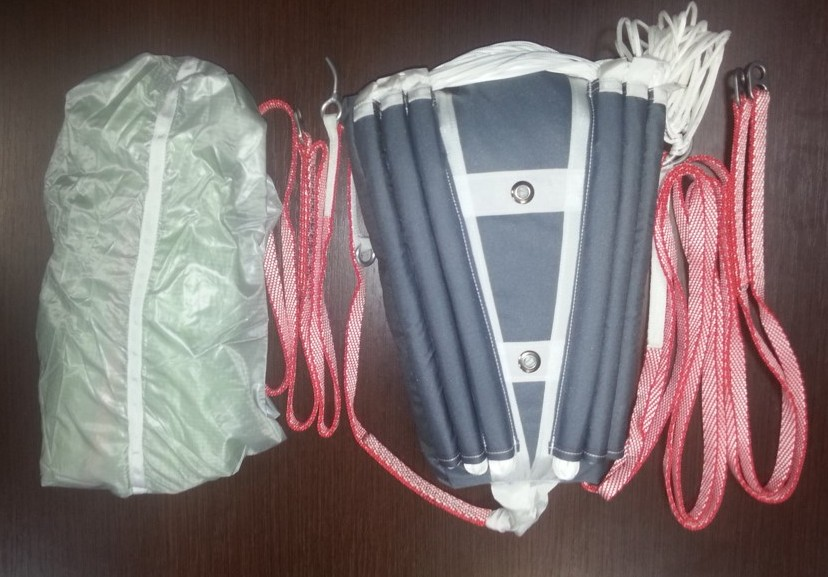

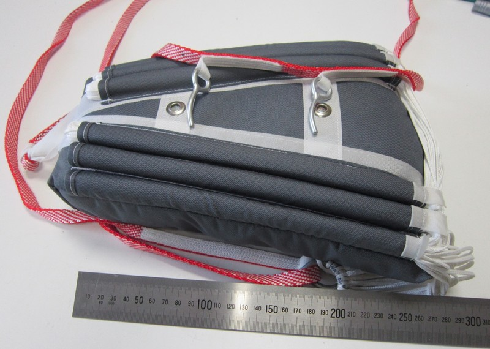

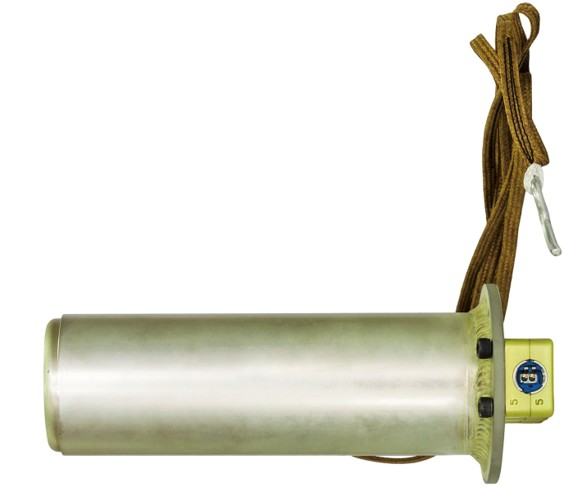

</FlexContainer>

### DOWNLOADS

<DownloadLinks
files={[
    { name: "EMERGENCY RESCUE SYSTEM BY UAVOS", path: "/products/EMERGENCY-RESCUE-SYSTEM-UAVOS-v2(en).pdf" },
]}
/>